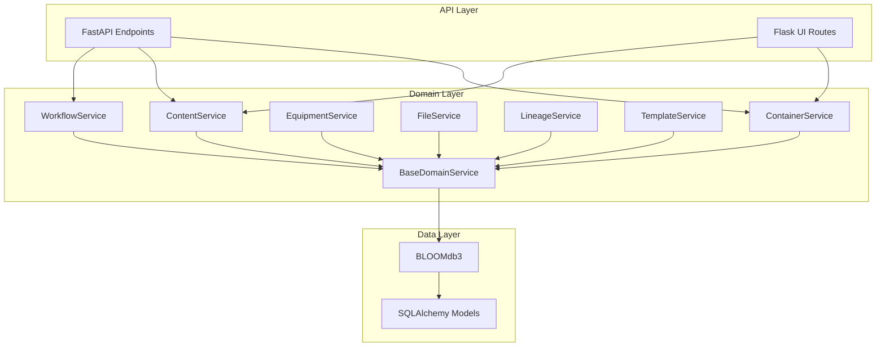
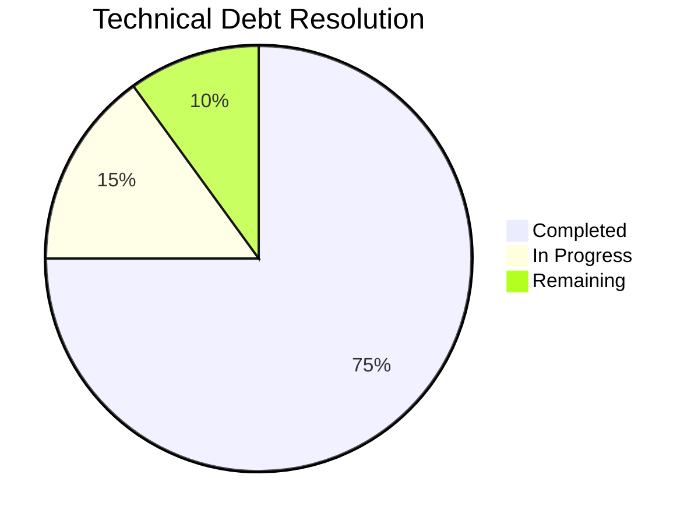

# BLOOM LIMS - Comprehensive System Specification

> **Last Updated**: 2024-12-24 | **Version**: Dynamically fetched from [GitHub Releases](https://github.com/Daylily-Informatics/bloom/releases)

## Table of Contents
1. [Executive Summary](#executive-summary)
2. [System Architecture](#system-architecture)
3. [Domain Layer](#domain-layer)
4. [Core Data Model](#core-data-model)
5. [Database Schema](#database-schema)
6. [Object Hierarchy](#object-hierarchy)
7. [Template System](#template-system)
8. [Workflow Engine](#workflow-engine)
9. [Action System](#action-system)
10. [File Management](#file-management)
11. [API Layer](#api-layer)
12. [Web Interface](#web-interface)
13. [External Integrations](#external-integrations)
14. [Configuration](#configuration)
15. [Deployment](#deployment)

---

## 1. Executive Summary

BLOOM (Bioinformatics Laboratory Operations and Object Management) is a Laboratory Information Management System (LIMS) designed for managing laboratory workflows, sample tracking, and data management. The system is built on a flexible, template-driven architecture that allows laboratories to define custom object types, workflows, and actions without code changes.

### Key Features
- **Template-driven object creation**: All laboratory objects (containers, samples, workflows) are created from JSON templates
- **Hierarchical lineage tracking**: Parent-child relationships between all objects with full audit trail
- **Flexible workflow engine**: Configurable multi-step workflows with queue management
- **Action system**: Extensible action framework for object state transitions and operations
- **File management**: S3-compatible file storage with metadata tracking
- **Barcode/label printing**: Integration with Zebra label printers via zebra_day
- **FedEx tracking**: Package tracking integration via fedex_tracking_day
- **Multi-interface support**: FastAPI REST API (primary), Flask web UI
- **Domain-driven architecture**: Clean separation with 8 specialized domain modules
- **Pydantic validation**: Comprehensive input/output validation with schema modules
- **Health monitoring**: Kubernetes-ready health check endpoints

### Technology Stack
- **Language**: Python 3.12+
- **Database**: PostgreSQL 15+ (via SQLAlchemy ORM with Alembic migrations)
- **Web Frameworks**: FastAPI (primary API), Flask (legacy UI)
- **Storage**: AWS S3 / Supabase Storage
- **Authentication**: Supabase Auth (OAuth2 with social providers)
- **Validation**: Pydantic v2 with pydantic-settings
- **Label Printing**: zebra_day library
- **Package Tracking**: fedex_tracking_day library

---

## 2. System Architecture

### 2.1 High-Level Architecture

```
┌─────────────────────────────────────────────────────────────────────────────┐
│                              BLOOM LIMS                                      │
├─────────────────────────────────────────────────────────────────────────────┤
│  ┌─────────────┐    ┌─────────────────┐                                     │
│  │  Flask UI   │    │   CLI Tools     │                                     │
│  │  (Port 5000)│    └────┬────────────┘                                     │
│  └──────┬──────┘                                                            │
│         │                │                                                 │
│  ┌──────┴────────────────┴──────────────────────────────────────────────────────┐ │
│  │                        Business Logic Layer                             │ │
│  │  ┌─────────────┐ ┌─────────────┐ ┌─────────────┐ ┌─────────────────┐   │ │
│  │  │  BloomObj   │ │BloomWorkflow│ │ BloomFile   │ │ BloomEquipment  │   │ │
│  │  │  (bobjs.py) │ │ Step        │ │ Set         │ │                 │   │ │
│  │  └─────────────┘ └─────────────┘ └─────────────┘ └─────────────────┘   │ │
│  └────────────────────────────────────┬───────────────────────────────────┘ │
│                                       │                                     │
│  ┌────────────────────────────────────┴───────────────────────────────────┐ │
│  │                        Data Access Layer                                │ │
│  │  ┌─────────────────────────────────────────────────────────────────┐   │ │
│  │  │                    BLOOMdb3 (db.py)                              │   │ │
│  │  │  - SQLAlchemy Session Management                                │   │ │
│  │  │  - Connection Pooling                                           │   │ │
│  │  │  - Transaction Management                                       │   │ │
│  │  └─────────────────────────────────────────────────────────────────┘   │ │
│  └────────────────────────────────────┬───────────────────────────────────┘ │
│                                       │                                     │
│  ┌────────────────────────────────────┴───────────────────────────────────┐ │
│  │                        ORM Models (bdb.py)                              │ │
│  │  ┌──────────────┐ ┌──────────────┐ ┌──────────────┐ ┌──────────────┐   │ │
│  │  │BloomObj Model│ │GenericLineage│ │EquipmentInst│ │ DataLineage  │   │ │
│  │  └──────────────┘ └──────────────┘ └──────────────┘ └──────────────┘   │ │
│  └────────────────────────────────────┬───────────────────────────────────┘ │
│                                       │                                     │
└───────────────────────────────────────┼─────────────────────────────────────┘
                                        │
                    ┌───────────────────┴───────────────────┐
                    │           PostgreSQL Database          │
                    │  ┌─────────────┐  ┌─────────────────┐ │
                    │  │ bloom_obj   │  │generic_instance │ │
                    │  │             │  │_lineage         │ │
                    │  └─────────────┘  └─────────────────┘ │
                    │  ┌─────────────┐  ┌─────────────────┐ │
                    │  │equipment_   │  │ data_lineage    │ │
                    │  │instance     │  │                 │ │
                    │  └─────────────┘  └─────────────────┘ │
                    └───────────────────────────────────────┘
```

### 2.2 Module Organization

```
bloom_lims/
├── _version.py         # Dynamic version from GitHub releases
├── __init__.py         # Package initialization & exports
├── config.py           # Pydantic settings & configuration
├── exceptions.py       # Typed exception hierarchy
├── bdb.py              # SQLAlchemy ORM models and base classes
├── db.py               # Database connection and session management (BLOOMdb3)
├── bobjs.py            # Legacy business logic (transitioning to domain/)
├── bfile.py            # File management (BloomFile, BloomFileSet)
├── bequip.py           # Equipment management (BloomEquipment)
├── env.py              # Environment configuration
│
├── domain/             # Domain-driven business logic (NEW)
│   ├── __init__.py
│   ├── base.py         # BaseDomainService with common patterns
│   ├── utils.py        # Shared domain utilities
│   ├── containers.py   # Container operations
│   ├── content.py      # Sample/specimen operations
│   ├── equipment.py    # Equipment management
│   ├── files.py        # File handling service
│   ├── lineage.py      # Object relationship tracking
│   ├── templates.py    # Template management
│   └── workflows.py    # Workflow orchestration
│
├── schemas/            # Pydantic validation schemas (NEW)
│   ├── __init__.py
│   ├── base.py         # Common schema patterns
│   ├── containers.py   # Container validation
│   ├── content.py      # Content/sample validation
│   ├── equipment.py    # Equipment validation
│   ├── files.py        # File validation
│   ├── lineage.py      # Lineage validation
│   ├── templates.py    # Template validation
│   ├── workflows.py    # Workflow validation
│   └── api/            # API request/response schemas
│
├── core/               # Cross-cutting concerns (NEW)
│   ├── cache.py        # Caching abstraction
│   ├── exceptions.py   # Core exceptions
│   └── validation.py   # Validation utilities
│
├── api/                # API layer (NEW)
│   ├── versioning.py   # API version negotiation
│   └── rate_limiting.py # Request rate limiting
│
├── migrations/         # Alembic database migrations (NEW)
│   ├── env.py
│   └── versions/
│
├── health.py           # Health check endpoints (NEW)
├── backup/             # Backup CLI and utilities
└── config/             # Configuration files
    ├── assay_config.yaml
    └── fedex_config.yaml
```

### 2.3 Entry Points

| Entry Point | File | Port | Purpose |
|-------------|------|------|---------|
| Main App | `main.py` | 5000 | Combined UI + API |
| Flask UI | `bloom_lims/bkend/bkend.py` | 5000 | Web-based user interface |
| FastAPI | `bloom_lims/bkend/fastapi_bkend.py` | 8000 | REST API |
| Health | `/health/*` | - | Kubernetes probes |

### 2.4 Domain Layer (NEW)

The domain layer provides a clean separation of business logic:



---

## 3. Core Data Model

### 3.1 BloomObj - The Universal Object

Every entity in BLOOM is a `BloomObj`. This includes:
- **Templates**: Blueprint definitions for creating instances
- **Instances**: Actual laboratory objects created from templates
- **Containers**: Tubes, plates, wells, boxes
- **Content**: Samples, specimens, reagents
- **Workflows**: Process definitions and instances
- **Workflow Steps**: Individual steps within workflows
- **Equipment**: Laboratory instruments and devices
- **Files**: Uploaded documents and data files

### 3.2 Object Classification Hierarchy

Objects are classified using a four-level hierarchy:

```
super_type / btype / b_sub_type / version
```

**Examples:**
- `container/tube/tube-generic-10ml/1.0`
- `content/sample/blood-plasma/1.0`
- `workflow/assay/rare-mendelian/1.0`
- `workflow_step/queue/accessioning/1.0`
- `equipment/instrument/sequencer/1.0`

### 3.3 Template vs Instance

| Aspect | Template | Instance |
|--------|----------|----------|
| `is_template` | `True` | `False` |
| `template_uuid` | `NULL` | Points to template |
| Purpose | Define structure | Represent real objects |
| `json_addl` | Contains `instantiation_layouts` | Contains `properties`, `actions` |

---

## 4. Database Schema

### 4.1 Primary Tables

#### `bloom_obj` - Core Object Table

| Column | Type | Description |
|--------|------|-------------|
| `uuid` | UUID | Primary key |
| `euid` | Text | Enterprise Unique Identifier (human-readable, variable length) |
| `name` | String(400) | Object name |
| `super_type` | String(100) | Top-level classification |
| `btype` | String(100) | Object type |
| `b_sub_type` | String(100) | Object subtype |
| `version` | String(100) | Version string |
| `is_template` | Boolean | True if this is a template |
| `is_singleton` | Boolean | True if only one instance allowed |
| `template_uuid` | UUID | Reference to template (for instances) |
| `json_addl` | JSONB | Flexible JSON storage for properties, actions, etc. |
| `bstatus` | String(100) | Object status (active, complete, destroyed, etc.) |
| `bstate` | String(100) | Object state |
| `is_deleted` | Boolean | Soft delete flag |
| `created_dt` | DateTime | Creation timestamp |
| `modified_dt` | DateTime | Last modification timestamp |
| `created_by` | String | Creator username |
| `modified_by` | String | Last modifier username |
| `audit_comment` | String | Audit trail comment |
| `polymorphic_discriminator` | String | For SQLAlchemy inheritance |

#### `generic_instance_lineage` - Object Relationships

| Column | Type | Description |
|--------|------|-------------|
| `uuid` | UUID | Primary key |
| `parent_instance_uuid` | UUID | Parent object UUID |
| `child_instance_uuid` | UUID | Child object UUID |
| `relationship_type` | String | Type of relationship |
| `created_dt` | DateTime | Creation timestamp |
| `is_deleted` | Boolean | Soft delete flag |
| `polymorphic_discriminator` | String | For inheritance |

#### `equipment_instance` - Equipment Records

| Column | Type | Description |
|--------|------|-------------|
| `uuid` | UUID | Primary key |
| `euid` | Text | Enterprise Unique Identifier (human-readable) |
| `name` | String(400) | Equipment name |
| `equipment_type` | String(100) | Type of equipment |
| `json_addl` | JSONB | Equipment properties |
| `bstatus` | String(100) | Equipment status |
| `is_deleted` | Boolean | Soft delete flag |

#### `data_lineage` - Data Provenance

| Column | Type | Description |
|--------|------|-------------|
| `uuid` | UUID | Primary key |
| `parent_data_uuid` | UUID | Parent data UUID |
| `child_data_uuid` | UUID | Child data UUID |
| `relationship_type` | String | Type of data relationship |

### 4.2 EUID Format

The **Enterprise Unique Identifier (EUID)** is a human-readable identifier designed for laboratory operations:

```
Format: [PREFIX][SEQUENCE_NUMBER]
Examples: CX1, CX12, CX123, WX1000, CWX5, MRX42

Components:
- PREFIX: 2-3 uppercase letter code identifying object type
- SEQUENCE_NUMBER: Integer with NO leading zeros (critical LIMS design principle)
```

**Key EUID Prefixes:**
- `GT` (Template), `GL` (Lineage), `CX` (Container), `CWX` (Well)
- `MX` (Content), `MRX` (Reagent), `MCX` (Control)
- `WX` (Workflow), `WSX` (Workflow Step), `QX` (Queue)
- `TRX` (Test Requisition), `EX` (Equipment), `DX` (Data)
- `AY` (Assay), `FI` (File), `FS` (File Set), `GX` (Generic)

Generated by PostgreSQL trigger function `set_generic_instance_euid()` in `postgres_schema_v3.sql`.
Prefixes are defined in `bloom_lims/config/{super_type}/metadata.json`.

---

## 5. Object Hierarchy

### 5.1 Super Types

| Super Type | Description | Examples |
|------------|-------------|----------|
| `container` | Physical containers | tubes, plates, wells, boxes |
| `content` | Material contents | samples, specimens, reagents |
| `workflow` | Process definitions | assays, accessioning workflows |
| `workflow_step` | Workflow components | queues, processing steps |
| `equipment` | Laboratory equipment | sequencers, thermocyclers |
| `file` | Digital files | data files, reports |
| `file_set` | File collections | result sets, batch uploads |
| `data` | Data records | measurements, results |
| `control` | Control samples | positive/negative controls |
| `test_requisition` | Test orders | clinical test requests |

### 5.2 Container Types

```
container/
├── tube/
│   ├── tube-generic-10ml/1.0
│   ├── tube-cryovial/1.0
│   └── tube-blood-collection/1.0
├── plate/
│   ├── fixed-plate-24/1.0
│   ├── fixed-plate-96/1.0
│   └── fixed-plate-384/1.0
├── well/
│   └── well-standard/1.0
├── box/
│   ├── box-81-position/1.0
│   └── box-freezer/1.0
└── rack/
    └── rack-tube/1.0
```

### 5.3 Workflow Structure

```
workflow (assay instance)
├── workflow_step (queue: accessioning)
│   └── workset (batch of samples)
│       └── containers/samples
├── workflow_step (queue: extraction)
│   └── workset
│       └── containers/samples
├── workflow_step (queue: library-prep)
│   └── workset
│       └── containers/samples
└── workflow_step (queue: sequencing)
    └── workset
        └── containers/samples
```

---

## 6. Template System

### 6.1 Template JSON Structure

Templates are stored in `json_addl` with the following structure:

```json
{
  "properties": {
    "name": "Template Name",
    "description": "Template description",
    "lab_code": "LAB001"
  },
  "instantiation_layouts": [
    {
      "container/well/well-standard/1.0/": {
        "json_addl": {
          "cont_address": {
            "name": "A1",
            "row": "A",
            "col": "1"
          }
        }
      }
    }
  ],
  "actions": {},
  "action_groups": {}
}
```

### 6.2 Template Loading

Templates are loaded from JSON files in `bloom_lims/templates/` directory:

```python
# Load template from file
bobj = BloomObj(BLOOMdb3())
template = bobj.create_template_from_json_file("path/to/template.json")

# Or create from code string
template = bobj.create_template_by_code("container/plate/fixed-plate-96/1.0")
```

### 6.3 Instance Creation

```python
# Create instance from template EUID
bobj = BloomObj(BLOOMdb3())
instances = bobj.create_instances(template_euid)

# Returns: [[parent_instance], [child_instances...]]
# For a plate: [[plate], [well1, well2, ..., well96]]

# Create instance by code path
instance = bobj.create_instance_by_code(
    "container/tube/tube-generic-10ml/1.0",
    {"json_addl": {"properties": {"name": "My Tube"}}}
)
```

---

## 7. Workflow Engine

### 7.1 Workflow Components

| Component | Description | Class |
|-----------|-------------|-------|
| Workflow | Top-level process definition | `BloomWorkflow` |
| Workflow Step | Individual step/queue | `BloomWorkflowStep` |
| Workset | Batch of items in a queue | Part of workflow_step |
| Action | Operations on objects | Defined in `json_addl` |

### 7.2 Workflow Lifecycle

```
┌─────────────┐     ┌─────────────┐     ┌─────────────┐     ┌─────────────┐
│   created   │────▶│ in_progress │────▶│  complete   │     │  abandoned  │
└─────────────┘     └─────────────┘     └─────────────┘     └─────────────┘
                           │                                       ▲
                           │                                       │
                           └───────────────────────────────────────┘
                                        (can abandon)
```

### 7.3 Status Values

| Status | Description |
|--------|-------------|
| `created` | Initial state after creation |
| `in_progress` | Work has started |
| `complete` | Successfully finished |
| `abandoned` | Cancelled/stopped |
| `failed` | Error occurred |
| `destroyed` | Object destroyed (containers) |
| `active` | Currently active |

### 7.4 BloomWorkflow Class

```python
class BloomWorkflow(BloomObj):
    """Manages workflow instances and their lifecycle."""

    def create_empty_workflow(self, template_euid):
        """Create a new workflow instance from template."""
        return self.create_instances(template_euid)

    def do_action(self, wf_euid, action, action_group, action_ds={}):
        """Execute an action on a workflow."""
        # Supported actions:
        # - do_action_create_and_link_child
        # - do_action_create_package_and_first_workflow_step
        # - do_action_destroy_specimen_containers
```

### 7.5 BloomWorkflowStep Class

```python
class BloomWorkflowStep(BloomObj):
    """Manages individual workflow steps and queues."""

    def do_action(self, wfs_euid, action, action_group, action_ds={}):
        """Execute an action on a workflow step."""
        # Supported actions:
        # - do_action_create_and_link_child
        # - do_action_create_input
        # - do_action_create_child_container_and_link_child_workflow_step
        # - do_action_create_test_req_and_link_child_workflow_step
        # - do_action_add_container_to_assay_q
        # - do_action_fill_plate_undirected
        # - do_action_fill_plate_directed
        # - do_action_link_tubes_auto
        # - do_action_cfdna_quant
        # - do_action_stamp_copy_plate
        # - do_action_log_temperature
```

---

## 8. Action System

### 8.1 Action Structure in json_addl

Actions are defined in the `json_addl` field of objects:

```json
{
  "action_groups": {
    "status_actions": {
      "label": "Status Actions",
      "actions": {
        "set_in_progress": {
          "label": "Start Work",
          "action_enabled": "1",
          "method_name": "do_action_set_object_status",
          "captured_data": {
            "object_status": "in_progress"
          }
        },
        "set_complete": {
          "label": "Mark Complete",
          "action_enabled": "1",
          "method_name": "do_action_set_object_status",
          "captured_data": {
            "object_status": "complete"
          }
        }
      }
    }
  },
  "actions": {
    "print_label": {
      "label": "Print Barcode Label",
      "action_enabled": "1",
      "method_name": "do_action_print_barcode_label",
      "lab": "main_lab",
      "printer_name": "zebra_1",
      "label_style": "2x1_basic"
    }
  }
}
```

### 8.2 Available Action Methods

#### Global Actions (BloomObj)

| Method | Description |
|--------|-------------|
| `do_action_set_object_status` | Change object status |
| `do_action_print_barcode_label` | Print barcode label |
| `do_action_destroy_specimen_containers` | Mark containers as destroyed |
| `do_action_create_package_and_first_workflow_step_assay` | Create package workflow |
| `do_action_move_workset_to_another_queue` | Move workset between queues |
| `do_stamp_plates_into_plate` | Stamp multiple plates into one |
| `do_action_download_file` | Download file from storage |
| `do_action_add_file_to_file_set` | Add file to file set |
| `do_action_remove_file_from_file_set` | Remove file from file set |
| `do_action_add_relationships` | Create lineage relationships |

#### Workflow Step Actions (BloomWorkflowStep)

| Method | Description |
|--------|-------------|
| `do_action_create_and_link_child` | Create child object and link |
| `do_action_create_input` | Create input object |
| `do_action_create_child_container_and_link_child_workflow_step` | Create container with workflow step |
| `do_action_create_test_req_and_link_child_workflow_step` | Create test requisition |
| `do_action_add_container_to_assay_q` | Add container to assay queue |
| `do_action_fill_plate_undirected` | Fill plate without position mapping |
| `do_action_fill_plate_directed` | Fill plate with position mapping |
| `do_action_link_tubes_auto` | Auto-link tubes |
| `do_action_cfdna_quant` | cfDNA quantification action |
| `do_action_stamp_copy_plate` | Create plate copy |
| `do_action_log_temperature` | Log temperature reading |

### 8.3 Action Execution Flow

```python
# 1. Get object and action definition
bobj = BloomObj(BLOOMdb3())
obj = bobj.get_by_euid(euid)
action_ds = obj.json_addl["action_groups"][action_group]["actions"][action]

# 2. Add captured data from user input
action_ds["captured_data"] = user_input_data
action_ds["curr_user"] = current_user

# 3. Execute action
result = bobj.do_action(euid, action, action_group, action_ds)

# 4. Action records execution in json_addl["action_log"]
```

### 8.4 Action Logging

Every action execution is logged:

```json
{
  "action_log": [
    {
      "action": "set_in_progress",
      "action_group": "status_actions",
      "timestamp": "2024-01-15T10:30:00",
      "user": "lab_tech_1",
      "captured_data": {
        "object_status": "in_progress"
      }
    }
  ]
}
```

---

## 9. File Management

### 9.1 BloomFile Class

The `BloomFile` class (`bfile.py`) manages file uploads and downloads:

```python
class BloomFile(BloomObj):
    """Manages file objects in BLOOM."""

    def upload_file(self, file_path, bucket="bloom-files", metadata=None):
        """Upload file to S3/Supabase storage."""
        # Creates BloomObj record
        # Uploads to storage bucket
        # Returns file EUID

    def download_file(self, euid, save_path="./", include_metadata=False):
        """Download file from storage."""
        # Retrieves file from storage
        # Optionally includes metadata JSON

    def get_file_metadata(self, euid):
        """Get file metadata without downloading."""
```

### 9.2 BloomFileSet Class

Groups related files together:

```python
class BloomFileSet(BloomObj):
    """Manages collections of files."""

    def create_file_set(self, name, description=None):
        """Create a new file set."""

    def add_files_to_file_set(self, euid, file_euid):
        """Add files to an existing file set."""

    def remove_files_from_file_set(self, euid, file_euid):
        """Remove files from a file set."""

    def get_files_in_set(self, euid):
        """Get all files in a file set."""
```

### 9.3 Storage Configuration

Files are stored in S3-compatible storage (AWS S3 or Supabase Storage):

```python
# Environment variables for storage
SUPABASE_URL = os.getenv("SUPABASE_URL")
SUPABASE_KEY = os.getenv("SUPABASE_KEY")
AWS_ACCESS_KEY_ID = os.getenv("AWS_ACCESS_KEY_ID")
AWS_SECRET_ACCESS_KEY = os.getenv("AWS_SECRET_ACCESS_KEY")
S3_BUCKET = os.getenv("S3_BUCKET", "bloom-files")
```

---

## 10. API Layer

### 10.1 FastAPI Endpoints

The FastAPI backend (`fastapi_bkend.py`) provides REST API access:

#### Object Operations

| Endpoint | Method | Description |
|----------|--------|-------------|
| `/api/objects/{euid}` | GET | Get object by EUID |
| `/api/objects` | POST | Create new object |
| `/api/objects/{euid}` | PUT | Update object |
| `/api/objects/{euid}` | DELETE | Soft delete object |
| `/api/objects/search` | POST | Search objects |

#### Template Operations

| Endpoint | Method | Description |
|----------|--------|-------------|
| `/api/templates` | GET | List all templates |
| `/api/templates/{euid}` | GET | Get template by EUID |
| `/api/templates/{euid}/instantiate` | POST | Create instance from template |

#### Workflow Operations

| Endpoint | Method | Description |
|----------|--------|-------------|
| `/api/workflows` | GET | List workflows |
| `/api/workflows/{euid}` | GET | Get workflow details |
| `/api/workflows/{euid}/steps` | GET | Get workflow steps |
| `/api/workflows/{euid}/action` | POST | Execute workflow action |

#### File Operations

| Endpoint | Method | Description |
|----------|--------|-------------|
| `/api/files/upload` | POST | Upload file |
| `/api/files/{euid}/download` | GET | Download file |
| `/api/files/{euid}/metadata` | GET | Get file metadata |

### 10.2 Request/Response Format

```python
# Example: Create instance from template
POST /api/templates/{template_euid}/instantiate
Content-Type: application/json

{
  "json_addl": {
    "properties": {
      "name": "Sample Tube 001",
      "lab_code": "LAB001"
    }
  }
}

# Response
{
  "success": true,
  "data": {
    "euid": "CX1234",
    "uuid": "550e8400-e29b-41d4-a716-446655440000",
    "name": "Sample Tube 001",
    "super_type": "container",
    "btype": "tube",
    "b_sub_type": "tube-generic-10ml",
    "version": "1.0",
    "bstatus": "created"
  }
}
```

### 10.3 Authentication

API authentication uses Supabase Auth:

```python
# JWT token in Authorization header
Authorization: Bearer <jwt_token>

# Token validation
from gotrue import SyncGoTrueClient
client = SyncGoTrueClient(url=SUPABASE_URL, headers={"apikey": SUPABASE_KEY})
user = client.get_user(token)
```

---

## 11. Web Interface

### 11.1 Flask Application Structure

```
bloom_lims/bkend/
├── bkend.py              # Main Flask application
├── templates/            # Jinja2 templates
│   ├── base.html
│   ├── index.html
│   ├── object_detail.html
│   ├── workflow_view.html
│   └── ...
└── static/               # Static assets
    ├── css/
    ├── js/
    └── images/
```

### 11.2 Key Routes

| Route | Description |
|-------|-------------|
| `/` | Home page / dashboard |
| `/object/<euid>` | Object detail view |
| `/workflow/<euid>` | Workflow view |
| `/search` | Search interface |
| `/templates` | Template browser |
| `/action/<euid>/<action_group>/<action>` | Action execution |
| `/print/<euid>` | Print barcode label |

### 11.3 Template Rendering

```python
@app.route('/object/<euid>')
def object_detail(euid):
    bobj = BloomObj(BLOOMdb3())
    obj = bobj.get_by_euid(euid)

    return render_template(
        'object_detail.html',
        obj=obj,
        lineages=obj.parent_of_lineages,
        actions=obj.json_addl.get('actions', {}),
        action_groups=obj.json_addl.get('action_groups', {})
    )
```

---

## 12. External Integrations

### 12.1 Zebra Label Printing (zebra_day)

BLOOM integrates with Zebra label printers for barcode printing:

```python
from zebra_day import ZebraDay

# Configuration in json_addl
{
  "actions": {
    "print_label": {
      "method_name": "do_action_print_barcode_label",
      "lab": "main_lab",
      "printer_name": "zebra_zd420",
      "label_style": "2x1_basic",
      "alt_a": "",  # Custom field A
      "alt_b": "",  # Custom field B
      "alt_c": "",  # Custom field C
    }
  }
}

# Printing execution
def print_label(self, lab, printer_name, label_zpl_style, euid, **kwargs):
    zd = ZebraDay()
    zd.print_label(
        printer=printer_name,
        template=label_zpl_style,
        data={
            "euid": euid,
            "barcode": euid,
            **kwargs
        }
    )
```

### 12.2 FedEx Tracking (fedex_tracking_day)

Package tracking integration for shipment management:

```python
from fedex_tracking_day import FedexTracker

# Get tracking information
tracker = FedexTracker()
tracking_data = tracker.get_fedex_ops_meta_ds(tracking_number)

# Returns:
{
    "tracking_number": "1234567890",
    "status": "Delivered",
    "Transit_Time_sec": 172800,
    "delivery_date": "2024-01-15",
    "events": [...]
}
```

### 12.3 Cognito Authentication

BLOOM uses AWS Cognito for SSO through the hosted UI. Tokens are validated against Cognito's JWKS before sessions are created.

```python
from auth.cognito.client import get_cognito_auth, CognitoTokenError

cognito = get_cognito_auth()

# Hosted UI login URL
authorize_url = cognito.config.authorize_url

# Validate an ID or access token returned from the hosted UI
try:
    claims = cognito.validate_token(id_token)
    email = claims.get("email")
except CognitoTokenError as exc:
    raise ValueError(f"Invalid Cognito token: {exc}")
```

### 12.4 AWS S3 Integration

Alternative file storage using AWS S3:

```python
import boto3

s3_client = boto3.client(
    's3',
    aws_access_key_id=os.getenv('AWS_ACCESS_KEY_ID'),
    aws_secret_access_key=os.getenv('AWS_SECRET_ACCESS_KEY')
)

# Upload file
s3_client.upload_file(
    local_path,
    bucket_name,
    f"bloom/{euid}/{filename}"
)

# Download file
s3_client.download_file(
    bucket_name,
    f"bloom/{euid}/{filename}",
    local_path
)
```

---

## 13. Configuration

### 13.1 Environment Variables

Create a `.env` file with the following variables:

```bash
# Database
BLOOM_DB_HOST=localhost
BLOOM_DB_PORT=5432
BLOOM_DB_NAME=bloom_lims
BLOOM_DB_USER=bloom_user
BLOOM_DB_PASSWORD=secure_password

# Cognito
COGNITO_REGION=us-east-1
COGNITO_USER_POOL_ID=us-east-1_XXXXXXXXX
COGNITO_CLIENT_ID=your_app_client_id
COGNITO_DOMAIN=your-custom-domain.auth.us-east-1.amazoncognito.com
COGNITO_REDIRECT_URI=http://127.0.0.1:8000/
COGNITO_LOGOUT_REDIRECT_URI=http://127.0.0.1:8000/
COGNITO_WHITELIST_DOMAINS=all
COGNITO_SCOPES="openid email profile"

# AWS S3 (optional)
AWS_ACCESS_KEY_ID=your-access-key
AWS_SECRET_ACCESS_KEY=your-secret-key
S3_BUCKET=bloom-files
S3_REGION=us-east-1

# FedEx API
FEDEX_API_KEY=your-fedex-key
FEDEX_SECRET=your-fedex-secret

# Application
FLASK_SECRET_KEY=your-flask-secret
DEBUG=false
LOG_LEVEL=INFO
```

### 13.2 Database Connection String

```python
# Constructed from environment variables
DATABASE_URL = f"postgresql://{BLOOM_DB_USER}:{BLOOM_DB_PASSWORD}@{BLOOM_DB_HOST}:{BLOOM_DB_PORT}/{BLOOM_DB_NAME}"

# Or set directly
DATABASE_URL = os.getenv("DATABASE_URL")
```

### 13.3 Printer Configuration

Printer configuration is stored in YAML files:

```yaml
# config/printers.yaml
labs:
  main_lab:
    printers:
      zebra_zd420:
        ip: 192.168.1.100
        port: 9100
        type: zpl
      zebra_zd621:
        ip: 192.168.1.101
        port: 9100
        type: zpl

    label_styles:
      2x1_basic:
        width: 2
        height: 1
        template: |
          ^XA
          ^FO50,50^BY3
          ^BCN,100,Y,N,N
          ^FD{euid}^FS
          ^FO50,180^A0N,30,30^FD{alt_a}^FS
          ^XZ
```

### 13.4 Assay Configuration

```yaml
# config/assay_config.yaml
assays:
  rare-mendelian:
    name: "Rare Mendelian Disease Panel"
    version: "1.0"
    steps:
      - name: accessioning
        queue: workflow_step/queue/accessioning/1.0
      - name: extraction
        queue: workflow_step/queue/extraction/1.0
      - name: library_prep
        queue: workflow_step/queue/library-prep/1.0
      - name: sequencing
        queue: workflow_step/queue/sequencing/1.0
```

---

## 14. Deployment

### 14.1 Docker Deployment

```dockerfile
# Dockerfile
FROM python:3.11-slim

WORKDIR /app

COPY requirements.txt .
RUN pip install --no-cache-dir -r requirements.txt

COPY . .

EXPOSE 5000 8000 8080

CMD ["python", "-m", "bloom_lims.bkend.bkend"]
```

```yaml
# docker-compose.yml
version: '3.8'

services:
  bloom-web:
    build: .
    ports:
      - "5000:5000"
    environment:
      - DATABASE_URL=postgresql://bloom:password@db:5432/bloom_lims
    depends_on:
      - db

  bloom-api:
    build: .
    command: ["uvicorn", "bloom_lims.bkend.fastapi_bkend:app", "--host", "0.0.0.0", "--port", "8000"]
    ports:
      - "8000:8000"
    environment:
      - DATABASE_URL=postgresql://bloom:password@db:5432/bloom_lims
    depends_on:
      - db

  db:
    image: postgres:15
    environment:
      - POSTGRES_USER=bloom
      - POSTGRES_PASSWORD=password
      - POSTGRES_DB=bloom_lims
    volumes:
      - postgres_data:/var/lib/postgresql/data

volumes:
  postgres_data:
```

### 14.2 Database Initialization

```bash
# Create database
createdb bloom_lims

# Initialize schema (SQLAlchemy creates tables)
python -c "from bloom_lims.db import BLOOMdb3; BLOOMdb3()"

# Load initial templates
python -c "
from bloom_lims.bobjs import BloomObj
from bloom_lims.db import BLOOMdb3

bobj = BloomObj(BLOOMdb3())
bobj.load_templates_from_directory('bloom_lims/templates/')
"
```

### 14.3 Running Services

```bash
# Flask UI (development)
python -m bloom_lims.bkend.bkend

# FastAPI (development)
uvicorn bloom_lims.bkend.fastapi_bkend:app --reload --port 8000

# CherryPy Admin
python -m bloom_lims.bkend.cherrypy_bkend

# Production with gunicorn
gunicorn -w 4 -b 0.0.0.0:5000 bloom_lims.bkend.bkend:app
```

---

## Appendix A: Common Patterns

### A.1 Creating a New Sample Workflow

```python
from bloom_lims.bobjs import BloomObj, BloomWorkflow
from bloom_lims.db import BLOOMdb3

# 1. Get workflow template
bobj = BloomObj(BLOOMdb3())
wf_template = bobj.query_template_by_component_v2(
    "workflow", "assay", "rare-mendelian", "1.0"
)[0]

# 2. Create workflow instance
bwf = BloomWorkflow(BLOOMdb3())
workflow = bwf.create_empty_workflow(wf_template.euid)

# 3. Create sample container
tube_template = bobj.query_template_by_component_v2(
    "container", "tube", "tube-generic-10ml", "1.0"
)[0]
tube = bobj.create_instances(tube_template.euid)[0][0]

# 4. Link sample to workflow step
first_step = workflow[0][0].parent_of_lineages[0].child_instance
bobj.create_generic_instance_lineage_by_euids(first_step.euid, tube.euid)
```

### A.2 Executing an Action

```python
from bloom_lims.bobjs import BloomObj
from bloom_lims.db import BLOOMdb3

bobj = BloomObj(BLOOMdb3())

# Get object by EUID (format: PREFIX + sequence number)
obj = bobj.get_by_euid("CX1234")

# Prepare action data
action_ds = obj.json_addl["action_groups"]["status_actions"]["actions"]["set_complete"]
action_ds["captured_data"] = {"object_status": "complete"}
action_ds["curr_user"] = "lab_tech_1"

# Execute action
result = bobj.do_action(
    obj.euid,
    "set_complete",
    "status_actions",
    action_ds
)
```

### A.3 Querying Objects

```python
from bloom_lims.bobjs import BloomObj
from bloom_lims.db import BLOOMdb3

bobj = BloomObj(BLOOMdb3())

# By EUID (format: PREFIX + sequence number, e.g., CX1234, WX100)
obj = bobj.get_by_euid("CX1234")

# By UUID
obj = bobj.get_by_uuid("550e8400-e29b-41d4-a716-446655440000")

# By type (templates)
templates = bobj.query_template_by_component_v2(
    super_type="container",
    btype="plate",
    b_sub_type="fixed-plate-96",
    version="1.0"
)

# By type (instances)
instances = bobj.query_instance_by_component_v2(
    super_type="workflow",
    btype="assay",
    b_sub_type="rare-mendelian",
    version="1.0"
)

# Search with filters
results = bobj.search_objects(
    super_type="container",
    bstatus="active",
    name_contains="Sample"
)
```

---

## Appendix B: Glossary

| Term | Definition |
|------|------------|
| **EUID** | Enterprise Unique Identifier - Prefix + sequence number (e.g., `CX123`, `WX1000`) |
| **UUID** | Universally Unique Identifier - Standard 128-bit identifier |
| **Template** | Blueprint for creating object instances |
| **Instance** | Actual object created from a template |
| **Lineage** | Parent-child relationship between objects |
| **Workflow** | Multi-step process definition |
| **Workflow Step** | Individual step/queue in a workflow |
| **Workset** | Batch of items being processed together |
| **Action** | Operation that can be performed on an object |
| **Action Group** | Collection of related actions |
| **json_addl** | JSON field for flexible object properties |
| **super_type** | Top-level object classification |
| **btype** | Object type within super_type |
| **b_sub_type** | Object subtype within btype |
| **bstatus** | Current status of an object |

---

## Appendix C: Architecture Improvements Summary

### C.1 Strengths

| Strength | Description | Business Value |
|----------|-------------|----------------|
| **Template-Driven Architecture** | All objects created from JSON templates without code changes | Enables rapid customization for different lab workflows |
| **Domain-Driven Design** | Clean separation into 8 specialized domain modules | Maintainable, testable, scalable codebase |
| **Flexible JSON Storage** | `json_addl` field allows arbitrary properties without schema changes | Adapts to evolving requirements without migrations |
| **Comprehensive Lineage Tracking** | Full parent-child relationships with audit trail | Complete sample provenance and regulatory compliance |
| **Pydantic Validation** | Strong typing and validation on all inputs | Security, reliability, developer experience |
| **Health Monitoring** | Kubernetes-ready health probes | Production-grade deployment support |
| **SQLAlchemy + Alembic** | Mature ORM with migration support | Reliable data access, safe schema evolution |
| **External Integrations** | zebra_day, fedex_tracking_day built-in | Ready-to-use lab equipment integration |
| **EUID System** | Human-readable unique identifiers | Easy barcode scanning and manual entry |
| **Dynamic Versioning** | Version pulled from GitHub releases | Always accurate version display |

### C.2 Remaining Work

| Priority | Item | Status |
|----------|------|--------|
| Medium | Redis caching integration | Module exists, needs connection |
| Medium | Full async support | Partial implementation |
| Medium | Batch API endpoints | Planned |
| Low | Plugin architecture | Planned |
| Low | GraphQL API | Planned |

### C.3 Architecture Progress



### C.4 Completed Improvements ✅

The following items from the original roadmap have been completed:

#### Phase 1: Stability
- ✅ **Alembic database migrations** - `bloom_lims/migrations/`
- ✅ **Standardized error handling** - `bloom_lims/exceptions.py`, `bloom_lims/core/exceptions.py`
- ✅ **Pydantic input validation** - `bloom_lims/schemas/` (10 schema modules)
- ✅ **Session management patterns** - `_TransactionContext`, context managers in `BLOOMdb3`
- ✅ **Comprehensive logging** - Structured logging throughout

#### Phase 2: Quality
- ✅ **Domain module refactor** - `bloom_lims/domain/` (8 specialized modules)
- ✅ **API versioning** - `/api/v1/` prefix with `bloom_lims/api/versioning.py`
- ✅ **Health check endpoints** - `/health`, `/health/live`, `/health/ready`, `/health/metrics`
- ✅ **Type hints** - Added throughout new modules

#### Phase 3: Scale (In Progress)
- 🔲 **Caching layer** - Module exists at `bloom_lims/core/cache.py`, needs Redis integration
- 🔲 **Async operations** - Partial support, full implementation pending
- 🔲 **Batch API endpoints** - Planned
- ✅ **Rate limiting** - `bloom_lims/api/rate_limiting.py`

---

*Document Version: 2.0*
*Last Updated: 2024-12-24*
*BLOOM LIMS - Version dynamically fetched from GitHub releases*
