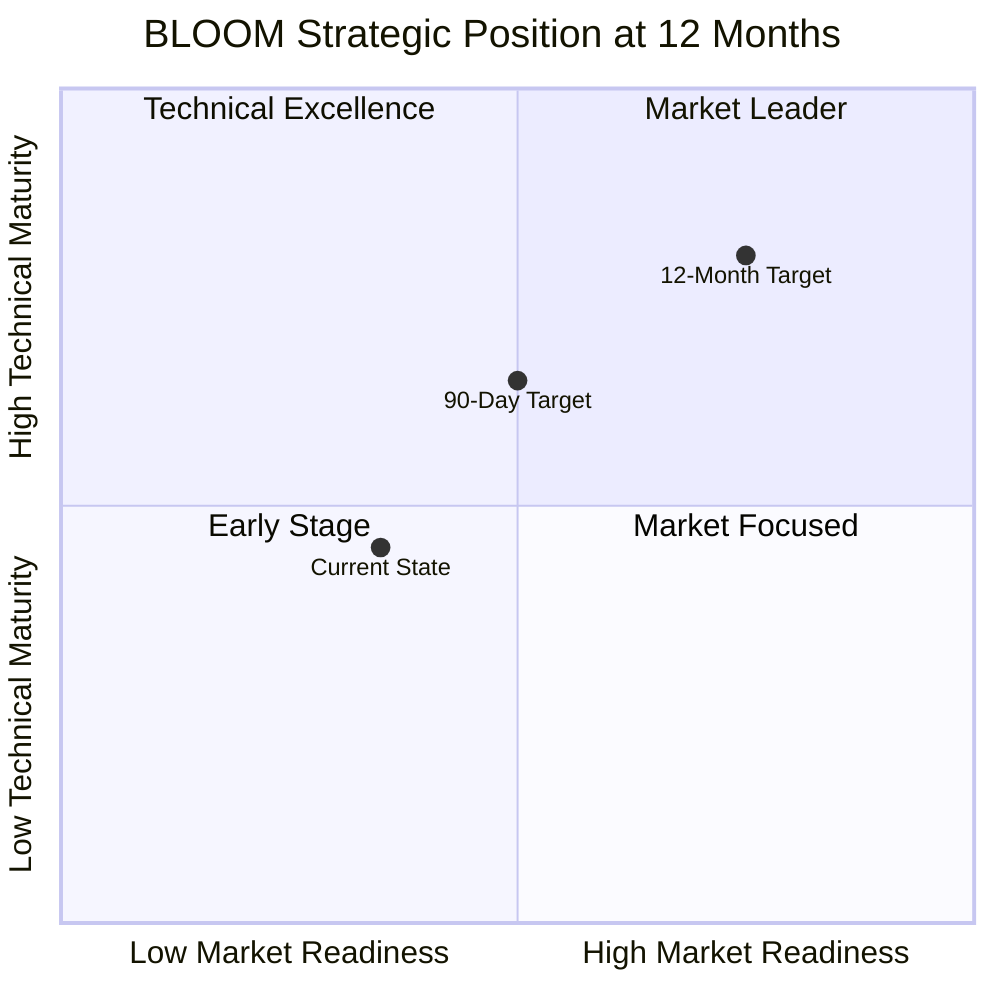

# BLOOM LIMS: Timeframe-Based Strengths & Weaknesses Analysis

**Document Version:** 1.0  
**Analysis Date:** 2024-12-23  
**Product Version:** v0.10.12 (POC)

---

## Executive Summary

This document provides a strategic assessment of BLOOM LIMS at two critical planning horizons: **90 days** (tactical/operational) and **12 months** (strategic/growth). The analysis considers the current POC state, technical debt, market positioning, and development velocity.

---

## 90-Day Horizon: Tactical Assessment

### 🟢 STRENGTHS AT 90 DAYS

| Rank | Strength | Impact | Confidence |
|------|----------|--------|------------|
| **S1** | **Functional Core Workflow Engine** | Core accessioning, specimen tracking, and queue management work end-to-end | HIGH |
| **S2** | **Template-Driven Flexibility** | New object types deployable via JSON without code changes; enables rapid lab customization | HIGH |
| **S3** | **Working Multi-Interface Stack** | Flask UI, FastAPI, and CherryPy all operational; supports diverse integration patterns | MEDIUM |
| **S4** | **OAuth2/Supabase Authentication** | Enterprise-grade auth ready; supports Google, GitHub, and other social providers | HIGH |
| **S5** | **Comprehensive Lineage Model** | Full parent-child tracking with audit trails; meets regulatory traceability requirements | HIGH |
| **S6** | **External Integration Foundation** | zebra_day (barcode printing), fedex_tracking_day functional; lab equipment ready | MEDIUM |
| **S7** | **Cross-Platform CI/CD** | GitHub Actions for macOS, Ubuntu, CentOS; automated build verification | HIGH |
| **S8** | **Operational Workflows Proven** | Accessioning → Plasma Isolation → DNA Extraction → Quant pipeline demonstrated | MEDIUM |

### 🔴 WEAKNESSES AT 90 DAYS

| Rank | Weakness | Risk Level | Mitigation Effort | Blocking? |
|------|----------|------------|-------------------|-----------|
| **W1** | **No Database Migrations (Alembic)** | CRITICAL | 2-3 weeks | YES - blocks production |
| **W2** | **Monolithic bobjs.py (3,852 lines)** | HIGH | 3-4 weeks | NO - but slows development |
| **W3** | **Inconsistent Error Handling** | HIGH | 2 weeks | YES - unpredictable failures |
| **W4** | **Session Management Issues** | HIGH | 1-2 weeks | YES - data integrity risk |
| **W5** | **No Input Validation (Pydantic)** | HIGH | 2 weeks | YES - security vulnerability |
| **W6** | **Limited Test Coverage** | MEDIUM | Ongoing | NO - but increases regression risk |
| **W7** | **Hardcoded Values in Business Logic** | MEDIUM | 2-3 weeks | NO - but limits customization |
| **W8** | **No API Versioning** | MEDIUM | 1 week | NO - but blocks client stability |
| **W9** | **Missing Health Check Endpoints** | LOW | 2-3 days | NO - but limits monitoring |
| **W10** | **Documentation Gaps** | LOW | Ongoing | NO - but slows onboarding |

### 90-Day Risk Matrix

```
LIKELIHOOD →
     HIGH │ W6 Testing    │ W2 Monolith   │
          │ W7 Hardcoded  │               │
   MEDIUM │ W8 API Ver    │ W3 Errors     │
          │ W10 Docs      │ W4 Sessions   │
     LOW  │ W9 Health     │ W1 Migrations │
          │               │ W5 Validation │
          └───────────────┴───────────────┘
               LOW            HIGH
                    ← IMPACT
```

### 90-Day Recommended Actions (Priority Order)

1. **WEEK 1-2**: Implement Alembic migrations + fix session management
2. **WEEK 3-4**: Add Pydantic input validation + standardize error handling
3. **WEEK 5-8**: Begin bobjs.py refactoring + add API versioning
4. **WEEK 9-12**: Increase test coverage to 60%+ + add health endpoints

---

## 12-Month Horizon: Strategic Assessment

### 🟢 STRENGTHS AT 12 MONTHS (Projected)

| Rank | Strength | Strategic Value | Dependency |
|------|----------|-----------------|------------|
| **S1** | **First-Principles Architecture** | Avoids common LIMS design shortcuts; sustainable long-term | None |
| **S2** | **Regulatory-Ready Design** | CLIA/CAP/HIPAA compatible structure; audit trail complete | Migrations + validation |
| **S3** | **Multi-Scale Deployment** | Designed for small labs to factory scale | Performance work |
| **S4** | **Open Source + MIT License** | Community contribution potential; no vendor lock-in | Documentation |
| **S5** | **Flexible Object Model** | Many-to-many relationships; objects in multiple workflows | None |
| **S6** | **Action System Extensibility** | Business logic changes without code deployment | Template maturity |
| **S7** | **Graph-Based Visualization** | Cytoscape integration for complex relationship exploration | None |
| **S8** | **Equipment Integration Framework** | Labware, instruments, printers abstracted cleanly | Template library |

### 🔴 WEAKNESSES AT 12 MONTHS (If Unaddressed)

| Rank | Weakness | Strategic Risk | Compounding Effect |
|------|----------|----------------|-------------------|
| **W1** | **No Caching Layer** | Performance ceiling at ~1000 concurrent users | Slows adoption |
| **W2** | **Synchronous Operations Only** | Cannot handle high-throughput lab automation | Limits factory scale |
| **W3** | **No Rate Limiting** | DoS vulnerability; cannot offer as SaaS | Security blocker |
| **W4** | **Limited Batch Operations** | Slow bulk processing; lab techs frustrated | Adoption friction |
| **W5** | **Single Database Pattern** | No read replicas; vertical scaling only | Cost escalation |
| **W6** | **No Plugin Architecture** | Custom extensions require core code changes | Community friction |
| **W7** | **Limited Reporting/Analytics** | Labs need insights; must export to external tools | Feature gap |
| **W8** | **No Mobile/Tablet Optimization** | Lab environments increasingly mobile | UX limitation |
| **W9** | **Missing Workflow Orchestration** | No Airflow/Prefect integration for automation | Automation gap |
| **W10** | **Incomplete Template Library** | Limited out-of-box value for new labs | Onboarding friction |

### 12-Month Strategic Position Matrix



---

## Comparative Analysis: 90 Days vs 12 Months

### Strength Evolution

| Strength Area | 90-Day State | 12-Month State (If Roadmap Executed) |
|---------------|--------------|--------------------------------------|
| **Core Functionality** | Working POC | Production-hardened |
| **Regulatory Compliance** | Structure exists | Validated & documented |
| **Scalability** | Single-instance | Horizontally scalable |
| **Integration Ecosystem** | 2 integrations | 10+ integrations |
| **Community** | Solo developer | Active contributors |
| **Documentation** | Sparse | Comprehensive |
| **Test Coverage** | ~30% estimated | 80%+ with integration tests |

### Weakness Resolution Timeline

| Weakness | 90-Day Fix Feasible? | 12-Month Resolution | Investment Required |
|----------|---------------------|---------------------|---------------------|
| No Migrations | ✅ YES | Resolved | 2-3 weeks |
| Monolithic Code | 🟡 PARTIAL | Resolved | 8-12 weeks |
| Error Handling | ✅ YES | Resolved | 2 weeks |
| Session Mgmt | ✅ YES | Resolved | 1-2 weeks |
| Input Validation | ✅ YES | Resolved | 2 weeks |
| No Caching | ❌ NO | Resolved | 4-6 weeks |
| Async Operations | ❌ NO | Resolved | 8-12 weeks |
| Rate Limiting | 🟡 PARTIAL | Resolved | 2-3 weeks |
| Batch Operations | ❌ NO | Resolved | 4-6 weeks |
| Plugin Architecture | ❌ NO | Designed, partial impl | 12+ weeks |

---

## Risk Assessment Summary

### 90-Day Critical Risks

1. **Production Deployment Blocked** - Without migrations and validation, production use is unsafe
2. **Data Integrity** - Session management issues could cause silent data corruption
3. **Security Exposure** - No input validation = injection vulnerabilities
4. **Developer Velocity** - Monolithic code slows feature development

### 12-Month Strategic Risks

1. **Market Window** - Competitors with similar flexibility may emerge
2. **Scale Ceiling** - Cannot serve high-throughput labs without async + caching
3. **Community Growth** - Documentation gaps prevent open-source contribution
4. **Enterprise Adoption** - Missing features (SSO beyond OAuth, audit exports, compliance reports)

---

## Investment Recommendations

### 90-Day Investment (Minimum Viable Production)

| Category | Effort | Priority |
|----------|--------|----------|
| Database Migrations | 2-3 weeks | P0 |
| Input Validation | 2 weeks | P0 |
| Error Handling | 2 weeks | P0 |
| Session Management | 1-2 weeks | P0 |
| Test Coverage (60%) | 4 weeks | P1 |
| API Versioning | 1 week | P1 |
| **Total** | **~12 weeks** | |

### 12-Month Investment (Market-Ready Product)

| Category | Effort | Priority |
|----------|--------|----------|
| 90-Day Items | 12 weeks | P0 |
| Code Refactoring | 8 weeks | P1 |
| Caching Layer | 4 weeks | P1 |
| Async Operations | 8 weeks | P2 |
| Batch APIs | 4 weeks | P2 |
| Plugin System Design | 6 weeks | P2 |
| Template Library | 8 weeks | P2 |
| Documentation | Ongoing | P1 |
| **Total** | **~50 weeks (1 FTE)** | |

---

## Conclusion

**At 90 Days:** BLOOM has a solid conceptual foundation and working POC, but requires immediate attention to database migrations, input validation, and error handling before any production deployment. The template-driven architecture is a genuine differentiator.

**At 12 Months:** With sustained investment, BLOOM can become a competitive open-source LIMS option for regulated laboratories. The key risks are execution speed (solo developer) and the need for caching/async to support scale. The open-source model and first-principles design provide a defensible position.

### Go/No-Go Criteria

| Milestone | 90-Day Criteria | 12-Month Criteria |
|-----------|-----------------|-------------------|
| Production | Migrations + Validation + Error Handling | All 90-day + 80% test coverage |
| Scale | N/A (not required at 90 days) | Caching + Async + Rate Limiting |
| Enterprise | OAuth working | SSO + Audit Exports + Compliance Reports |
| Community | README complete | Full docs + Contributor guide + Template library |

---

*Analysis prepared for strategic planning purposes. Estimates based on single experienced developer; team scaling would compress timelines.*

