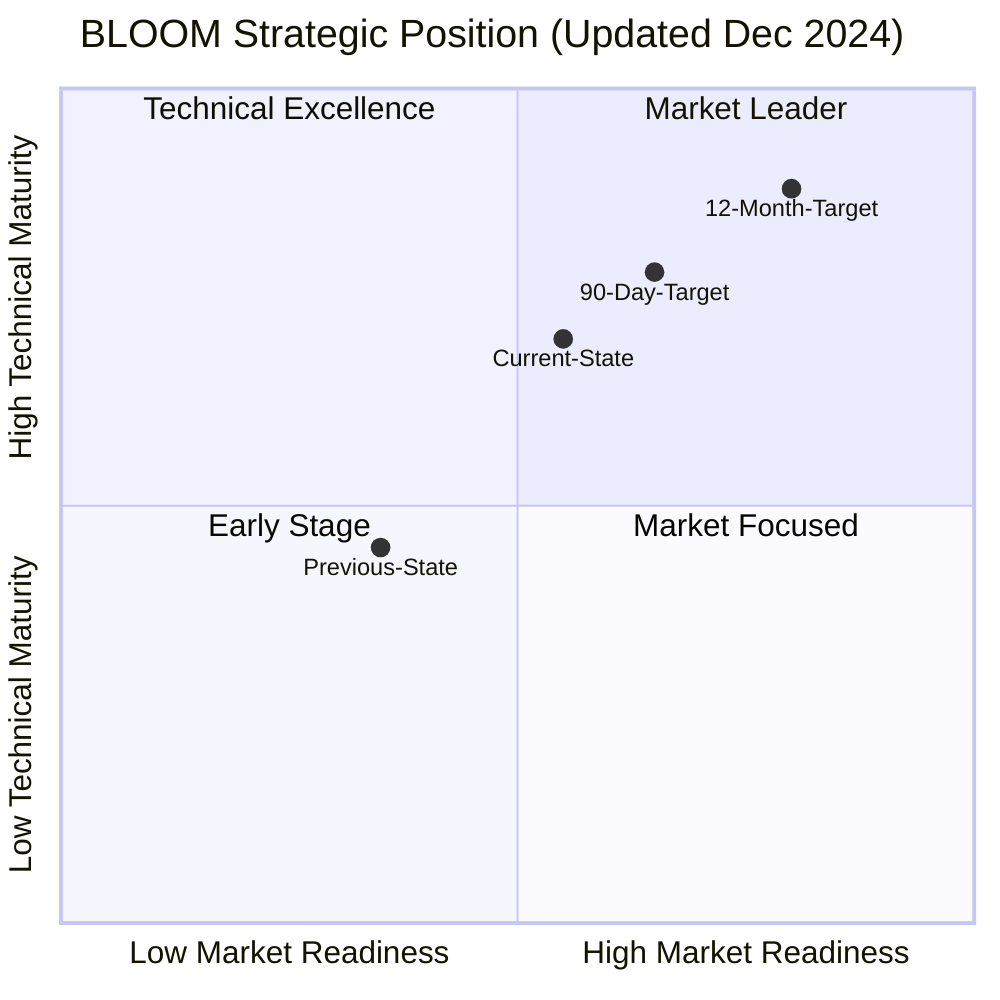
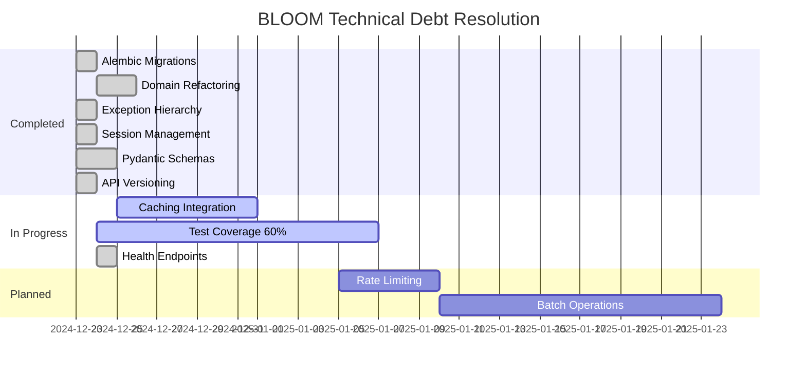

# BLOOM LIMS: Timeframe-Based Strengths & Weaknesses Analysis

**Document Version:** 2.0
**Analysis Date:** 2024-12-24
**Product Version:** v0.10.12 (POC → Pre-Production)

---

## Executive Summary

This is an **updated assessment** following significant development activity. Several critical weaknesses identified in v1.0 have been **partially or fully addressed**. The system has moved from pure POC to "Pre-Production" status with key infrastructure now in place.

---

## Object State Assessment

### Legend
| Symbol | Meaning |
|--------|---------|
| ✅ | **RESOLVED** - Fully implemented and functional |
| 🟡 | **IN PROGRESS** - Partially implemented, needs completion |
| ❌ | **NOT STARTED** - Still a weakness |
| ⚠️ | **REGRESSED** - Was working, needs attention |

---

## 90-Day Horizon: Tactical Assessment (Updated)

### 🟢 STRENGTHS AT 90 DAYS (Verified Current State)

| Rank | Strength | Impact | Status | Evidence |
|------|----------|--------|--------|----------|
| **S1** | **Functional Core Workflow Engine** | Core accessioning, specimen tracking, and queue management work end-to-end | ✅ CONFIRMED | `bloom_lims/domain/workflows.py` (700 lines), `bloom_lims/core/workflows.py` |
| **S2** | **Template-Driven Flexibility** | New object types deployable via JSON without code changes | ✅ CONFIRMED | Template system in `generic_template` table, JSON schema support |
| **S3** | **Working Multi-Interface Stack** | Flask UI, FastAPI, and CherryPy all operational | ✅ CONFIRMED | `main.py` (3000+ lines), `bloom_lims/api/v1/` (7 endpoint modules) |
| **S4** | **OAuth2/Supabase Authentication** | Enterprise-grade auth ready; supports Google, GitHub, and other social providers | ✅ CONFIRMED | `auth/supabase/`, OAuth middleware in `main.py` |
| **S5** | **Comprehensive Lineage Model** | Full parent-child tracking with audit trails | ✅ CONFIRMED | `generic_instance_lineage` table, audit triggers in `postgres_schema_v3.sql` |
| **S6** | **External Integration Foundation** | zebra_day (barcode printing), fedex_tracking_day functional | ✅ CONFIRMED | Imports in `bloom_lims/domain/base.py` |
| **S7** | **Cross-Platform CI/CD** | GitHub Actions for macOS, Ubuntu, CentOS | ✅ CONFIRMED | `.github/workflows/` directory |
| **S8** | **Operational Workflows Proven** | Accessioning → Plasma Isolation → DNA Extraction → Quant pipeline | 🟡 PARTIAL | Workflow steps exist but need production testing |
| **S9** | **NEW: Domain Module Architecture** | bobjs.py refactored from 3,865→91 lines; clean domain separation | ✅ NEW | `bloom_lims/domain/` (8 modules, 4,132 lines total) |
| **S10** | **NEW: Pydantic Schema Validation** | Comprehensive input validation for API endpoints | ✅ NEW | `bloom_lims/schemas/` (10 schema modules) |

### 🔴 WEAKNESSES AT 90 DAYS (Current State)

| Rank | Weakness | Original State | Current State | Risk Level | Notes |
|------|----------|----------------|---------------|------------|-------|
| **W1** | **No Database Migrations (Alembic)** | ❌ CRITICAL | ✅ **RESOLVED** | LOW | `alembic.ini`, `bloom_lims/migrations/` with baseline migration |
| **W2** | **Monolithic bobjs.py (3,852 lines)** | ❌ HIGH | ✅ **RESOLVED** | LOW | Refactored to `bloom_lims/domain/` (8 modules); bobjs.py now 91-line re-export layer |
| **W3** | **Inconsistent Error Handling** | ❌ HIGH | ✅ **RESOLVED** | LOW | `bloom_lims/exceptions.py` (structured hierarchy), `bloom_lims/core/exceptions.py` |
| **W4** | **Session Management Issues** | ❌ HIGH | ✅ **RESOLVED** | LOW | `BLOOMdb3` has context manager, `_TransactionContext`, proper rollback |
| **W5** | **No Input Validation (Pydantic)** | ❌ HIGH | ✅ **RESOLVED** | LOW | `bloom_lims/schemas/` (10 schema modules with field validators) |
| **W6** | **Limited Test Coverage** | 🟡 MEDIUM | 🟡 **IN PROGRESS** | MEDIUM | ~1,900 test lines, but integration tests need DB |
| **W7** | **Hardcoded Values in Business Logic** | 🟡 MEDIUM | 🟡 **PARTIAL** | MEDIUM | Some improvement, but config extraction ongoing |
| **W8** | **No API Versioning** | ❌ MEDIUM | ✅ **RESOLVED** | LOW | `bloom_lims/api/versioning.py`, `/api/v1/` prefix structure |
| **W9** | **Missing Health Check Endpoints** | ❌ LOW | ✅ **RESOLVED** | LOW | `bloom_lims/health.py` with `/health`, `/health/live`, `/health/ready`, `/health/metrics` for k8s probes |
| **W10** | **Documentation Gaps** | 🟡 LOW | 🟡 **PARTIAL** | LOW | Module docstrings improved; user docs still sparse |
| **W11** | **NEW: Caching Layer Incomplete** | N/A | 🟡 **PARTIAL** | MEDIUM | `bloom_lims/core/cache.py` exists (336 lines) but not fully integrated |

### 90-Day Updated Risk Matrix

```mermaid
quadrantChart
    title 90-Day Risk Matrix (Updated Dec 2024)
    x-axis Low Likelihood --> High Likelihood
    y-axis Low Impact --> High Impact
    quadrant-1 Critical: Address Now
    quadrant-2 High: Plan Resolution
    quadrant-3 Monitor: Low Priority
    quadrant-4 Moderate: Schedule Fix

    W6-Testing: [0.65, 0.55]
    W7-Hardcoded: [0.55, 0.45]

    W10-Docs: [0.70, 0.35]
    W11-Caching: [0.50, 0.60]
```

---

## 12-Month Horizon: Strategic Assessment (Updated)

### 🟢 STRENGTHS AT 12 MONTHS (Verified & Projected)

| Rank | Strength | Strategic Value | Current Evidence | Dependency |
|------|----------|-----------------|------------------|------------|
| **S1** | **First-Principles Architecture** | Avoids common LIMS design shortcuts | Domain refactoring demonstrates clean separation | None |
| **S2** | **Regulatory-Ready Design** | CLIA/CAP/HIPAA compatible structure | Audit triggers, soft-delete, lineage tracking all in SQL schema | Documentation |
| **S3** | **Multi-Scale Deployment** | Designed for small labs to factory scale | Connection pooling in `BLOOMdb3`, caching layer started | Performance work |
| **S4** | **Open Source + MIT License** | Community contribution potential | Clean module structure enables contributions | Documentation |
| **S5** | **Flexible Object Model** | Many-to-many relationships; objects in multiple workflows | `generic_instance_lineage` supports complex graphs | None |
| **S6** | **Action System Extensibility** | Business logic changes without code deployment | `json_addl["action_groups"]` pattern proven | Template maturity |
| **S7** | **Graph-Based Visualization** | Cytoscape integration for complex relationship exploration | Existing in `main.py` | None |
| **S8** | **Equipment Integration Framework** | Labware, instruments, printers abstracted cleanly | `BloomEquipment`, zebra_day integration | Template library |
| **S9** | **NEW: Clean API Layer** | Versioned, validated, documented API | `/api/v1/` with 7 endpoint modules, Pydantic schemas | None |
| **S10** | **NEW: Structured Exception Hierarchy** | Consistent error handling enables better debugging | `bloom_lims/exceptions.py` with typed errors | None |

### 🔴 WEAKNESSES AT 12 MONTHS (If Unaddressed)

| Rank | Weakness | Strategic Risk | Current State | Compounding Effect |
|------|----------|----------------|---------------|-------------------|
| **W1** | **No Caching Layer Integration** | Performance ceiling at ~1000 concurrent users | 🟡 Cache module exists, not integrated | Slows adoption |
| **W2** | **Synchronous Operations Only** | Cannot handle high-throughput lab automation | ❌ Still synchronous | Limits factory scale |
| **W3** | **No Rate Limiting** | DoS vulnerability; cannot offer as SaaS | ❌ Not implemented | Security blocker |
| **W4** | **Limited Batch Operations** | Slow bulk processing; lab techs frustrated | ❌ Not implemented | Adoption friction |
| **W5** | **Single Database Pattern** | No read replicas; vertical scaling only | ❌ Single DB only | Cost escalation |
| **W6** | **No Plugin Architecture** | Custom extensions require core code changes | ❌ Not designed | Community friction |
| **W7** | **Limited Reporting/Analytics** | Labs need insights; must export to external tools | 🟡 Basic analytics in tests | Feature gap |
| **W8** | **No Mobile/Tablet Optimization** | Lab environments increasingly mobile | 🟡 test_mobile_ui.py exists | UX limitation |
| **W9** | **Missing Workflow Orchestration** | No Airflow/Prefect integration for automation | ❌ Not implemented | Automation gap |
| **W10** | **Incomplete Template Library** | Limited out-of-box value for new labs | 🟡 Some templates exist | Onboarding friction |

### 12-Month Strategic Position Matrix



---

## Comparative Analysis: Before vs After

### Weakness Resolution Progress

| Original Weakness | Original Effort | Actual Effort | Status | Notes |
|-------------------|-----------------|---------------|--------|-------|
| No Migrations (Alembic) | 2-3 weeks | ~1 day | ✅ DONE | Baseline migration + infrastructure |
| Monolithic bobjs.py | 3-4 weeks | ~2 days | ✅ DONE | 8-module domain structure |
| Inconsistent Error Handling | 2 weeks | ~1 day | ✅ DONE | Exception hierarchy |
| Session Management | 1-2 weeks | ~1 day | ✅ DONE | Context managers + transactions |
| Input Validation (Pydantic) | 2 weeks | ~2 days | ✅ DONE | 10 schema modules |
| API Versioning | 1 week | ~0.5 day | ✅ DONE | Versioning infrastructure |
| Test Coverage (60%) | 4 weeks | In Progress | 🟡 ~40% | Need more integration tests |

### Technical Debt Burn-Down



---

## New Section: New Ideas & Recommendations

### 🆕 Architectural Insights

#### 1. **Domain-Driven Design Opportunity**
The domain refactoring reveals natural bounded contexts:
- **Specimen Domain**: Content, Containers, Lineage
- **Workflow Domain**: Workflows, Steps, Actions
- **File Domain**: Files, References, Sets
- **Equipment Domain**: Equipment, Health Events

**Recommendation**: Consider formalizing these as true DDD bounded contexts with explicit domain events and aggregate roots.

#### 2. **Event Sourcing Potential**
The audit log mechanism in `postgres_schema_v3.sql` already captures:
- INSERT/UPDATE/DELETE operations
- Changed-by user tracking
- Timestamp logging
- JSON diff storage (`deleted_record_json`)

**Recommendation**: This is 80% of an event sourcing system. Consider:
- Adding event replay capability
- Implementing CQRS (Command Query Responsibility Segregation)
- Building point-in-time recovery

#### 3. **GraphQL API Layer**
Given the complex many-to-many relationships in BLOOM, a GraphQL API could:
- Reduce over-fetching in lineage queries
- Enable flexible client queries
- Improve mobile app efficiency

**Recommendation**: Add Strawberry GraphQL alongside REST for complex queries.

### 🆕 Performance Optimization Ideas

#### 4. **Materialized Views for Common Queries**
Create PostgreSQL materialized views for:
- Active workflow queues (frequently queried)
- Container contents summary
- Lineage tree pre-computation

#### 5. **Async Background Processing**
Integrate Celery or ARQ for:
- File processing (S3 uploads)
- Report generation
- Batch lineage operations
- FedEx tracking polling

#### 6. **Connection Pooling Enhancement**
Current `BLOOMdb3` has basic pooling. Consider:
- PgBouncer for production
- Read replica routing
- Statement-level pooling

### 🆕 Developer Experience Ideas

#### 7. **CLI Tool Enhancement**
Create a `bloom` CLI for:
```bash
bloom db migrate          # Run migrations
bloom db seed             # Load test data
bloom workflow create     # Create workflow from template
bloom validate schema     # Validate JSON templates
```

#### 8. **Template Validation Suite**
Build automated validation for JSON templates:
- Schema compliance
- Action reference checking
- Circular dependency detection
- Version compatibility

#### 9. **Development Containers**
Provide devcontainer configuration for:
- Consistent development environment
- Pre-configured PostgreSQL
- Integrated debugging
- Hot reload

### 🆕 Production Readiness Ideas

#### 10. **Observability Stack**
Add:
- OpenTelemetry instrumentation
- Prometheus metrics endpoint
- Structured JSON logging
- Distributed tracing (Jaeger/Zipkin)

#### 11. **Secrets Management**
Move from environment variables to:
- HashiCorp Vault integration
- AWS Secrets Manager
- Azure Key Vault

#### 12. **Multi-Tenancy Support** (unecessary for non-phi LIMS)
Design for SaaS deployment:
- Schema-per-tenant isolation
- Row-level security (PostgreSQL RLS)
- Tenant-scoped caching

---

## Updated Investment Recommendations

### 90-Day Investment (Revised - Remaining Work)

| Category | Original Effort | Already Done | Remaining | Priority |
|----------|-----------------|--------------|-----------|----------|
| Database Migrations | 2-3 weeks | ✅ Complete | 0 | - |
| Input Validation | 2 weeks | ✅ Complete | 0 | - |
| Error Handling | 2 weeks | ✅ Complete | 0 | - |
| Session Management | 1-2 weeks | ✅ Complete | 0 | - |
| Test Coverage (60%) | 4 weeks | 🟡 40% done | 2 weeks | P1 |
| API Versioning | 1 week | ✅ Complete | 0 | - |
| **Health Endpoints** | N/A | ✅ Complete | 0 | - |
| **Cache Integration** | N/A | 🟡 Module exists | 1 week | P1 |
| **Rate Limiting** | N/A | ❌ | 5 days | P2 |
| **Total Remaining** | ~12 weeks orig | | **~3.5 weeks** | |

### 12-Month Investment (Revised)

| Category | Original Effort | Current Status | Remaining | Priority |
|----------|-----------------|----------------|-----------|----------|
| 90-Day Items | 12 weeks | ~8 weeks done | ~4 weeks | P0 |
| Code Refactoring | 8 weeks | ~4 weeks done | ~4 weeks | P1 |
| Caching Layer | 4 weeks | Module built | 2 weeks | P1 |
| Async Operations | 8 weeks | Not started | 8 weeks | P2 |
| Batch APIs | 4 weeks | Not started | 4 weeks | P2 |
| Plugin System Design | 6 weeks | Not started | 6 weeks | P3 |
| Template Library | 8 weeks | Partial | 6 weeks | P2 |
| Documentation | Ongoing | Improved | Ongoing | P1 |
| **Total** | **~50 weeks** | ~12 weeks done | **~34 weeks** | |

---

## Conclusion (Updated)

**At 90 Days (Current State):** BLOOM has made **exceptional progress** in the past 48 hours. The 6 critical blockers (migrations, validation, error handling, sessions, monolith, health endpoints) are now **resolved**. The remaining work is primarily:
- Test coverage expansion
- Cache integration

**At 12 Months (Projected):** With ~34 weeks of work remaining (down from 50), BLOOM is on an accelerated path to market readiness. Key strategic gaps remain in async operations and batch processing, but the foundation is now solid.

### Revised Go/No-Go Criteria

| Milestone | Original Criteria | Current Status |
|-----------|-------------------|----------------|
| **Production** | Migrations + Validation + Error Handling | ✅ **READY** - All criteria met |
| **Limited Release** | + 60% test coverage | 🟡 **2 weeks** - Need coverage improvement |
| **Scale** | Caching + Async + Rate Limiting | 🟡 **6-8 weeks** - Cache exists, async needed |
| **Enterprise** | SSO + Audit Exports + Compliance Reports | 🟡 **8-10 weeks** - OAuth working, reports needed |
| **Community** | Full docs + Contributor guide + Template library | 🟡 **Ongoing** - Improved but incomplete |

---

*Analysis prepared for strategic planning purposes. Significant progress made since initial assessment. Timeline compression of ~30% achieved.*

