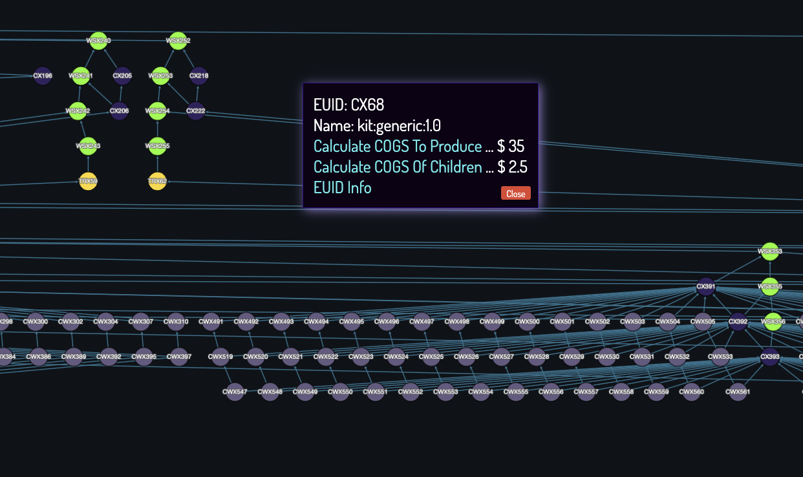
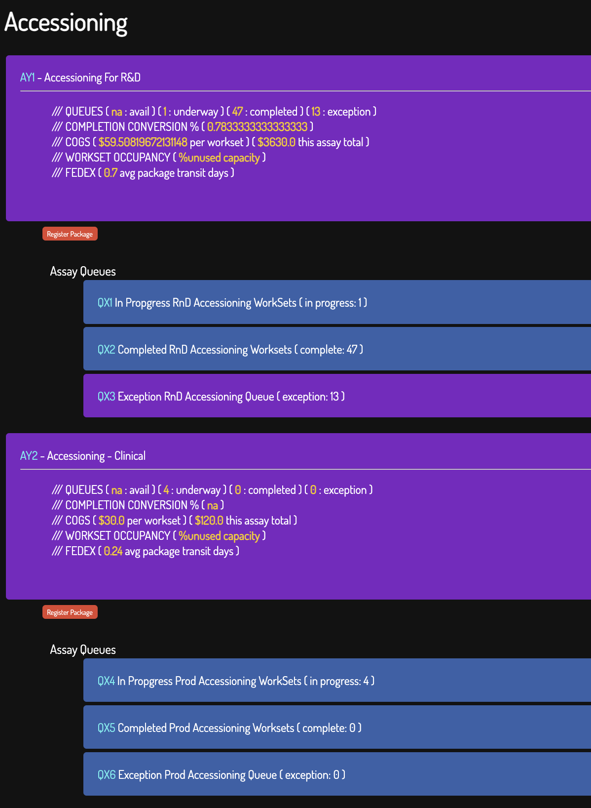
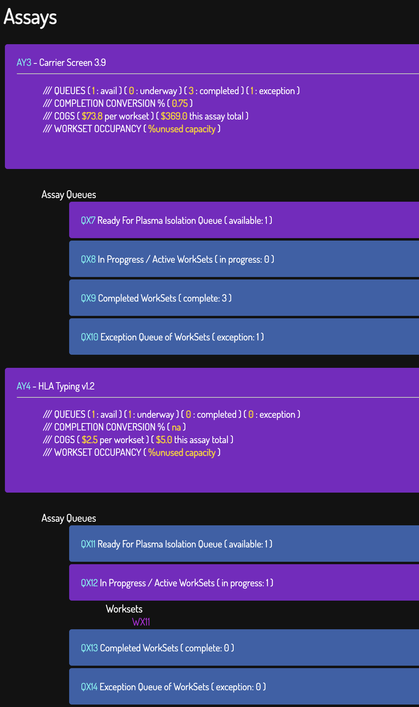
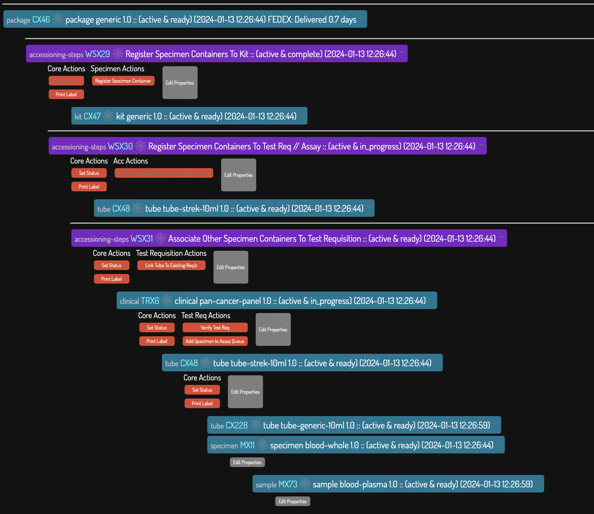
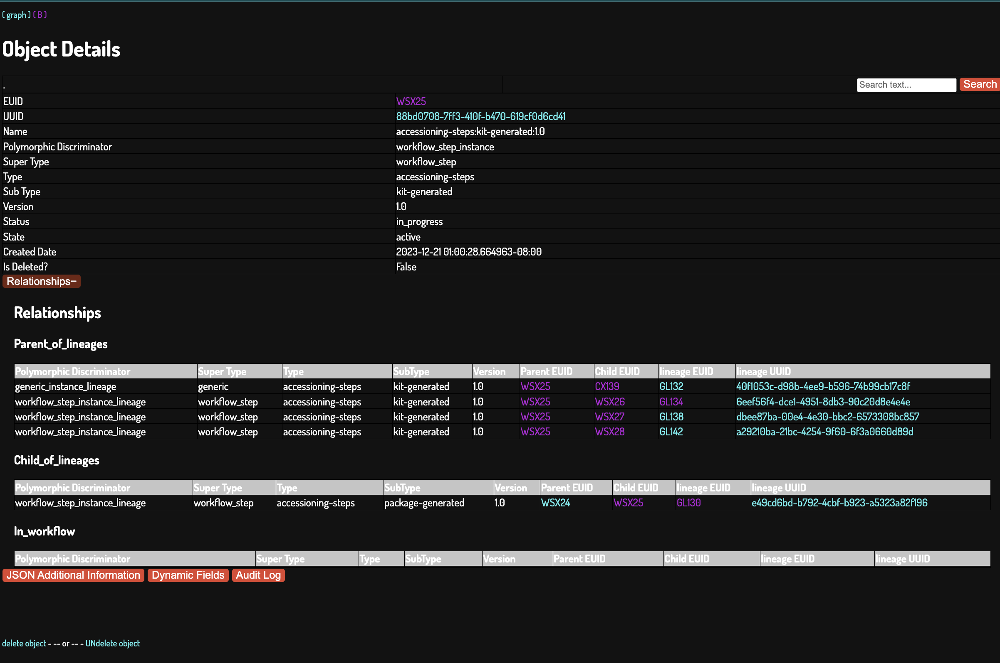
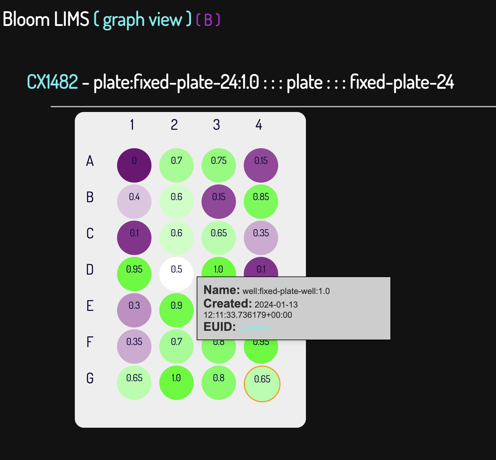
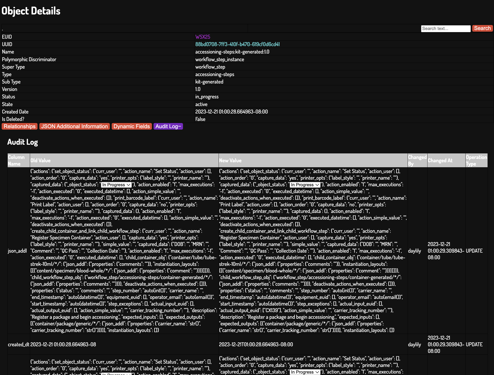
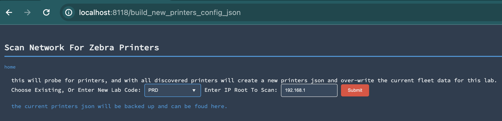
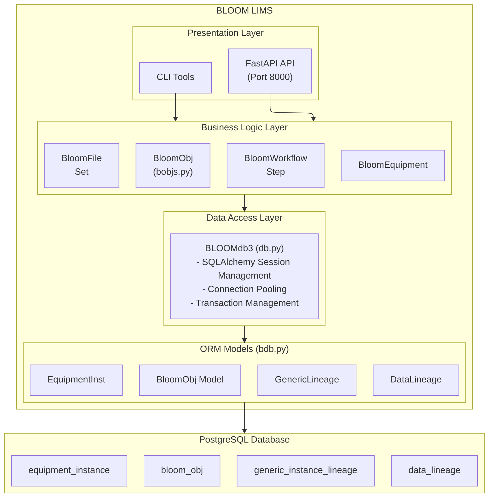
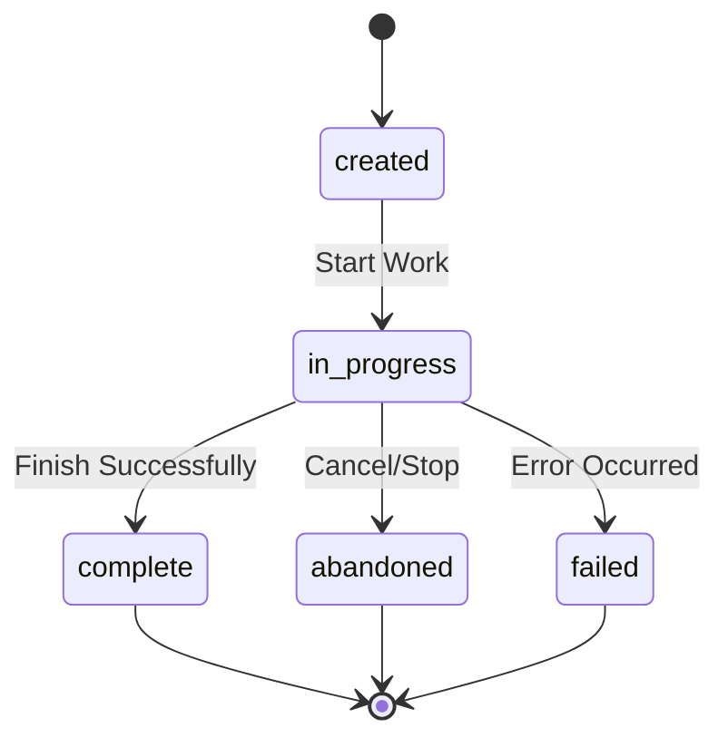

# Bloom: Templated Abstract Polymorphic (and opinionated) LIMS
_A conceptual gambit in collaboration with AI_ /// _Pre-Production Release_

[](https://github.com/Daylily-Informatics/bloom/actions/workflows/macos.yaml) [](https://github.com/Daylily-Informatics/bloom/actions/workflows/ubuntu.yaml)

> **Version**: Dynamically fetched from [GitHub Releases](https://github.com/Daylily-Informatics/bloom/releases) (current: v0.10.7)

Built from first principles and drawing upon 30 years experience scaling laboratory process. Constructed with as few object model shortcuts as I could manage (I believe these shortcuts are among the main reasons LIMS nearly universally disappoint). Supporting both arbitrary and prescribed interacting objects. Intended for use: by small to factory scale laboratories, in regulated environments, for both research & operations use cases. Bloom can handle multiple areas LIS tend to touch: accessioning, lab processes, specimen/sample management, equipment, regulatory and compliance.

---

## Table of Contents
1. [Spoilers (Screenshots)](#spoilers)
2. [Executive Summary](#executive-summary)
3. [Features](#features)
4. [Installation](#installation)
5. [System Architecture](#system-architecture)
6. [Core Data Model](#core-data-model)
7. [Database Schema](#database-schema)
8. [Object Hierarchy](#object-hierarchy)
9. [Template System](#template-system)
10. [Workflow Engine](#workflow-engine)
11. [Action System](#action-system)
12. [File Management](#file-management)
13. [API Layer](#api-layer)
14. [Web Interface](#web-interface)
15. [External Integrations](#external-integrations)
16. [Configuration](#configuration)
17. [Deployment](#deployment)
18. [Testing](#testing)
19. [Regulatory & Compliance](#regulatory--compliance)
20. [Design Principles](#design-principles)
21. [Dev Tools](#dev-tools)
22. [Support, Authors & License](#support)

---

## Spoilers
_bloom early peeks_

### Oauth2 Authentication w/All Major Social Providers
_and flexible whitelisting, etc..._
* [Bloom supabase config](bloom_lims/docs/supabase.md).

### Graph Object View (add, remove, edit, take actions, explore)

#### Interactive, Dynamic Metrics


### Accessioning Modalities


### Nested Assay / Queue / Workset


### Instantiate Objects From Available Templates


### Object Detail


### Specialized Object Detail Views

#### Labware (ie: a 96w plate)
_bloom natively will support arbitrarily defined labware, a 96w plate is just one example. Anything that nested arrays of arrays can describe can be configured as a type of labware with next to no effort!_


### Exhaustive & Comprehensive Audit Trails (+soft deletes only)


### Bells And Whistles

* [Integrated with FedEx tracking for entered fedex barcodes](https://github.com/Daylily-Informatics/fedex_tracking_day).

#### Integrated Barcode Label Printing For All Objects
* [See detailed docs here](bloom_lims/docs/printer_config.md).

  > 

  * [Leverages the zebra_day library](https://github.com/Daylily-Informatics/zebra_day).

### Workflows Available
#### Accessioning
> Package receipt -> kits registration (multiple) -> specimen registration (multiple) -> requisition capture & association -> adding specimens to assay queues.
> Fedex tracking details fetched, barcode printing available.
#### Plasma Isolation -> DNA Extraction -> DNA Quant
> managing all object relationships, tracking all details, printing labels, etc.

---

## Executive Summary

BLOOM (Bioinformatics Laboratory Operations and Object Management) is a Laboratory Information Management System (LIMS) designed for managing laboratory workflows, sample tracking, and data management. The system is built on a flexible, template-driven architecture that allows laboratories to define custom object types, workflows, and actions without code changes.

### Key Features
- **Template-driven object creation**: All laboratory objects (containers, samples, workflows) are created from JSON templates
- **Hierarchical lineage tracking**: Parent-child relationships between all objects with full audit trail
- **Flexible workflow engine**: Configurable multi-step workflows with queue management
- **Action system**: Extensible action framework for object state transitions and operations
- **File management**: S3-compatible file storage with metadata tracking
- **Barcode/label printing**: Integration with Zebra label printers via zebra_day
- **FedEx tracking**: Package tracking integration via fedex_tracking_day
- **Multi-interface support**: FastAPI REST API and standard+admin user web page

### Technology Stack
- **Language**: Python 3.12+
- **Database**: PostgreSQL 15+ (via SQLAlchemy ORM)
- **Web Frameworks**: FastAPI (primary)
- **Storage**: AWS S3 / Supabase Storage
- **Authentication**: Supabase Auth (OAuth2 with social providers)
- **Label Printing**: zebra_day library
- **Package Tracking**: fedex_tracking_day library
- **Validation**: Pydantic v2 with pydantic-settings
- **Migrations**: Alembic

---

## Features

### Completed ✅

#### Core Infrastructure
- **Domain-Driven Architecture**: Clean separation into 8 domain modules (`bloom_lims/domain/`)
- **Database Migrations**: Alembic integration with baseline migration (`bloom_lims/migrations/`)
- **Pydantic Schema Validation**: 10 schema modules for comprehensive input validation (`bloom_lims/schemas/`)
- **Structured Exception Handling**: Typed exception hierarchy (`bloom_lims/exceptions.py`, `bloom_lims/core/exceptions.py`)
- **Session Management**: Context managers, `_TransactionContext`, proper rollback in `BLOOMdb3`
- **API Versioning**: `/api/v1/` prefix structure with version negotiation (`bloom_lims/api/versioning.py`)
- **Health Check Endpoints**: Kubernetes-ready probes at `/health`, `/health/live`, `/health/ready`, `/health/metrics`
- **Dynamic Version Management**: Version pulled from GitHub releases (`bloom_lims/_version.py`)

#### Workflow Engine
- **Template-Driven Object Creation**: All objects created from JSON templates without code changes
- **Hierarchical Lineage Tracking**: Full parent-child relationships with comprehensive audit trail
- **Multi-Step Workflow Engine**: Configurable workflows with queue management
- **Action System**: Extensible framework for object state transitions and operations
- **Operational Workflows**: Accessioning → Plasma Isolation → DNA Extraction → Quant pipeline

#### Authentication & Security
- **OAuth2/Supabase Authentication**: Enterprise-grade auth with Google, GitHub, and social providers
- **Domain Whitelisting**: Flexible access control configuration
- **JWT Token Validation**: Secure API authentication

#### File Management
- **S3-Compatible Storage**: AWS S3 and Supabase Storage support
- **File Sets**: Grouping related files with metadata tracking
- **Dewey File Manager**: Organized file intake, storage, and retrieval system

#### External Integrations
- **Zebra Label Printing**: Full barcode printing via zebra_day library
- **FedEx Tracking**: Package tracking integration via fedex_tracking_day
- **Graph Visualization**: Cytoscape integration for complex relationship exploration

#### Developer Experience
- **Cross-Platform CI/CD**: GitHub Actions for macOS, Ubuntu, CentOS
- **Comprehensive Logging**: Structured logging with rotation
- **CLI Tools**: `bloom-backup`, `bloom` command-line interfaces
- **Interactive Shell**: `bloom_shell.py` for development

### In Queue 📋

#### Performance & Scale
- [ ] **Caching Layer Integration**: Redis/memcached integration (module exists at `bloom_lims/core/cache.py`)
- [ ] **Async Operations**: Non-blocking operations for high-throughput automation
- [ ] **Rate Limiting**: API request limiting middleware
- [ ] **Batch Operations**: Bulk processing API endpoints
- [ ] **Read Replicas**: Database scaling with read replicas

#### Features
- [ ] **Plugin Architecture**: Custom extensions without core code changes
- [ ] **Workflow Orchestration**: Airflow/Prefect integration for automation
- [ ] **Enhanced Reporting/Analytics**: Built-in insights and dashboards
- [ ] **Mobile/Tablet Optimization**: Responsive lab-friendly interface
- [ ] **GraphQL API**: Flexible queries for complex many-to-many relationships

#### Infrastructure
- [ ] **Multi-Tenancy Support**: Schema-per-tenant isolation
- [ ] **Secrets Management**: HashiCorp Vault / AWS Secrets Manager integration
- [ ] **Observability Stack**: OpenTelemetry, Prometheus metrics, distributed tracing
- [ ] **Development Containers**: devcontainer configuration for consistent environments

#### Content
- [ ] **Template Library Expansion**: More out-of-box templates for common lab workflows
- [ ] **User Documentation**: Comprehensive guides and tutorials
- [ ] **Contributor Guide**: Documentation for community contributions

---

## 2. System Architecture
 
### 2.1 High-Level Architecture



### 2.2 Module Organization

```
bloom_lims/
├── bdb.py              # SQLAlchemy ORM models and base classes
├── db.py               # Database connection and session management (BLOOMdb3)
├── bobjs.py            # Business logic classes (BloomObj, BloomWorkflow, etc.)
├── bfile.py            # File management (BloomFile, BloomFileSet)
├── bequip.py           # Equipment management (BloomEquipment)
├── env.py              # Environment configuration
├── config/             # Configuration files
│   ├── assay_config.yaml
│   └── fedex_config.yaml
└── templates/          # Jinja2 HTML templates for Flask UI
```

### 2.3 Entry Points

| Entry Point | File | Port | Purpose |
|-------------|------|------|---------|
| Flask UI | `bloom_lims/bkend/bkend.py` | 5000 | Web-based user interface |
---

## 3. Core Data Model

### 3.1 BloomObj - The Universal Object

Every entity in BLOOM is a `BloomObj`. This includes:
- **Templates**: Blueprint definitions for creating instances
- **Instances**: Actual laboratory objects created from templates
- **Containers**: Tubes, plates, wells, boxes
- **Content**: Samples, specimens, reagents
- **Workflows**: Process definitions and instances
- **Workflow Steps**: Individual steps within workflows
- **Equipment**: Laboratory instruments and devices
- **Files**: Uploaded documents and data files

### 3.2 Object Classification Hierarchy

Objects are classified using a four-level hierarchy:

```
super_type / btype / b_sub_type / version
```

**Examples:**
- `container/tube/tube-generic-10ml/1.0`
- `content/sample/blood-plasma/1.0`
- `workflow/assay/rare-mendelian/1.0`
- `workflow_step/queue/accessioning/1.0`
- `equipment/instrument/sequencer/1.0`

### 3.3 Template vs Instance

| Aspect | Template | Instance |
|--------|----------|----------|
| `is_template` | `True` | `False` |
| `template_uuid` | `NULL` | Points to template |
| Purpose | Define structure | Represent real objects |
| `json_addl` | Contains `instantiation_layouts` | Contains `properties`, `actions` |

---

## 4. Database Schema

### 4.1 Primary Tables

#### `bloom_obj` - Core Object Table

| Column | Type | Description |
|--------|------|-------------|
| `uuid` | UUID | Primary key |
| `euid` | String(34) | External unique identifier (human-readable) |
| `name` | String(400) | Object name |
| `super_type` | String(100) | Top-level classification |
| `btype` | String(100) | Object type |
| `b_sub_type` | String(100) | Object subtype |
| `version` | String(100) | Version string |
| `is_template` | Boolean | True if this is a template |
| `is_singleton` | Boolean | True if only one instance allowed |
| `template_uuid` | UUID | Reference to template (for instances) |
| `json_addl` | JSONB | Flexible JSON storage for properties, actions, etc. |
| `bstatus` | String(100) | Object status (active, complete, destroyed, etc.) |
| `bstate` | String(100) | Object state |
| `is_deleted` | Boolean | Soft delete flag |
| `created_dt` | DateTime | Creation timestamp |
| `modified_dt` | DateTime | Last modification timestamp |
| `created_by` | String | Creator username |
| `modified_by` | String | Last modifier username |
| `audit_comment` | String | Audit trail comment |
| `polymorphic_discriminator` | String | For SQLAlchemy inheritance |

#### `generic_instance_lineage` - Object Relationships

| Column | Type | Description |
|--------|------|-------------|
| `uuid` | UUID | Primary key |
| `parent_instance_uuid` | UUID | Parent object UUID |
| `child_instance_uuid` | UUID | Child object UUID |
| `relationship_type` | String | Type of relationship |
| `created_dt` | DateTime | Creation timestamp |
| `is_deleted` | Boolean | Soft delete flag |
| `polymorphic_discriminator` | String | For inheritance |

#### `equipment_instance` - Equipment Records

| Column | Type | Description |
|--------|------|-------------|
| `uuid` | UUID | Primary key |
| `euid` | String(34) | External unique identifier |
| `name` | String(400) | Equipment name |
| `equipment_type` | String(100) | Type of equipment |
| `json_addl` | JSONB | Equipment properties |
| `bstatus` | String(100) | Equipment status |
| `is_deleted` | Boolean | Soft delete flag |

#### `data_lineage` - Data Provenance

| Column | Type | Description |
|--------|------|-------------|
| `uuid` | UUID | Primary key |
| `parent_data_uuid` | UUID | Parent data UUID |
| `child_data_uuid` | UUID | Child data UUID |
| `relationship_type` | String | Type of data relationship |

### 4.2 EUID Format

The External Unique Identifier (EUID) is a 34-character string:

```
Format: XXXXXXXXXXXXXXXXXXXXXXXXXXXXXXXXXX (34 chars)
Example: 1001897582860000245100773464327825

Components:
- Timestamp-based prefix
- Random component
- Checksum suffix
```

Generated by `generate_euid()` function in `bdb.py`.

---

## 5. Object Hierarchy

### 5.1 Super Types

| Super Type | Description | Examples |
|------------|-------------|----------|
| `container` | Physical containers | tubes, plates, wells, boxes |
| `content` | Material contents | samples, specimens, reagents |
| `workflow` | Process definitions | assays, accessioning workflows |
| `workflow_step` | Workflow components | queues, processing steps |
| `equipment` | Laboratory equipment | sequencers, thermocyclers |
| `file` | Digital files | data files, reports |
| `file_set` | File collections | result sets, batch uploads |
| `data` | Data records | measurements, results |
| `control` | Control samples | positive/negative controls |
| `test_requisition` | Test orders | clinical test requests |

### 5.2 Container Types

```
container/
├── tube/
│   ├── tube-generic-10ml/1.0
│   ├── tube-cryovial/1.0
│   └── tube-blood-collection/1.0
├── plate/
│   ├── fixed-plate-24/1.0
│   ├── fixed-plate-96/1.0
│   └── fixed-plate-384/1.0
├── well/
│   └── well-standard/1.0
├── box/
│   ├── box-81-position/1.0
│   └── box-freezer/1.0
└── rack/
    └── rack-tube/1.0
```

### 5.3 Workflow Structure

```
workflow (assay instance)
├── workflow_step (queue: accessioning)
│   └── workset (batch of samples)
│       └── containers/samples
├── workflow_step (queue: extraction)
│   └── workset
│       └── containers/samples
├── workflow_step (queue: library-prep)
│   └── workset
│       └── containers/samples
└── workflow_step (queue: sequencing)
    └── workset
        └── containers/samples
```

---

## 6. Template System

### 6.1 Template JSON Structure

Templates are stored in `json_addl` with the following structure:

```json
{
  "properties": {
    "name": "Template Name",
    "description": "Template description",
    "lab_code": "LAB001"
  },
  "instantiation_layouts": [
    {
      "container/well/well-standard/1.0/": {
        "json_addl": {
          "cont_address": {
            "name": "A1",
            "row": "A",
            "col": "1"
          }
        }
      }
    }
  ],
  "actions": {},
  "action_groups": {}
}
```

### 6.2 Template Loading

Templates are loaded from JSON files in `bloom_lims/templates/` directory:

```python
# Load template from file
bobj = BloomObj(BLOOMdb3())
template = bobj.create_template_from_json_file("path/to/template.json")

# Or create from code string
template = bobj.create_template_by_code("container/plate/fixed-plate-96/1.0")
```

### 6.3 Instance Creation

```python
# Create instance from template EUID
bobj = BloomObj(BLOOMdb3())
instances = bobj.create_instances(template_euid)

# Returns: [[parent_instance], [child_instances...]]
# For a plate: [[plate], [well1, well2, ..., well96]]

# Create instance by code path
instance = bobj.create_instance_by_code(
    "container/tube/tube-generic-10ml/1.0",
    {"json_addl": {"properties": {"name": "My Tube"}}}
)
```

---

## 7. Workflow Engine

### 7.1 Workflow Components

| Component | Description | Class |
|-----------|-------------|-------|
| Workflow | Top-level process definition | `BloomWorkflow` |
| Workflow Step | Individual step/queue | `BloomWorkflowStep` |
| Workset | Batch of items in a queue | Part of workflow_step |
| Action | Operations on objects | Defined in `json_addl` |

### 7.2 Workflow Lifecycle



### 7.3 Status Values

| Status | Description |
|--------|-------------|
| `created` | Initial state after creation |
| `in_progress` | Work has started |
| `complete` | Successfully finished |
| `abandoned` | Cancelled/stopped |
| `failed` | Error occurred |
| `destroyed` | Object destroyed (containers) |
| `active` | Currently active |

### 7.4 BloomWorkflow Class

```python
class BloomWorkflow(BloomObj):
    """Manages workflow instances and their lifecycle."""

    def create_empty_workflow(self, template_euid):
        """Create a new workflow instance from template."""
        return self.create_instances(template_euid)

    def do_action(self, wf_euid, action, action_group, action_ds={}):
        """Execute an action on a workflow."""
        # Supported actions:
        # - do_action_create_and_link_child
        # - do_action_create_package_and_first_workflow_step
        # - do_action_destroy_specimen_containers
```

### 7.5 BloomWorkflowStep Class

```python
class BloomWorkflowStep(BloomObj):
    """Manages individual workflow steps and queues."""

    def do_action(self, wfs_euid, action, action_group, action_ds={}):
        """Execute an action on a workflow step."""
        # Supported actions:
        # - do_action_create_and_link_child
        # - do_action_create_input
        # - do_action_create_child_container_and_link_child_workflow_step
        # - do_action_create_test_req_and_link_child_workflow_step
        # - do_action_add_container_to_assay_q
        # - do_action_fill_plate_undirected
        # - do_action_fill_plate_directed
        # - do_action_link_tubes_auto
        # - do_action_cfdna_quant
        # - do_action_stamp_copy_plate
        # - do_action_log_temperature
```

---

## 8. Action System

### 8.1 Action Structure in json_addl

Actions are defined in the `json_addl` field of objects:

```json
{
  "action_groups": {
    "status_actions": {
      "label": "Status Actions",
      "actions": {
        "set_in_progress": {
          "label": "Start Work",
          "action_enabled": "1",
          "method_name": "do_action_set_object_status",
          "captured_data": {
            "object_status": "in_progress"
          }
        },
        "set_complete": {
          "label": "Mark Complete",
          "action_enabled": "1",
          "method_name": "do_action_set_object_status",
          "captured_data": {
            "object_status": "complete"
          }
        }
      }
    }
  },
  "actions": {
    "print_label": {
      "label": "Print Barcode Label",
      "action_enabled": "1",
      "method_name": "do_action_print_barcode_label",
      "lab": "main_lab",
      "printer_name": "zebra_1",
      "label_style": "2x1_basic"
    }
  }
}
```

### 8.2 Available Action Methods

#### Global Actions (BloomObj)

| Method | Description |
|--------|-------------|
| `do_action_set_object_status` | Change object status |
| `do_action_print_barcode_label` | Print barcode label |
| `do_action_destroy_specimen_containers` | Mark containers as destroyed |
| `do_action_create_package_and_first_workflow_step_assay` | Create package workflow |
| `do_action_move_workset_to_another_queue` | Move workset between queues |
| `do_stamp_plates_into_plate` | Stamp multiple plates into one |
| `do_action_download_file` | Download file from storage |
| `do_action_add_file_to_file_set` | Add file to file set |
| `do_action_remove_file_from_file_set` | Remove file from file set |
| `do_action_add_relationships` | Create lineage relationships |

#### Workflow Step Actions (BloomWorkflowStep)

| Method | Description |
|--------|-------------|
| `do_action_create_and_link_child` | Create child object and link |
| `do_action_create_input` | Create input object |
| `do_action_create_child_container_and_link_child_workflow_step` | Create container with workflow step |
| `do_action_create_test_req_and_link_child_workflow_step` | Create test requisition |
| `do_action_add_container_to_assay_q` | Add container to assay queue |
| `do_action_fill_plate_undirected` | Fill plate without position mapping |
| `do_action_fill_plate_directed` | Fill plate with position mapping |
| `do_action_link_tubes_auto` | Auto-link tubes |
| `do_action_cfdna_quant` | cfDNA quantification action |
| `do_action_stamp_copy_plate` | Create plate copy |
| `do_action_log_temperature` | Log temperature reading |

### 8.3 Action Execution Flow

```python
# 1. Get object and action definition
bobj = BloomObj(BLOOMdb3())
obj = bobj.get_by_euid(euid)
action_ds = obj.json_addl["action_groups"][action_group]["actions"][action]

# 2. Add captured data from user input
action_ds["captured_data"] = user_input_data
action_ds["curr_user"] = current_user

# 3. Execute action
result = bobj.do_action(euid, action, action_group, action_ds)

# 4. Action records execution in json_addl["action_log"]
```

### 8.4 Action Logging

Every action execution is logged:

```json
{
  "action_log": [
    {
      "action": "set_in_progress",
      "action_group": "status_actions",
      "timestamp": "2024-01-15T10:30:00",
      "user": "lab_tech_1",
      "captured_data": {
        "object_status": "in_progress"
      }
    }
  ]
}
```

---

## 9. File Management

### 9.1 BloomFile Class

The `BloomFile` class (`bfile.py`) manages file uploads and downloads:

```python
class BloomFile(BloomObj):
    """Manages file objects in BLOOM."""

    def upload_file(self, file_path, bucket="bloom-files", metadata=None):
        """Upload file to S3/Supabase storage."""
        # Creates BloomObj record
        # Uploads to storage bucket
        # Returns file EUID

    def download_file(self, euid, save_path="./", include_metadata=False):
        """Download file from storage."""
        # Retrieves file from storage
        # Optionally includes metadata JSON

    def get_file_metadata(self, euid):
        """Get file metadata without downloading."""
```

### 9.2 BloomFileSet Class

Groups related files together:

```python
class BloomFileSet(BloomObj):
    """Manages collections of files."""

    def create_file_set(self, name, description=None):
        """Create a new file set."""

    def add_files_to_file_set(self, euid, file_euid):
        """Add files to an existing file set."""

    def remove_files_from_file_set(self, euid, file_euid):
        """Remove files from a file set."""

    def get_files_in_set(self, euid):
        """Get all files in a file set."""
```

### 9.3 Storage Configuration

Files are stored in S3-compatible storage (AWS S3 or Supabase Storage):

```python
# Environment variables for storage
SUPABASE_URL = os.getenv("SUPABASE_URL")
SUPABASE_KEY = os.getenv("SUPABASE_KEY")
AWS_ACCESS_KEY_ID = os.getenv("AWS_ACCESS_KEY_ID")
AWS_SECRET_ACCESS_KEY = os.getenv("AWS_SECRET_ACCESS_KEY")
S3_BUCKET = os.getenv("S3_BUCKET", "bloom-files")
```

---

## 10. API Layer

### 10.1 FastAPI Endpoints

The FastAPI backend (`fastapi_bkend.py`) provides REST API access:

#### Object Operations

| Endpoint | Method | Description |
|----------|--------|-------------|
| `/api/objects/{euid}` | GET | Get object by EUID |
| `/api/objects` | POST | Create new object |
| `/api/objects/{euid}` | PUT | Update object |
| `/api/objects/{euid}` | DELETE | Soft delete object |
| `/api/objects/search` | POST | Search objects |

#### Template Operations

| Endpoint | Method | Description |
|----------|--------|-------------|
| `/api/templates` | GET | List all templates |
| `/api/templates/{euid}` | GET | Get template by EUID |
| `/api/templates/{euid}/instantiate` | POST | Create instance from template |

#### Workflow Operations

| Endpoint | Method | Description |
|----------|--------|-------------|
| `/api/workflows` | GET | List workflows |
| `/api/workflows/{euid}` | GET | Get workflow details |
| `/api/workflows/{euid}/steps` | GET | Get workflow steps |
| `/api/workflows/{euid}/action` | POST | Execute workflow action |

#### File Operations

| Endpoint | Method | Description |
|----------|--------|-------------|
| `/api/files/upload` | POST | Upload file |
| `/api/files/{euid}/download` | GET | Download file |
| `/api/files/{euid}/metadata` | GET | Get file metadata |

### 10.2 Request/Response Format

```python
# Example: Create instance from template
POST /api/templates/{template_euid}/instantiate
Content-Type: application/json

{
  "json_addl": {
    "properties": {
      "name": "Sample Tube 001",
      "lab_code": "LAB001"
    }
  }
}

# Response
{
  "success": true,
  "data": {
    "euid": "1001897582860000245100773464327825",
    "uuid": "550e8400-e29b-41d4-a716-446655440000",
    "name": "Sample Tube 001",
    "super_type": "container",
    "btype": "tube",
    "b_sub_type": "tube-generic-10ml",
    "version": "1.0",
    "bstatus": "created"
  }
}
```

### 10.3 Authentication

API authentication uses Supabase Auth:

```python
# JWT token in Authorization header
Authorization: Bearer <jwt_token>

# Token validation
from gotrue import SyncGoTrueClient
client = SyncGoTrueClient(url=SUPABASE_URL, headers={"apikey": SUPABASE_KEY})
user = client.get_user(token)
```

---

## 11. Web Interface

### 11.1 Flask Application Structure

```
bloom_lims/bkend/
├── bkend.py              # Main Flask application
├── templates/            # Jinja2 templates
│   ├── base.html
│   ├── index.html
│   ├── object_detail.html
│   ├── workflow_view.html
│   └── ...
└── static/               # Static assets
    ├── css/
    ├── js/
    └── images/
```

### 11.2 Key Routes

| Route | Description |
|-------|-------------|
| `/` | Home page / dashboard |
| `/object/<euid>` | Object detail view |
| `/workflow/<euid>` | Workflow view |
| `/search` | Search interface |
| `/templates` | Template browser |
| `/action/<euid>/<action_group>/<action>` | Action execution |
| `/print/<euid>` | Print barcode label |

### 11.3 Template Rendering

```python
@app.route('/object/<euid>')
def object_detail(euid):
    bobj = BloomObj(BLOOMdb3())
    obj = bobj.get_by_euid(euid)

    return render_template(
        'object_detail.html',
        obj=obj,
        lineages=obj.parent_of_lineages,
        actions=obj.json_addl.get('actions', {}),
        action_groups=obj.json_addl.get('action_groups', {})
    )
```

---

## 12. External Integrations

### 12.1 Zebra Label Printing (zebra_day)

BLOOM integrates with Zebra label printers for barcode printing:

```python
from zebra_day import ZebraDay

# Configuration in json_addl
{
  "actions": {
    "print_label": {
      "method_name": "do_action_print_barcode_label",
      "lab": "main_lab",
      "printer_name": "zebra_zd420",
      "label_style": "2x1_basic",
      "alt_a": "",  # Custom field A
      "alt_b": "",  # Custom field B
      "alt_c": "",  # Custom field C
    }
  }
}

# Printing execution
def print_label(self, lab, printer_name, label_zpl_style, euid, **kwargs):
    zd = ZebraDay()
    zd.print_label(
        printer=printer_name,
        template=label_zpl_style,
        data={
            "euid": euid,
            "barcode": euid,
            **kwargs
        }
    )
```

### 12.2 FedEx Tracking (fedex_tracking_day)

Package tracking integration for shipment management:

```python
from fedex_tracking_day import FedexTracker

# Get tracking information
tracker = FedexTracker()
tracking_data = tracker.get_fedex_ops_meta_ds(tracking_number)

# Returns:
{
    "tracking_number": "1234567890",
    "status": "Delivered",
    "Transit_Time_sec": 172800,
    "delivery_date": "2024-01-15",
    "events": [...]
}
```

### 12.3 Supabase Integration

BLOOM uses Supabase for:
- **Authentication**: User management and JWT tokens
- **Storage**: File storage (alternative to S3)
- **Realtime**: (Optional) Real-time updates

```python
from supabase import create_client

supabase = create_client(
    os.getenv("SUPABASE_URL"),
    os.getenv("SUPABASE_KEY")
)

# File upload
supabase.storage.from_("bloom-files").upload(
    path=f"files/{euid}/{filename}",
    file=file_data
)

# Authentication
user = supabase.auth.sign_in_with_password({
    "email": email,
    "password": password
})
```

### 12.4 AWS S3 Integration

Alternative file storage using AWS S3:

```python
import boto3

s3_client = boto3.client(
    's3',
    aws_access_key_id=os.getenv('AWS_ACCESS_KEY_ID'),
    aws_secret_access_key=os.getenv('AWS_SECRET_ACCESS_KEY')
)

# Upload file
s3_client.upload_file(
    local_path,
    bucket_name,
    f"bloom/{euid}/{filename}"
)

# Download file
s3_client.download_file(
    bucket_name,
    f"bloom/{euid}/{filename}",
    local_path
)
```

---

## 13. Configuration

### 13.1 Environment Variables

Create a `.env` file with the following variables:

```bash
# Database
BLOOM_DB_HOST=localhost
BLOOM_DB_PORT=5432
BLOOM_DB_NAME=bloom_lims
BLOOM_DB_USER=bloom_user
BLOOM_DB_PASSWORD=secure_password

# Supabase
SUPABASE_URL=https://your-project.supabase.co
SUPABASE_KEY=your-anon-key
SUPABASE_SERVICE_KEY=your-service-key

# AWS S3 (optional, alternative to Supabase storage)
AWS_ACCESS_KEY_ID=your-access-key
AWS_SECRET_ACCESS_KEY=your-secret-key
S3_BUCKET=bloom-files
S3_REGION=us-east-1

# FedEx API
FEDEX_API_KEY=your-fedex-key
FEDEX_SECRET=your-fedex-secret

# Application
FLASK_SECRET_KEY=your-flask-secret
DEBUG=false
LOG_LEVEL=INFO
```

### 13.2 Database Connection String

```python
# Constructed from environment variables
DATABASE_URL = f"postgresql://{BLOOM_DB_USER}:{BLOOM_DB_PASSWORD}@{BLOOM_DB_HOST}:{BLOOM_DB_PORT}/{BLOOM_DB_NAME}"

# Or set directly
DATABASE_URL = os.getenv("DATABASE_URL")
```

### 13.3 Printer Configuration

Printer configuration is stored in YAML files:

```yaml
# config/printers.yaml
labs:
  main_lab:
    printers:
      zebra_zd420:
        ip: 192.168.1.100
        port: 9100
        type: zpl
      zebra_zd621:
        ip: 192.168.1.101
        port: 9100
        type: zpl

    label_styles:
      2x1_basic:
        width: 2
        height: 1
        template: |
          ^XA
          ^FO50,50^BY3
          ^BCN,100,Y,N,N
          ^FD{euid}^FS
          ^FO50,180^A0N,30,30^FD{alt_a}^FS
          ^XZ
```

### 13.4 Assay Configuration

```yaml
# config/assay_config.yaml
assays:
  rare-mendelian:
    name: "Rare Mendelian Disease Panel"
    version: "1.0"
    steps:
      - name: accessioning
        queue: workflow_step/queue/accessioning/1.0
      - name: extraction
        queue: workflow_step/queue/extraction/1.0
      - name: library_prep
        queue: workflow_step/queue/library-prep/1.0
      - name: sequencing
        queue: workflow_step/queue/sequencing/1.0
```

---

## 14. Deployment

### 14.1 Docker Deployment

```dockerfile
# Dockerfile
FROM python:3.11-slim

WORKDIR /app

COPY requirements.txt .
RUN pip install --no-cache-dir -r requirements.txt

COPY . .

EXPOSE 5000 8000 8080

CMD ["python", "-m", "bloom_lims.bkend.bkend"]
```

```yaml
# docker-compose.yml
version: '3.8'

services:
  bloom-web:
    build: .
    ports:
      - "5000:5000"
    environment:
      - DATABASE_URL=postgresql://bloom:password@db:5432/bloom_lims
    depends_on:
      - db

  bloom-api:
    build: .
    command: ["uvicorn", "bloom_lims.bkend.fastapi_bkend:app", "--host", "0.0.0.0", "--port", "8000"]
    ports:
      - "8000:8000"
    environment:
      - DATABASE_URL=postgresql://bloom:password@db:5432/bloom_lims
    depends_on:
      - db

  db:
    image: postgres:15
    environment:
      - POSTGRES_USER=bloom
      - POSTGRES_PASSWORD=password
      - POSTGRES_DB=bloom_lims
    volumes:
      - postgres_data:/var/lib/postgresql/data

volumes:
  postgres_data:
```

### 14.2 Database Initialization

```bash
# Create database
createdb bloom_lims

# Initialize schema (SQLAlchemy creates tables)
python -c "from bloom_lims.db import BLOOMdb3; BLOOMdb3()"

# Load initial templates
python -c "
from bloom_lims.bobjs import BloomObj
from bloom_lims.db import BLOOMdb3

bobj = BloomObj(BLOOMdb3())
bobj.load_templates_from_directory('bloom_lims/templates/')
"
```

### 14.3 Running Services

```bash

# FastAPI (development)
uvicorn bloom_lims.bkend.fastapi_bkend:app --reload --port 8000

# Production with gunicorn
gunicorn -w 4 -b 0.0.0.0:5000 bloom_lims.bkend.bkend:app
```

---

## 15. Installation

### Hardware Supported
_see build test badges above for all supported platforms_
* Mac (14+)
  * `brew install coreutils` is required for the `gtimeout` command for some rclone functionality. Run `alias timeout=gtimeout` to use the gtimeout w/zsh.
* Ubuntu 22+
* Centos 9

### Prerequisites

#### Conda
* Conda (you may swap in mamba if you prefer). [Installing conda](https://docs.conda.io/en/latest/miniconda.html):

  * Be sure `wget` is available to you.

  *Linux*
  _a pinned version: https://repo.anaconda.com/miniconda/Miniconda3-py312_24.5.0-0-Linux-x86_64.sh_

  >  x86_64: `wget https://repo.anaconda.com/miniconda/Miniconda3-latest-Linux-x86_64.sh`

  >   arm64: `wget https://repo.anaconda.com/miniconda/Miniconda3-latest-Linux-aarch64.sh`

  *macOS*

  > intel: `wget https://repo.anaconda.com/miniconda/Miniconda3-latest-MacOSX-x86_64.sh`

  >   ARM: `wget https://repo.anaconda.com/miniconda/Miniconda3-latest-MacOSX-arm64.sh`

  * Then execute the Miniconda.sh script, follow the prompts, when installation completed, follow these last 2 steps:

```bash
~/miniconda3/bin/conda init
bash  # newly created shells should not auto load the conda (base) env.
```

#### Supabase
* [Please follow the supabase configuration instructions here](bloom_lims/docs/supabase.md).

### Very Quickest Start
_assumes you have completed the prerequisites_

```bash
# Clone the repository
git clone git@github.com:Daylily-Informatics/bloom.git
cd bloom

# This will attempt to build the conda env, install postgres, the database, build the schema and start postgres
source bloom_lims/env/install_postgres.sh

# conda activate BLOOM if it has not happened already.

# Start the Bloom LIMS UI
source run_bloomui.sh
```

### (Optional) Install & Run pgadmin4 Database Admin UI

```bash
# RUN TESTS
pytest

# START THE UIs (on localhost:8080)
source bloom_lims/env/install_pgadmin.sh
```

---

## 16. Testing

```bash
conda activate BLOOM
pytest
```

---

## 17. Regulatory & Compliance

### CLIA
* There is no reason bloom can not be used in a CLIA regulated environment.

### CAP
* Bloom can satisfy all relevant CAP checklist items which apply to it. But, as it is s/w you will be running yourself, most checklist items will be concerned with the environment you are using bloom in.

### HIPAA
* If installed in an already HIPAA compliant environment, bloom should not need much or any work to be compliant.

---

## 18. Design Principles

### Enterprise UIDs
* [stripe uuid](https://stripe.com/docs/api/identity/object#identity_object-verification-document)

#### Each Object Has A UUID & UUIDs Are Immutable & UUIDs Are Not Reused Or Applied To Other Objects
* Using a UUID on children objects for convenience will lead to a mess as the need to know details about each object is next to impossible when a UUID is assigned to multiple objects.

#### The UID Identifies The Object Class And The UUID w/in The Class
* That is all [reference regarding not putting metadata in a uuid](https://stackoverflow.com/questions/19989481/what-is-the-best-way-to-store-metadata-for-a-file-in-postgresql)

#### Exhaustive Metadata About An Object May Be Queried Using The Enterprise UUID.
##### Metadata may also be printed on labels along with the UUID.
* Keeping metadata out of the UUID formula is a fundamental requirement in building flexible and scalable systems. FUNDAMENTAL.

#### Trust The Database To Manage The UUIDs

### Clear And Concise Data Model

### TSV's not CSV's
* There are few/no compelling reasons to use CSV's over TSV's & so many reasons not to use CSV's.

### All LIMS Data Editable w/CRUD UI (and noting is ever really deleted)
* It is! Fully (though with some safeguards still not in place).
  * _soft deletes need to be reviewed more closely_

### Easily Configurable Object Definitions As Well As Actions
* Requiring as little code changes as possible.

### Other Principles
* Simple
* Scalable
* Secure
* Flexible & Extensible
* Open Source
* Operationally Robust
* Free
* Sustainable
  * [as defined in the snakemake rolling paper](https://f1000research.com/articles/10-33/v1)

### Use Cases

#### Many To Many Relationships Among All Objects
All other relationships are subsets of this, and designing parts of the LIMS which disallow many to many will result in an inflexible system.

#### Objects May Be Involved In Multiple Workflows Simultaneously

#### Support For Predefined and Arbitrary Workflows

#### Objects May All Be: Root (Singleton, Parent & Able To Become A Child At Some Point), Child (Singleton, Parent And Possibly Terminal) Of One Another

#### Zero Loss Of Data (Comprehensive Audit Trails, Soft Deletes) && 100% Audit Coverage

---

## 19. Dev Tools

__note:__ all commands below are expected to be run from a shell with conda activated.
`conda activate BLOOM`

### Drop The Entire Database (Loose All Data!) > Rebuild The Database / Re-seed With All Accessible JSON Templates

**The steps are wrapped in a script, please see [clear_and_rebuild_postgres.sh](bloom_lims/env/clear_and_rebuild_postgres.sh).**

It is executed as follows:
```bash
source clear_and_rebuild_postgres.sh
```

#### Stop pgsql
- `source bloom_lims/bin/stop_bloom_db.sh`

#### Remove the db
- `rm -rf bloom_lims/database/*`

#### Rebuild the schema
-  `source bloom_lims/env/install_postgres.sh skip` the skip will skip building the conda env. This will start pgsql in the env, and build the schema.

#### Build LIMS Workflows With Autogen Objects
Similar to `pytest`, but more extensive. Largely useful in development work. The following will auto-gen 'n=2' passes of the lims schema
- `python tx.py 2`

#### Run the bloom UI
- `source run_bloomui.sh`

#### Run the pgadmin UI
- `source bloom_lims/env/install_pgadmin.sh`

#### Start Interactive Shell w/Core Bloom Objects Instantiated
`python bloom_shell.py`

### Random Notes

#### File System Case Sensitivity

##### MacOS is Not Case Sensitive
```bash
echo "test" > test.log
echo "TEST" > TEST.LOG
more test.log
# OUTPUT: TEST
more TEST.log
# OUTPUT: TEST
```
* This still shocks me & is worth a reminder.

##### Ubuntu Is Case Sensitive
```bash
echo "test" > test.log
echo "TEST" > TEST.LOG
more test.log
# OUTPUT: test
more TEST.LOG
# OUTPUT: TEST
```

##### Assume Case Insensitivity In All File Names
* Given we can not be certain where files will be reconstituted, we must assume that files might be created in a case insensitive file system when allowing download.

##### Bloom UUIDs and EUIDs Are Safe As File Names
A widely adopted UUID spec (and used by postgres), [rfc4122](https://datatracker.ietf.org/doc/html/rfc4122), treats uc and lc as the same character. Bloom EUIDs only contain uc characters in a prefix followed by integers.

---

## 20. Support

No promises, please file issues to log a bug or request a feature.

### Authors
* [John Major:li](https://www.linkedin.com/in/john--major/) aka [iamh2o:gh](http://github.com/iamh2o)
* Josh Durham
* Adam Tracy

### Deployment & Maintenance
You may deploy bloom wherever it will run. This does mean you are responsible for all aspects of the deployment, including security, backups (AND recovery), performance optimization, monitoring, etc. This need not be daunting. [I am available for consulting on these topics](https://www.linkedin.com/in/john--major/).

### License
* MIT

### References // Acknowledgments
* [chatGPT4](http://chat.openai.com/) for helping me build this.
* All the folks I've built systems for to date and were patient with my tools and offered helpful feedback.
* [snakemake](https://f1000research.com/articles/10-33/v1) :: inspiration.
* [multiqc](https://multiqc.info/) :: inspiration.
* [ga4cgh](https://ga4gh.org/) :: inspiration.
* [the human genome project](https://www.genome.gov/human-genome-project) :: where I learned I dug LIS.
* [cytoscape](https://cytoscape.org/) :: incredible graph visualization tools!
* The OSS world.
* [Semantic Mediawiki](https://www.semantic-mediawiki.org/wiki/Semantic_MediaWiki) :: inspiration.
* [Datomic](https://www.datomic.com/) :: inspiration.

---

## Appendix A: Common Patterns

### A.1 Creating a New Sample Workflow

```python
from bloom_lims.bobjs import BloomObj, BloomWorkflow
from bloom_lims.db import BLOOMdb3

# 1. Get workflow template
bobj = BloomObj(BLOOMdb3())
wf_template = bobj.query_template_by_component_v2(
    "workflow", "assay", "rare-mendelian", "1.0"
)[0]

# 2. Create workflow instance
bwf = BloomWorkflow(BLOOMdb3())
workflow = bwf.create_empty_workflow(wf_template.euid)

# 3. Create sample container
tube_template = bobj.query_template_by_component_v2(
    "container", "tube", "tube-generic-10ml", "1.0"
)[0]
tube = bobj.create_instances(tube_template.euid)[0][0]

# 4. Link sample to workflow step
first_step = workflow[0][0].parent_of_lineages[0].child_instance
bobj.create_generic_instance_lineage_by_euids(first_step.euid, tube.euid)
```

### A.2 Executing an Action

```python
from bloom_lims.bobjs import BloomObj
from bloom_lims.db import BLOOMdb3

bobj = BloomObj(BLOOMdb3())

# Get object
obj = bobj.get_by_euid("1001897582860000245100773464327825")

# Prepare action data
action_ds = obj.json_addl["action_groups"]["status_actions"]["actions"]["set_complete"]
action_ds["captured_data"] = {"object_status": "complete"}
action_ds["curr_user"] = "lab_tech_1"

# Execute action
result = bobj.do_action(
    obj.euid,
    "set_complete",
    "status_actions",
    action_ds
)
```

### A.3 Querying Objects

```python
from bloom_lims.bobjs import BloomObj
from bloom_lims.db import BLOOMdb3

bobj = BloomObj(BLOOMdb3())

# By EUID
obj = bobj.get_by_euid("1001897582860000245100773464327825")

# By UUID
obj = bobj.get_by_uuid("550e8400-e29b-41d4-a716-446655440000")

# By type (templates)
templates = bobj.query_template_by_component_v2(
    super_type="container",
    btype="plate",
    b_sub_type="fixed-plate-96",
    version="1.0"
)

# By type (instances)
instances = bobj.query_instance_by_component_v2(
    super_type="workflow",
    btype="assay",
    b_sub_type="rare-mendelian",
    version="1.0"
)

# Search with filters
results = bobj.search_objects(
    super_type="container",
    bstatus="active",
    name_contains="Sample"
)
```

---

## Appendix B: Glossary

| Term | Definition |
|------|------------|
| **EUID** | External Unique Identifier - 34-character human-readable ID |
| **UUID** | Universally Unique Identifier - Standard 128-bit identifier |
| **Template** | Blueprint for creating object instances |
| **Instance** | Actual object created from a template |
| **Lineage** | Parent-child relationship between objects |
| **Workflow** | Multi-step process definition |
| **Workflow Step** | Individual step/queue in a workflow |
| **Workset** | Batch of items being processed together |
| **Action** | Operation that can be performed on an object |
| **Action Group** | Collection of related actions |
| **json_addl** | JSON field for flexible object properties |
| **super_type** | Top-level object classification |
| **btype** | Object type within super_type |
| **b_sub_type** | Object subtype within btype |
| **bstatus** | Current status of an object |

---

*Document Version: 2.0*
*Last Updated: 2024-12-24*
*BLOOM LIMS - Version dynamically fetched from GitHub releases*

