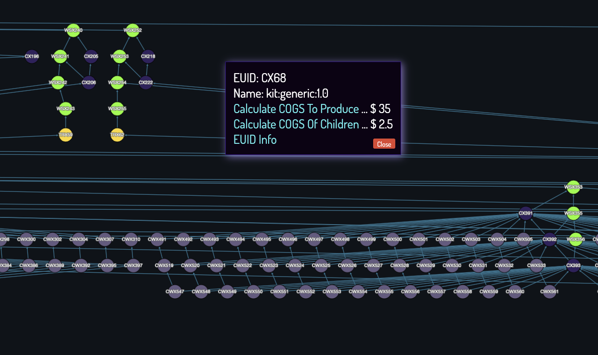
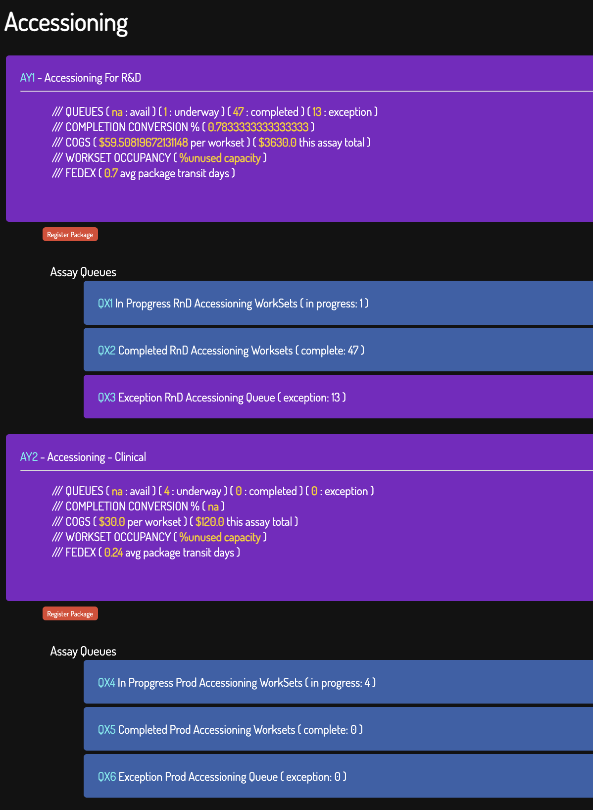
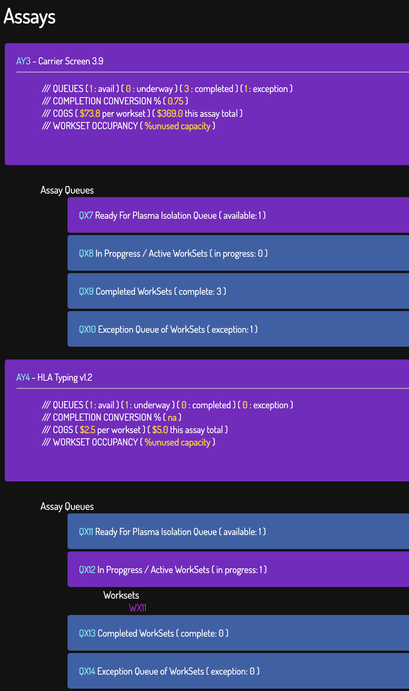
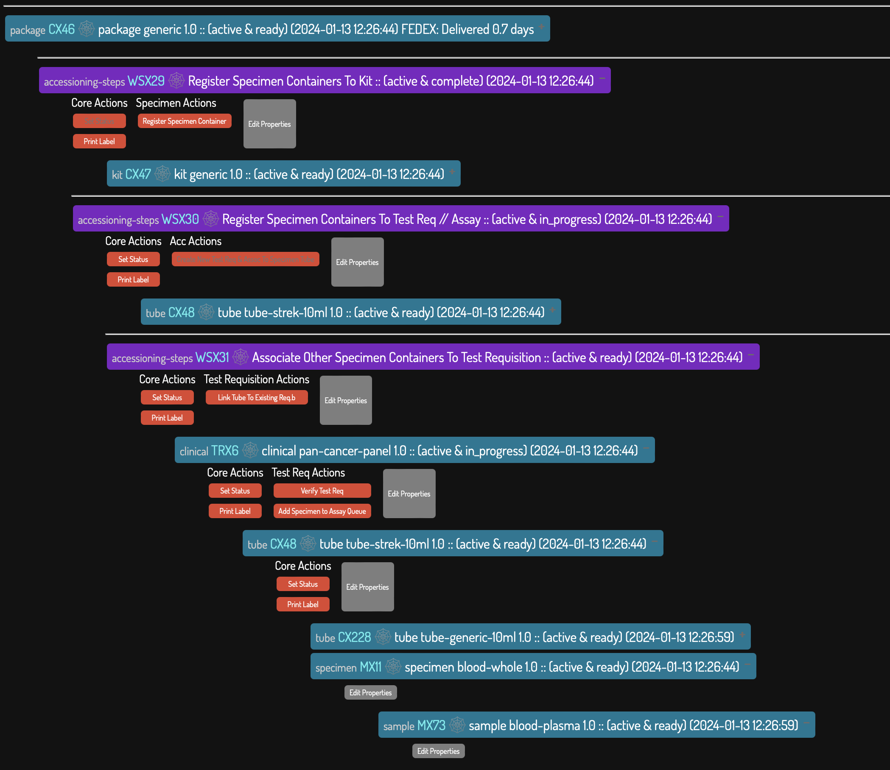
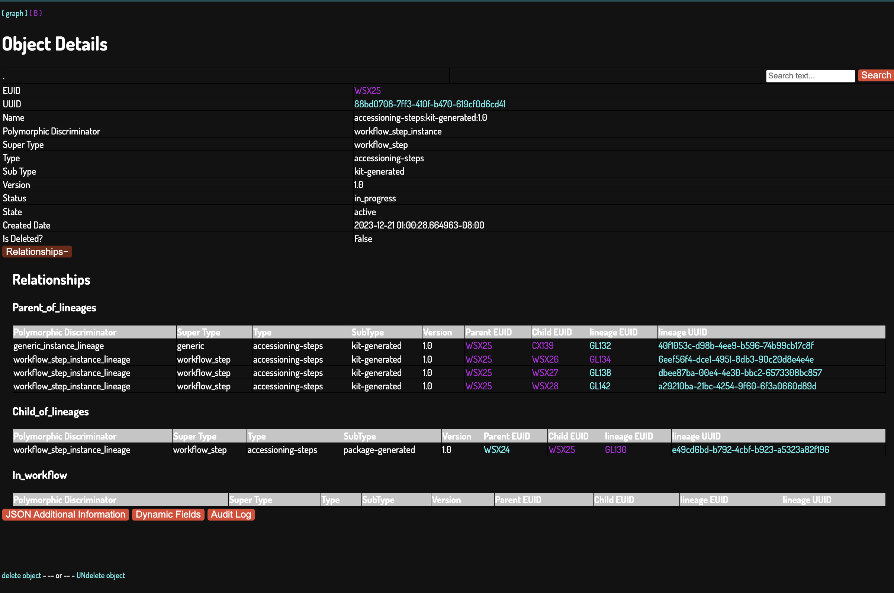
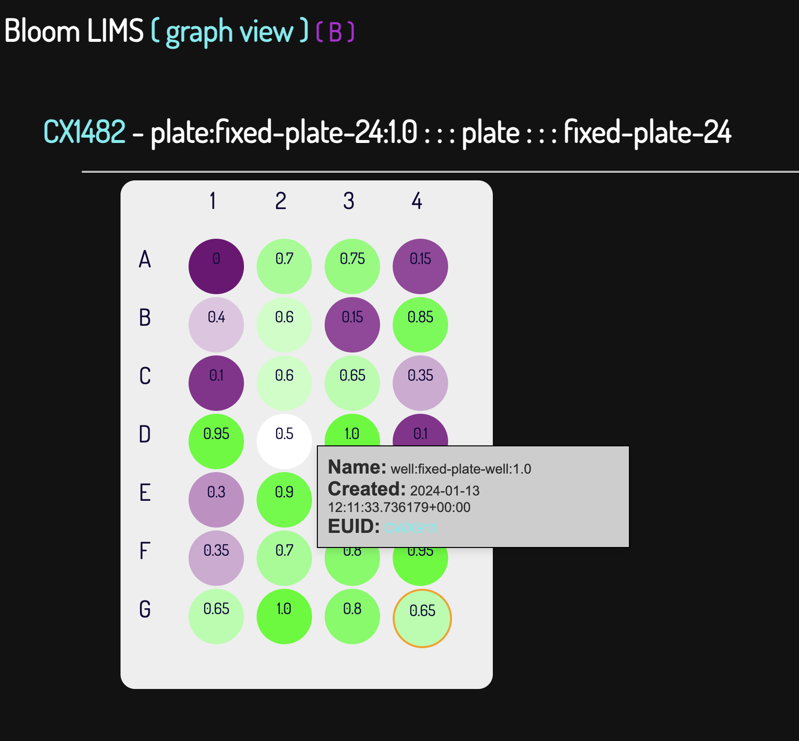
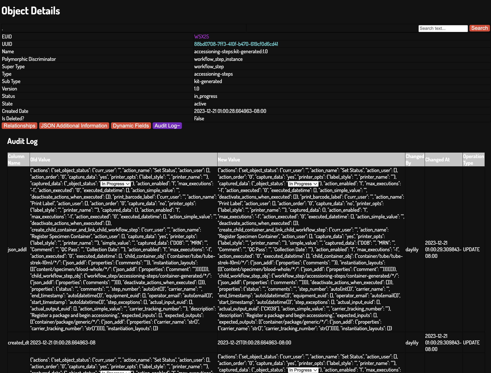

# Bloom: Templated Abstract Polymorphic (and opinionated) LIMS
_a conceptual gambit in collaboration with chatGPT4_  ·  **v2.0.0**

[](https://github.com/Daylily-Informatics/bloom/actions/workflows/ci.yml)

Built from first principles drawing on 30 years of scaling laboratory process. Constructed with as few object-model shortcuts as possible — because those shortcuts are among the main reasons LIMS nearly universally disappoint. Bloom supports arbitrary and prescribed interacting objects and is intended for small-to-factory-scale laboratories, regulated environments, and both research and operational use cases. It covers accessioning, lab processes, specimen/sample management, equipment, and regulatory compliance.

## What Bloom Owns
Bloom is the wet-lab and material-state authority:
- containers and placements
- specimens and derived materials
- extraction, QC, library-prep, pool, and run objects
- sequenced library assignments
- wet-lab queue membership and queue-transition state
- Bloom-side lineage linking to Atlas fulfillment context

## What Bloom Does Not Own
- customer-portal data and tenant administration
- patient, clinician, shipment, TRF, or test truth
- artifact registry authority
- analysis execution or result-return workflows


# Spoilers
_bloom early peeks_

## AWS Cognito Authentication
_with flexible whitelisting, role-based access, and session management_
* [Bloom Cognito configuration docs](bloom_lims/docs/cognito.md)

## Graph Object View (add, remove, edit, take actions, explore)

### Interactive, Dynamic Metrics


## Accessioning Modalities


## Nested Assay / Queue / Workset


## Instantiate Objects From Available Templates


## Object Detail


### Specialized Object Detail Views

#### Labware (ie: a 96w plate)
_Bloom natively supports arbitrarily defined labware — a 96w plate is one example. Anything describable as nested arrays of arrays can be configured as labware with next to no code._


### Exhaustive & Comprehensive Audit Trails (+soft deletes only)


## Bells And Whistles

* [Integrated with FedEx tracking for entered FedEx barcodes](https://github.com/Daylily-Informatics/fedex_tracking_day)

### Integrated Barcode Label Printing For All Objects
* [See detailed docs here](bloom_lims/docs/printer_config.md)

  > 

  * [Leverages the zebra_day library](https://github.com/Daylily-Informatics/zebra_day)

## Workflows Available
### Accessioning
> Package receipt → kit registration → specimen registration → requisition capture & association → adding specimens to assay queues. FedEx tracking fetched, barcode printing available.
### Plasma Isolation → DNA Extraction → DNA Quant
> Manages all object relationships, tracks all details, prints labels.


# Installation

## Prerequisites

### Hardware
* macOS 14+ (intel or Apple Silicon)
  * `brew install coreutils` required for `gtimeout` (rclone). Add `alias timeout=gtimeout` to your shell config.
* Ubuntu 22+

### Conda
Bloom requires Conda for environment management. [Install Miniconda](https://docs.conda.io/en/latest/miniconda.html):

**Linux x86_64:**
```bash
wget https://repo.anaconda.com/miniconda/Miniconda3-latest-Linux-x86_64.sh
bash Miniconda3-latest-Linux-x86_64.sh
~/miniconda3/bin/conda init && bash
```

**macOS:**
```bash
# Intel
wget https://repo.anaconda.com/miniconda/Miniconda3-latest-MacOSX-x86_64.sh
# Apple Silicon
wget https://repo.anaconda.com/miniconda/Miniconda3-latest-MacOSX-arm64.sh
bash Miniconda3-latest-MacOSX-*.sh
~/miniconda3/bin/conda init && bash
```

### AWS Cognito
Authentication is handled via AWS Cognito. Use `daycog` for shared pool/app/user lifecycle, then apply Bloom-local config from [bloom_lims/docs/cognito.md](bloom_lims/docs/cognito.md) before starting the server.

## Quick Start
_Assumes Conda is installed and Cognito is configured._

```bash
# Clone and enter the repository
git clone git@github.com:Daylily-Informatics/bloom.git
cd bloom

# Activate environment (creates the BLOOM conda env on first run)
source ./activate

# Initialize and seed the database
bloom db init
bloom db seed

# Start the web UI (default: https://localhost:8912)
bloom server start
```

### Optional: pgAdmin4 Database Admin UI
```bash
source bloom_lims/env/install_pgadmin.sh
```

### Optional: Install via PyPI
```bash
pip install bloom_lims
```


## Runtime Shape

Bloom is a FastAPI application with both API and server-rendered GUI surfaces.

Primary entrypoints:
- App entrypoint: `main.py` (run via `uvicorn main:app`)
- App factory: `bloom_lims.app:create_app`
- CLI entrypoint: `bloom` (after `source ./activate`)

Primary CLI groups:

| Command | Description |
|---|---|
| `bloom server` | `start, stop, status, logs` |
| `bloom db` | `init, start, stop, status, migrate, seed, shell, reset` |
| `bloom config` | `path, init, show, validate, edit, reset, shell, doctor, status` |
| `bloom info` | Show environment and runtime information |
| `bloom version` | Show CLI version |
| `bloom integrations` | Atlas integration management |
| `bloom quality` | Code quality checks |
| `bloom test` | Run targeted test suites |
| `bloom users` | User management |

Bloom delegates shared infrastructure ownership:

- use `tapdb` for shared DB/runtime lifecycle
- use `daycog` for shared Cognito lifecycle
- use `bloom db ...` only for Bloom-specific overlay seed/reset behavior on top of TapDB

Bloom template definitions are authored as JSON packs under
`config/tapdb_templates/` and loaded through TapDB during `bloom db init` /
`bloom db seed`.

## API Surface

Canonical prefix: `/api/v1`

| Route group | Purpose |
|---|---|
| `/api/v1/objects` | Core LIMS objects |
| `/api/v1/containers` | Labware and placements |
| `/api/v1/content` | Specimen / material content |
| `/api/v1/equipment` | Equipment registry |
| `/api/v1/templates` | Object template management |
| `/api/v1/subjects` | Subject (patient/donor) records |
| `/api/v1/lineages` | Object lineage graph |
| `/api/v1/search` | Search v1 |
| `/api/v1/search/v2` | Search v2 |
| `/api/v1/object-creation` | Batch object creation |
| `/api/v1/tracking` | Carrier tracking |
| `/api/v1/user-tokens` | User token management |
| `/api/v1/admin/*` | Admin endpoints |
| `/api/v1/external/specimens` | External specimen intake |
| `/api/v1/external/atlas` | Atlas integration bridge |
| `/api/v1/external/atlas/beta` | Atlas beta endpoints |

Server-rendered GUI routes remain active under the root app (login, operational views, graph screens).

## Cross-Repo Boundaries

- **Atlas** sends accepted-material and status traffic into Bloom.
- **Bloom** links physical execution state back to Atlas TRF/test/fulfillment-item context.
- **Bloom** can register run artifacts in Dewey when Dewey integration is enabled.
- **Ursa** resolves sequencing context from Bloom using run and lane identifiers.

## TapDB Mount

Bloom can mount the TapDB admin surface inside the same server process at `/admin/tapdb`.

Rules when mounted:
- Bloom session auth is the gate
- Access is admin-only
- Unauthenticated browser requests redirect to `/login`
- Mounted TapDB local login is disabled


## Integrations

### CRMs
If they have APIs, fetching physician or patient identifiers/metadata is straightforward.

### Zebra Barcode Label Printing
* In place. [See detailed docs here](bloom_lims/docs/printer_config.md).
* Uses [zebra_day](http://github.com/Daylily-Informatics/zebra_day).

### FedEx Tracking API
* In place. Requires the config YAML for [fedex_tracking_day](http://github.com/Daylily-Informatics/fedex_tracking_day).

#### Salesforce (example CRM)
* `simple_salesforce` or `salesforce` python packages — straightforward to add.


## Design Principles

### Enterprise UIDs (EUIDs)

#### Each Object Has A UUID; UUIDs Are Immutable And Not Reused
Using the same UUID on child objects for convenience creates irreconcilable confusion at scale.

#### The UID Identifies The Object Class; The UUID Identifies The Instance
[Reference: don't put metadata in a UUID.](https://stackoverflow.com/questions/19989481/what-is-the-best-way-to-store-metadata-for-a-file-in-postgresql)

#### Exhaustive Object Metadata Is Queryable Via The Enterprise UUID
Metadata may also appear on printed barcode labels alongside the EUID.

**Bloom EUIDs are uppercase-prefix + integer — safe as filenames across case-sensitive and case-insensitive file systems.**

#### Trust The Database To Manage UUIDs

### Clear And Concise Data Model

### TSVs, Not CSVs
Few compelling reasons to use CSV over TSV; many reasons not to.

#### All LIMS Data Editable via CRUD UI
Fully editable — soft deletes only, ensuring complete audit coverage.

#### Object Definitions and Actions Are Config-Driven
Minimal code changes required to add new object types or workflow steps.

### Other
* Simple · Scalable · Secure · Flexible & Extensible · Open Source · Operationally Robust · Free
* [Sustainable](https://f1000research.com/articles/10-33/v1) (per the Snakemake rolling paper definition)


## Use Cases

### LIMS Actions (must have)

#### Many-To-Many Relationships Among All Objects
All other relationships are subsets of this. Blocking many-to-many leads to inflexibility.

#### Objects May Be Involved In Multiple Workflows Simultaneously

#### Support For Predefined and Arbitrary Workflows

#### Objects may be: root, child, parent, or terminal — composable in any combination

#### Zero Loss Of Data (comprehensive audit trails, soft deletes) && 100% Audit Coverage


## Deployment & Maintenance
Bloom deploys wherever it runs. You own security, backups, recovery, performance, and monitoring. [Consulting available.](https://www.linkedin.com/in/john--major/)

## Regulatory & Compliance
### CLIA
No reason Bloom cannot be used in a CLIA regulated environment.

### CAP
Bloom can satisfy all relevant CAP checklist items. Most items concern the environment Bloom is operated in.

### HIPAA
If installed in a HIPAA-compliant environment, Bloom should require minimal additional work to comply.

## Timezone Policy
- Bloom persists timestamps in UTC.
- Display timezone is user-configurable via TapDB-backed `system_user` preferences.
- Canonical preference key: `display_timezone`.


# Support
No promises — please file issues for bugs or feature requests.


# Authors
* [John Major](https://www.linkedin.com/in/john--major/) aka [iamh2o](http://github.com/iamh2o)
* Josh Durham
* Adam Tracy

# License
MIT

# References & Acknowledgments
* [chatGPT4](http://chat.openai.com/) — helped build this.
* Everyone who ran early versions and offered feedback.
* [Snakemake](https://f1000research.com/articles/10-33/v1) — inspiration.
* [MultiQC](https://multiqc.info/) — inspiration.
* [GA4GH](https://ga4gh.org/) — inspiration.
* [The Human Genome Project](https://www.genome.gov/human-genome-project) — where I learned I loved LIS.
* [Cytoscape](https://cytoscape.org/) — graph visualization.
* [Semantic MediaWiki](https://www.semantic-mediawiki.org/wiki/Semantic_MediaWiki) — inspiration.
* [Datomic](https://www.datomic.com/) — inspiration.
* The OSS world.


# Testing

```bash
source ./activate
bloom db init
pytest
```

Focused validation (matches CI):
```bash
pytest --no-cov \
  tests/test_config_runtime.py \
  tests/test_route_coverage_gaps_api.py \
  tests/test_route_coverage_gaps_gui.py \
  tests/test_api_v1.py \
  tests/test_gui_endpoints.py \
  tests/test_api_atlas_bridge.py \
  tests/test_atlas_lookup_resilience.py \
  tests/test_queue_flow.py \
  tests/test_run_resolver.py

ruff check bloom_lims tests
```


# Dev Tools

All commands assume `source ./activate` has been run.

## Reset and Rebuild the Database (⚠️ destroys all data)

```bash
bloom db reset
bloom db init
bloom db seed
```

## Start the UI

```bash
# Via CLI (recommended)
bloom server start

# Or directly via uvicorn (dev mode, port 8911)
uvicorn main:app --reload --port 8911

# Or via gunicorn (production)
bash run_bloomui.sh --mode prod --port 8911
```

## Interactive Python Shell

```bash
bloom config shell
```

## pgAdmin UI

```bash
source bloom_lims/env/install_pgadmin.sh
```

## Lint / Format

```bash
ruff check bloom_lims tests
ruff format bloom_lims tests
```


# Notes

## File System Case Sensitivity

### macOS Is NOT Case Sensitive
```bash
echo "test" > test.log && echo "TEST" > TEST.LOG
more test.log   # → TEST  (same file!)
```

### Ubuntu Is Case Sensitive
```bash
echo "test" > test.log && echo "TEST" > TEST.LOG
more test.log   # → test
```

### Assume Case Insensitivity In All File Names
Given files may be reconstituted on a case-insensitive file system, all file names should be treated as case-insensitive.

#### Bloom UUIDs and EUIDs Are Safe As File Names
Per [RFC 4122](https://datatracker.ietf.org/doc/html/rfc4122), UUID uppercase/lowercase are equivalent. Bloom EUIDs use an uppercase prefix followed by integers only.
