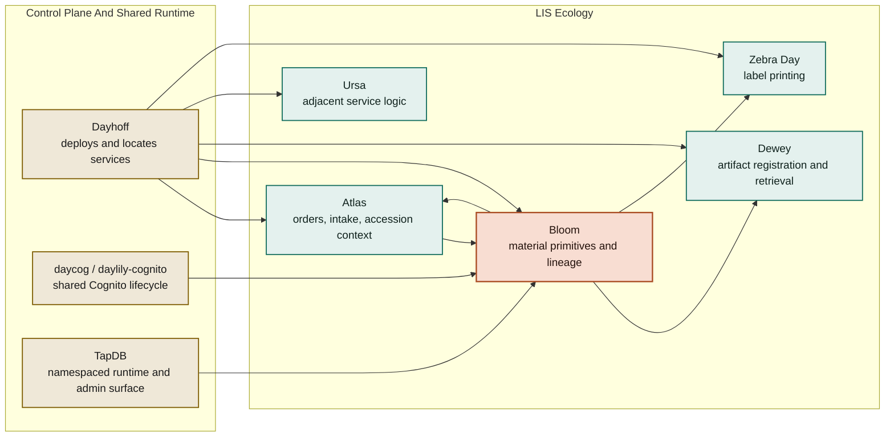
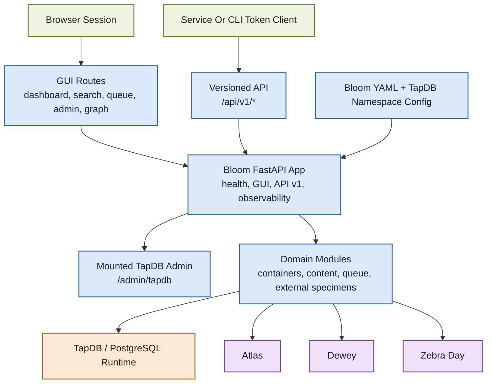
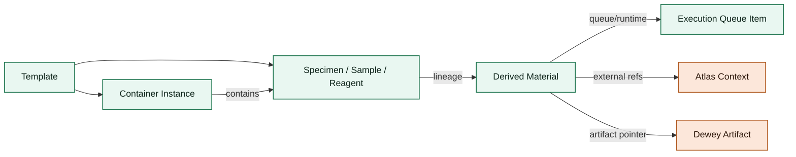

# BLOOM

BLOOM is the material-state service in the Dayhoff lab-software bundle. It tracks the primitives that other systems build from: containers, specimens, samples, reagents, equipment, lineage edges, queue/runtime state, and the external references that tie those records back to the rest of a lab ecosystem. Bloom is intentionally not a soup-to-nuts LIMS. It does not own order intake, portal UX, identity lifecycle, artifact byte storage, or deployment orchestration. It owns the durable answer to questions like "what exists?", "where is it?", "what did it come from?", and "what instance of Bloom is serving that answer?"

In practice that makes Bloom a foundation service. Atlas can accession and coordinate intake, Dewey can register and search artifacts, Ursa can provide adjacent service logic, Zebra Day can handle label printing, daycog can manage shared Cognito, and Dayhoff can deploy the stack, but Bloom remains the place where material primitives and lineage become first-class, queryable state.

## Bloom In The Dayhoff Ecology


```mermaid
flowchart LR
    classDef control fill:#efe8d8,stroke:#7c5a00,color:#1a1a1a,stroke-width:1.5px;
    classDef service fill:#e4f1ee,stroke:#0f6b5b,color:#10221d,stroke-width:1.5px;
    classDef core fill:#f8ddd2,stroke:#aa4d24,color:#25130d,stroke-width:2px;
    classDef data fill:#e7ebfb,stroke:#3758b5,color:#111a35,stroke-width:1.5px;

    subgraph Control["Control Plane And Shared Runtime"]
        Dayhoff["Dayhoff<br/>deploys and locates services"]
        daycog["daycog / daylily-cognito<br/>shared Cognito lifecycle"]
        TapDB["TapDB<br/>namespaced runtime and admin surface"]
    end

    subgraph Services["LIS Ecology"]
        Atlas["Atlas<br/>orders, intake, accession context"]
        Bloom["Bloom<br/>material primitives and lineage"]
        Dewey["Dewey<br/>artifact registration and retrieval"]
        Ursa["Ursa<br/>adjacent service logic"]
        Zebra["Zebra Day<br/>label printing"]
    end

    Dayhoff --> Atlas
    Dayhoff --> Bloom
    Dayhoff --> Dewey
    Dayhoff --> Ursa
    Dayhoff --> Zebra
    daycog --> Bloom
    TapDB --> Bloom
    Atlas --> Bloom
    Bloom --> Dewey
    Bloom --> Zebra
    Bloom --> Atlas

    class Dayhoff,daycog,TapDB control
    class Atlas,Dewey,Ursa,Zebra service
    class Bloom core
```

## What Bloom Owns

- Material primitives: container, content, specimen, sample, reagent, subject, equipment, template-backed instances.
- Material relationships: parent/child lineage, containment, graph traversal, and operator-visible provenance.
- Queue/runtime state for the current queue-centric beta surface.
- Integration-facing material references: Atlas reference binding, Atlas status event push, Dewey artifact registration calls, Zebra Day printer preferences, carrier tracking lookups.

## What Bloom Does Not Own

- End-to-end order or requisition lifecycle. Atlas owns that side of the ecology.
- Artifact bytes and downstream analysis products. Dewey and the analysis stack own those surfaces.
- Shared identity lifecycle. Cognito and `daycog` own pool and app-client lifecycle.
- Deployment orchestration and service discovery. Dayhoff owns that control plane.

## Architecture, Stack, And Philosophy

Bloom is a FastAPI service with a mounted GUI and a mounted TapDB admin sub-application. The runtime is configured through deployment-scoped YAML and TapDB namespace config rather than ad hoc shell state. Persistence and object identity are TapDB-backed. Browser authentication is Cognito-hosted-UI based through `daylily-cognito`. The GUI is mostly server-rendered Jinja templates with a modern operations surface, while graph exploration is powered by a Cytoscape-based client under `static/js/graph.js`.

The design philosophy is narrower than a classic monolith:

- Keep Bloom authoritative for material state and lineage, not for every lab concern.
- Prefer deployment-scoped, reproducible runtime config over hidden workstation state.
- Expose stable, EUID-centered HTTP contracts instead of leaking internal UUIDs.
- Let other Dayhoff services call Bloom for state and provenance instead of copying that state.
- Treat older workflow/workset surfaces as history. The supported product surface is queue-centric.


```mermaid
flowchart TB
    classDef edge fill:#eef4e1,stroke:#597b2b,color:#18220f,stroke-width:1.5px;
    classDef app fill:#dbe9f8,stroke:#2b5d90,color:#102030,stroke-width:1.5px;
    classDef store fill:#fce9d7,stroke:#a85d17,color:#271406,stroke-width:1.5px;
    classDef ext fill:#efe2f8,stroke:#7140a2,color:#1d1030,stroke-width:1.5px;

    Browser["Browser Session"]
    TokenClient["Service Or CLI Token Client"]
    App["Bloom FastAPI App<br/>health, GUI, API v1, observability"]
    GUI["GUI Routes<br/>dashboard, search, queue, admin, graph"]
    API["Versioned API<br/>/api/v1/*"]
    Admin["Mounted TapDB Admin<br/>/admin/tapdb"]
    Domain["Domain Modules<br/>containers, content, queue, external specimens"]
    Config["Bloom YAML + TapDB Namespace Config"]
    Store["TapDB / PostgreSQL Runtime"]
    AtlasExt["Atlas"]
    DeweyExt["Dewey"]
    ZebraExt["Zebra Day"]

    Browser --> GUI
    TokenClient --> API
    GUI --> App
    API --> App
    App --> Admin
    App --> Domain
    Config --> App
    Domain --> Store
    Domain --> AtlasExt
    Domain --> DeweyExt
    Domain --> ZebraExt

    class Browser,TokenClient edge
    class App,GUI,API,Admin,Domain,Config app
    class Store store
    class AtlasExt,DeweyExt,ZebraExt ext
```

## Functional Model

Bloom is best understood as a graph of material facts:

- Templates define what kinds of things can exist.
- Object creation mints EUID-backed instances from those templates.
- Containers and content can be linked so Bloom knows what is in what.
- Lineage edges record derivation and movement.
- Queue/runtime objects describe the current operator-facing beta execution surface.
- External references bind Bloom records to Atlas and other systems without giving those systems direct ownership of Bloom state.


```mermaid
flowchart LR
    classDef state fill:#e9f7f1,stroke:#267a55,color:#10261c,stroke-width:1.5px;
    classDef ref fill:#fce7da,stroke:#b05a21,color:#2a1407,stroke-width:1.5px;

    T["Template"] --> C["Container Instance"]
    T --> S["Specimen / Sample / Reagent"]
    C -->|"contains"| S
    S -->|"lineage"| D["Derived Material"]
    D -->|"queue/runtime"| Q["Execution Queue Item"]
    D -->|"external refs"| A["Atlas Context"]
    D -->|"artifact pointer"| F["Dewey Artifact"]

    class T,C,S,D,Q state
    class A,F ref
```

## Quick Start

Bloom's supported repo entrypoint is the activation script:

```bash
source ./activate <deploy-name>
```

For a first local bring-up:

```bash
source ./activate bringup
bloom config init
bloom db build
bloom config status
bloom config doctor
bloom server start --port 8912
curl -k https://127.0.0.1:8912/readyz
```

Bloom's primary config files are deployment-scoped:

- Bloom YAML: `~/.config/bloom-<deploy-name>/bloom-config-<deploy-name>.yaml`
- TapDB runtime config: `~/.config/tapdb/bloom/bloom-<deploy-name>/tapdb-config.yaml`
- Default local upload directory: `~/.config/tapdb/bloom/bloom-<deploy-name>/<tapdb-env>/uploads`

Use Bloom's CLI first:

- `bloom config ...` for service config inspection and repair.
- `bloom db ...` for runtime/bootstrap actions delegated to TapDB.
- `bloom server ...` for lifecycle.
- `tapdb ...` only when Bloom explicitly delegates low-level DB/runtime config.
- `daycog ...` only when Bloom explicitly delegates shared Cognito lifecycle.

See [docs/how-tos.md](docs/how-tos.md) for complete setup, auth, and troubleshooting recipes.

## API Surface Summary

The supported versioned API lives under `/api/v1`. Core route groups include:

- object and template management: `/api/v1/objects`, `/api/v1/containers`, `/api/v1/content`, `/api/v1/templates`, `/api/v1/object-creation`
- identity and token introspection: `/api/v1/auth`, `/api/v1/user-tokens`, `/api/v1/admin/groups`, `/api/v1/admin/user-tokens`
- graph and search: `/api/v1/lineages`, `/api/v1/graph`, `/api/v1/search/v2`
- operator/runtime: `/api/v1/execution`, `/api/v1/batch`, `/api/v1/tasks`, `/api/v1/stats`, `/api/v1/tracking`
- integration-specific: `/api/v1/external/specimens`, `/api/v1/external/atlas`, `/api/v1/external/atlas/beta`

Two design points matter:

- Public API payloads are EUID-centered. The tests explicitly check that internal UUIDs do not leak back out on key object surfaces.
- Bloom does not currently expose a general event bus. "Messaging" in current code means synchronous HTTP APIs plus targeted integration hooks, such as Atlas status-event push and best-effort Bloom-to-Atlas webhook delivery.

Example: unified search v2

```bash
curl -k https://localhost:8912/api/v1/search/v2/query \
  -H "Authorization: Bearer <blm-token>" \
  -H "Content-Type: application/json" \
  -d '{
    "query": "test",
    "record_types": ["instance", "template"],
    "page": 1,
    "page_size": 25
  }'
```

Example: external specimen create with Atlas references

```bash
curl -k https://localhost:8912/api/v1/external/specimens \
  -H "Authorization: Bearer <blm-token>" \
  -H "Idempotency-Key: specimen-create-001" \
  -H "Content-Type: application/json" \
  -d '{
    "specimen_template_code": "content/specimen/blood-whole/1.0",
    "specimen_name": "specimen-demo",
    "status": "active",
    "container_template_code": "container/tube/tube-generic-10ml/1.0",
    "properties": {"source": "atlas-contract-test"},
    "atlas_refs": {
      "order_number": "ORD-123",
      "patient_id": "PAT-123",
      "kit_barcode": "KIT-123"
    }
  }'
```

Deep dive: [docs/apis.md](docs/apis.md)

## GUI Overview

Bloom's GUI is an operator and developer surface, not just a demo shell. The main current routes are:

- `/`: dashboard
- `/search`: unified search
- `/queue_details`: queue runtime view
- `/equipment_overview`: equipment inventory
- `/reagent_overview`: reagent inventory
- `/create_object`: object creation wizard
- `/create_from_template`: template-driven instance creation
- `/admin`: admin, token, observability, and anomaly pages
- `/dindex2`: graph explorer

The role model is simple:

- `READ_ONLY`: can inspect data and manage own tokens.
- `READ_WRITE`: can mutate standard Bloom records and runtime actions.
- `ADMIN`: can use admin pages, admin token issuance, mounted TapDB admin, and graph mutation helpers.

Group codes are orthogonal to that role ladder. In current code they are primarily feature gates for specific integrations and tokenized access, especially `API_ACCESS`, `ENABLE_ATLAS_API`, and `ENABLE_URSA_API`.

Deep dive: [docs/gui.md](docs/gui.md)

## Security And Auth

Bloom uses YAML-first Cognito configuration for normal startup. If required TapDB or Cognito config is missing, startup validation fails fast. Browser auth uses `daylily-cognito` Hosted UI session helpers and stores a normalized principal in the session rather than raw OAuth tokens. API access uses bearer tokens with Bloom-side RBAC and token-scope privilege caps.

Security-relevant current behavior:

- GUI auth is Cognito-backed and configured from Bloom YAML.
- External integration routes require token auth and, for Atlas/Ursa surfaces, specific service groups in addition to general permissions.
- Mounted TapDB admin at `/admin/tapdb` is Bloom-admin-gated; it does not run an independent TapDB login flow when mounted.
- Outbound Bloom-to-Atlas event delivery is HMAC-signed and fail-open.

For local tests and some unit test suites, auth bypass flags still exist in code. Those are test/dev escape hatches, not the supported operational path.

## Testing

Current repository facts:

- `tests/` currently contains 60 `test_*.py` files.
- `pyproject.toml` sets the coverage gate to `fail_under = 39`.
- Playwright support is installed, but the checked-in E2E suite is intentionally narrow today.

The current committed Playwright coverage is limited to browser login/logout round trips:

- [tests/e2e/README.md](tests/e2e/README.md)
- [tests/e2e/test_auth_e2e.py](tests/e2e/test_auth_e2e.py)

Those E2E tests verify:

- a Cognito-backed login returns the user to `/`
- logout lands on `/login` or the Cognito Hosted UI logout/login pages
- a protected route redirects back through the auth flow after logout

There are no checked-in rich Playwright report bundles or curated screenshot sets in the repo today, so the code and test files are the authoritative reference.

## Contributing

Start from a feature branch, activate the repo-managed environment, and prefer Bloom's supported CLI path while working:

```bash
source ./activate <deploy-name>
git switch -c codex/<short-topic>
bloom config doctor
pytest --no-cov tests/test_execution_queue_api.py -q
ruff check bloom_lims tests
```

When you are touching runtime behavior, update docs and examples to match the actual Bloom CLI. Older references in historical docs, activation banners, or service-catalog metadata may still mention retired commands like `bloom db init`; the current CLI help is authoritative.

## Docs Navigation

- [docs/architecture.md](docs/architecture.md): implementation structure, runtime layers, persistence, and integration boundaries
- [docs/apis.md](docs/apis.md): route groups, auth model, request/response examples, and messaging boundaries
- [docs/gui.md](docs/gui.md): screens, roles, browser auth flow, and graph/admin behavior
- [docs/how-tos.md](docs/how-tos.md): practical setup, config, test, and troubleshooting recipes
- [docs/becoming_a_discoverable_service.md](docs/becoming_a_discoverable_service.md): how Bloom fits Dayhoff's service catalog and deployment-scoped discovery model
- [docs/old_docs/README.md](docs/old_docs/README.md): historical background and retired planning material

## Recommended Historical Reading

These are worth reading for background, but they are not the current contract. Current code and the docs in this README's navigation section win when they disagree.

- [docs/old_docs/README.md](docs/old_docs/README.md): the best map of what is archival versus still conceptually useful.
- [docs/old_docs/material_transfer_algebra_and_execution_envelope_constitution.md](docs/old_docs/material_transfer_algebra_and_execution_envelope_constitution.md): the strongest articulation of Bloom's material-primitive worldview.
- [docs/old_docs/ATLAS_BLOOM_CONTRACT_TESTS.md](docs/old_docs/ATLAS_BLOOM_CONTRACT_TESTS.md): good historical framing for Atlas-to-Bloom contract expectations.
- [docs/old_docs/tapdb_mount_completion_report.md](docs/old_docs/tapdb_mount_completion_report.md): useful context for why TapDB admin is embedded inside Bloom.
- [docs/old_docs/bloom_final_completion_report.md](docs/old_docs/bloom_final_completion_report.md): explains the queue-centric shift and the retirement of older workflow/workset product surfaces.
- [docs/old_docs/SEARCH_V2.md](docs/old_docs/SEARCH_V2.md): background on the unified search direction that the current code now implements under `/api/v1/search/v2`.

## Glossary

- **Bloom**: the service in this repo; authoritative for material primitives, lineage, and related queue/runtime state.
- **Dayhoff**: the deployment control plane that pins repos, activates them, starts services, and checks readiness.
- **TapDB**: the shared runtime/database layer Bloom delegates to for namespaced config, DB lifecycle, and the mounted admin app.
- **daycog / daylily-cognito**: the shared Cognito library and CLI Bloom uses for browser auth and shared pool/app lifecycle.
- **Atlas**: the order, intake, and accession-oriented service that exchanges external references and status information with Bloom.
- **Dewey**: the artifact-oriented service Bloom calls when it needs to register or refer to analysis/storage outputs.
- **Ursa**: an adjacent Dayhoff service with its own integration gate in Bloom's RBAC/group model.
- **Zebra Day**: the label-printing service Bloom uses for printer discovery and print-job submission.
- **material primitive**: a lowest-level material record Bloom treats as first-class state, such as a specimen, sample, reagent, or container-backed material instance.
- **lineage**: the directed parent/child relationship graph that explains derivation, transfer, or containment history.
- **queue runtime**: the queue-centric beta execution surface Bloom exposes for current operator workflows.
- **deployment-scoped config**: config whose file path and runtime identity include the deploy name, such as `~/.config/bloom-<deploy>/...`.
- **template pack**: the collection of template-backed definitions that describe which object categories, types, and subtypes may be created.
- **instance**: a concrete EUID-backed object created from a template or direct object-creation path.
- **workset / workflow**: older Bloom concepts that still exist historically in-repo but are not mounted as supported product API/GUI surfaces today.
- **Hosted UI**: Cognito's browser-facing login/logout flow used by Bloom's GUI session path.
- **discoverable service**: a service that follows Dayhoff's activation, bootstrap, start, and readiness conventions so the deployment bundle can locate and run it consistently.
