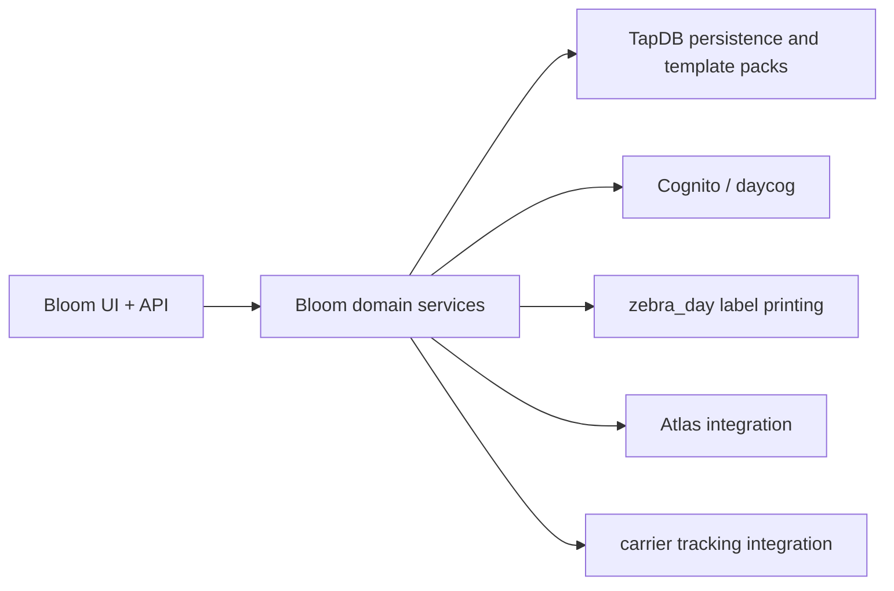

[](https://github.com/Daylily-Informatics/bloom/releases)
[](https://github.com/Daylily-Informatics/bloom/tags)
[](https://github.com/Daylily-Informatics/bloom/actions/workflows/ci.yml)

# Bloom

Bloom is the wet-lab and material-state authority for the stack. It models containers, specimens, derived materials, assay/workset flow, sequencing context, and the physical lineage that links operational lab work back to Atlas order context.

Bloom owns:
- containers, placements, specimens, and derived materials
- extraction, QC, library-prep, pool, and run objects
- wet-lab queue membership and related operational state
- lineage links between physical-material state and Atlas fulfillment context

Bloom does not own:
- customer-portal truth and tenant administration
- patient, clinician, shipment, TRF, or test authority
- canonical artifact registry authority
- analysis execution or result-return workflows

If you need to understand what physically exists in the lab, how it changed, and how those changes are linked together, Bloom is the authoritative repo.

## Component View


```mermaid
flowchart LR
    UI["Bloom UI + API"] --> Domain["Bloom domain services"]
    Domain --> TapDB["TapDB persistence and template packs"]
    Domain --> Cognito["Cognito / daycog"]
    Domain --> Zebra["zebra_day label printing"]
    Domain --> Atlas["Atlas integration"]
    Domain --> Tracking["carrier tracking integration"]
```

## Prerequisites

- Python 3.12+
- Conda for the supported `BLOOM` environment
- local PostgreSQL/TapDB-compatible runtime for full local work
- optional Cognito setup for auth-complete browser flows
- optional printer and carrier-tracking configuration for the integration-heavy paths

## Getting Started

### Quickstart

```bash
source ./activate <deploy-name>
bloom db init
bloom db seed
bloom server start --port 8912
```

The supported local workflow is CLI-first and uses Bloom’s own environment/bootstrap path.

Delete-only teardown is also available:

```bash
bloom db nuke
bloom db nuke --force
```

## Architecture

### Technology

- FastAPI + server-rendered GUI
- Typer-based `bloom` CLI
- TapDB for shared persistence/runtime lifecycle
- Cognito-backed authentication
- optional integrations for label printing and carrier tracking

### Core Object Model

Bloom’s main concepts are:

- templates that describe lab object types and allowed structure
- instances representing containers, materials, assay artifacts, queues, and run context
- lineage links that model parent/child and workflow relationships
- audit trails and soft-delete history

Bloom template definitions are authored as JSON packs under `config/tapdb_templates/` and loaded through TapDB. Runtime code should not create `generic_template` rows directly.

### Runtime Shape

- app entrypoint: `main.py`
- app factory: `bloom_lims.app:create_app`
- CLI: `bloom`
- main CLI groups: `server`, `db`, `config`, `info`, `integrations`, `quality`, `test`, `users`

### Integration Boundaries

- Atlas provides intake and fulfillment context
- Dewey may register or resolve artifacts when enabled
- Ursa consumes sequencing context downstream
- Zebra Day supports label-print workflows

## Visual Tour

Bloom is unusually UI-heavy for a service repo, so the README keeps a few representative screens.

### Graph And Metrics


### Accessioning


### Object Detail


## Cost Estimates

Approximate only.

- Local development: workstation plus a local database.
- Small shared environment: usually the cost of the Dayhoff-managed host/database footprint, not Bloom-specific code.
- Integration-heavy environments increase operator cost when printers, tracking, TLS, and shared auth are enabled, but Bloom still tends to be a service inside a broader stack budget rather than a standalone large spend item.

## Development Notes

- Canonical local entry path: `source ./activate <deploy-name>`
- Use `bloom ...` as the main operational interface
- Use `tapdb ...` only for shared DB/runtime work Bloom explicitly delegates
- Use `daycog ...` only for shared Cognito work Bloom explicitly delegates
- `bloom db reset` rebuilds after deletion; `bloom db nuke` stops after the destructive schema reset

Useful checks:

```bash
source ./activate <deploy-name>
bloom --help
pytest -q
```

## Sandboxing

- Safe: docs work, code reading, tests, `bloom --help`, and local-only validation against disposable local runtimes
- Local-stateful: `bloom db init`, `bloom db seed`, `bloom db reset`, and `bloom db nuke`
- Requires extra care: Cognito lifecycle, external tracking integrations, printer integrations, and any Dayhoff-managed deployed environment flows

## Current Docs

- [Docs index](docs/README.md)
- [Authentication](docs/AUTHENTICATION.md)
- [Search V2](docs/SEARCH_V2.md)
- [Bloom beta API contracts](docs/bloom_beta_api_contracts.md)
- [Release tag policy](docs/RELEASE_TAG_POLICY.md)

## References

- [FastAPI](https://fastapi.tiangolo.com/)
- [TapDB](https://github.com/Daylily-Informatics/daylily-tapdb)
- [daylily-cognito](https://github.com/Daylily-Informatics/daylily-cognito)
- [zebra_day](https://github.com/Daylily-Informatics/zebra_day)
 
 
