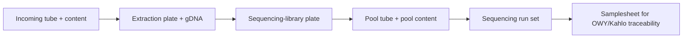

<div align="center">
<pre>
██████╗ ██╗      ██████╗  ██████╗ ███╗   ███╗
██╔══██╗██║     ██╔═══██╗██╔═══██╗████╗ ████║
██████╔╝██║     ██║   ██║██║   ██║██╔████╔██║
██╔══██╗██║     ██║   ██║██║   ██║██║╚██╔╝██║
██████╔╝███████╗╚██████╔╝╚██████╔╝██║ ╚═╝ ██║
╚═════╝ ╚══════╝ ╚═════╝  ╚═════╝ ╚═╝     ╚═╝
</pre>
<p><strong>Internal material, container, lineage, and lab-action graph service.</strong></p>
<p>
  <a href="#quickstart">Quickstart</a> ·
  <a href="#api">API</a> ·
  <a href="#gui">GUI</a> ·
  <a href="docs/lab_actions.md">Lab actions</a> ·
  <a href="#testing-info">Tests</a>
</p>
</div>

## Overview

Bloom is the LSMC internal material and container graph service. It owns laboratory containers, materials/content, equipment, lineage, recursive template creation, search, and graph views. Atlas owns orders and customer-facing accession context; Bloom owns the physical/material execution graph.

Current Dayhoff pin: `7.0.22`. Current TapDB dependency: `daylily-tapdb @ ...@9.0.9`.

Bloom is internal-only in Dayhoff exposure policy. It must be reachable only through approved LSMC networks and Dayhoff-generated service credentials.

TapDB template identity is semantic. Categories are names like `container`, `material`, `data`, `equipment`, `set`, and `workflow`; prefixes such as `BC*`, `BN*`, `BD*`, `BR*`, and `BG*` are issuance and governance labels only. Existing historical objects keep their already minted EUIDs, but new and active template definitions must not use a Meridian/EUID prefix as the category name.

## What It Does

- Owns Bloom containers, materials/content, equipment, recursive templates, lineages, search, and graph views.
- Exposes `/lab-actions` and `/api/v1/lab-actions/*` for extraction plate, sequencing-library plate, pool-tube, and sequencing-run setup.
- Mounts TapDB at `/tapdb` for generic object, template, lineage, audit, graph, and external-link inspection.
- Provides health and observability surfaces for Kahlo and Dayhoff deployment verification.

## How It Works


```mermaid
flowchart LR
    Tube["Incoming tube + content"] --> Extraction["Extraction plate + gDNA"]
    Extraction --> Library["Sequencing-library plate"]
    Library --> Pool["Pool tube + pool content"]
    Pool --> RunSet["Sequencing run set"]
    RunSet --> OWY["Samplesheet for OWY/Kahlo traceability"]
```

Bloom models physical/material execution. Atlas owns orders and customer accession context; Dewey owns durable artifact identity; Ursa owns analysis trigger/job records.

## Quickstart

```bash
cd /Users/jmajor/projects/mega_dayhoff/repos_work/bloom
source ./activate <deploy-name>
bloom --help
bloom config init --help
bloom db build --target local
bloom server start --port 8912
```

Runtime config, service config, TapDB config, and registry paths must be passed explicitly. Do not rely on deployment-name guessing or `~/.config` fallback discovery.

## CLI Interface

The primary CLI is `bloom`. It covers config initialization, DB/bootstrap tasks, service startup, object/template workflows, and operational helpers.

Bloom can delegate low-level storage lifecycle to `tapdb` and shared Cognito lifecycle to `daycog` only where the Bloom CLI or docs explicitly say so.

Common command families:

| Family | Purpose |
|---|---|
| `bloom config ...` | Materialize explicit deployment-scoped service config. |
| `bloom db ...` | Build or verify Bloom-owned local database state through supported paths. |
| `bloom server ...` | Start the FastAPI service with explicit generated config. |
| `bloom objects/templates/lineage ...` | Work with Bloom-owned containers, materials, templates, and lineages where exposed by the CLI. |
| `bloom tokens/admin ...` | Manage supported internal/admin auth surfaces without printing secrets. |

For normal user/admin behavior, the CLI, API, and GUI are alternate surfaces over the same Bloom object, template, lineage, and auth capabilities. A feature should not be CLI-only, API-only, or GUI-only unless the docs say why.

## GUI

Bloom exposes a FastAPI/Jinja GUI for internal operators. Current surfaces include dashboard/home, object search and details, container/content/equipment operations, graph views, auth/profile flows, the `/lab-actions` wet-lab action wizard, and the mounted TapDB GUI at `/tapdb` when configured by Dayhoff.

`/lab-actions` is the temporary operator flow for mapping incoming biospecimen tubes to extraction plates, extraction QC plates, sequencing-library plates, pool tubes, generic lab/run sets, per-well associated data, and sequencing run sets. It also accepts `.csv` and `.xlsx` spreadsheet uploads for the same API-backed actions. GUI actions should not have behavior that is unavailable through the API.

See [`docs/lab_actions.md`](docs/lab_actions.md) for the template matrix, lineage contract, API examples, GUI flow, and production rollout checklist for this surface.

Every human-visible EUID should link to the canonical TapDB object page at `/tapdb/object/{euid}` unless Bloom owns a more specific detail page; service-specific pages should still link back to canonical TapDB details.

## API

The primary API is under `/api/v1/*`. Current route families include objects, containers, content, equipment, execution queue, batch operations, templates, subjects, lineages, stats, search, object creation, lab actions, user tokens, admin auth, external specimens, Atlas integration, beta lab integration, and graph APIs.

The lab-action route family includes:

- `POST /api/v1/lab-actions/extraction-plates`
- `POST /api/v1/lab-actions/extraction-qc-plates`
- `POST /api/v1/lab-actions/seq-library-plates`
- `POST /api/v1/lab-actions/seq-library-pools`
- `POST /api/v1/lab-actions/seq-runs`
- `POST /api/v1/lab-actions/sets`
- `GET /api/v1/lab-actions/sets/{set_euid}`
- `POST /api/v1/lab-actions/sets/{set_euid}/members`
- `POST /api/v1/lab-actions/plate-well-data`
- `POST /api/v1/lab-actions/spreadsheet-import`
- `GET /api/v1/lab-actions/seq-runs/{set_euid}/samplesheet`
- `GET /api/v1/lab-actions/plates/{plate_euid}/mapping.csv`
- `POST /api/v1/lab-actions/print-euids`

The generic run-set template is `set/run-set/generic/1.01`. It is used for sequencing-run sets and other temporary Bloom-owned sets of internal or external EUIDs.

Health and observability routes include `/healthz`, `/readyz`, `/health`, `/obs_services`, `/api_health`, `/endpoint_health`, `/db_health`, `/my_health`, and `/auth_health` when configured for Dayhoff observability.

## Testing Info

Focused checks:

```bash
python -m pytest tests -q
python -m pytest tests/test_lsmc_ui_skin_system_contract.py -q
```

Deployed browser evidence should target `https://bloom.<deploy>.dev.lsmc.bio` and include the dashboard, object search/detail, TapDB mount, graph, and auth redirect surfaces. Current `jemdev5` deployment evidence is linked from Dayhoff `docs/plans/20260618T132900Z_jemdev5_dayhoff_7067_live_deploy_ledger.md`.

## Technical Details, History, And Linkouts

- [`docs/apis.md`](docs/apis.md): API details.
- [`docs/gui.md`](docs/gui.md): GUI routes and screenshots when current.
- [`docs/lab_actions.md`](docs/lab_actions.md): extraction/QC/library/pooling/set/sequencing-run action flow, spreadsheet upload schemas, template matrix, and production rollout checklist.
- [`docs/architecture.md`](docs/architecture.md): domain model and runtime boundaries.
- [`docs/becoming_a_discoverable_service.md`](docs/becoming_a_discoverable_service.md): Dayhoff/Kahlo observability contract.
- [`docs/plans/`](docs/plans/): active ledgers.
- [`docs/old_docs/`](docs/old_docs/): historical material only.

Current Bloom language should use Container and Material separation. Order, OrderTest, SubjectRef, AccessionCase, and fulfillment semantics are Atlas-owned or cross-service references, not Bloom-owned order lifecycle objects.
