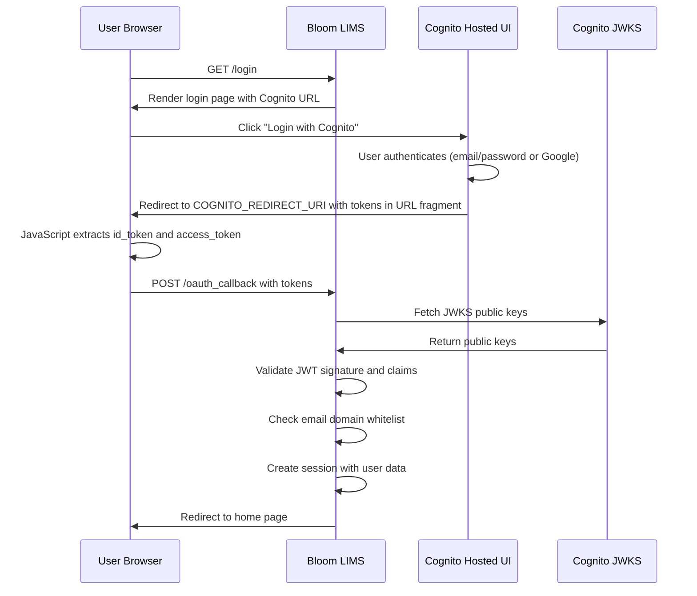

# AWS Cognito Authentication for Bloom LIMS

Bloom LIMS uses [AWS Cognito](https://aws.amazon.com/cognito/) for single sign-on (SSO) authentication via the hosted UI. This replaces the previous Supabase integration and provides enterprise-grade authentication with support for social identity providers (Google, etc.) and SAML/OIDC federation.

---

## Table of Contents

1. [Prerequisites](#prerequisites)
2. [AWS Cognito Configuration](#aws-cognito-configuration)
   - [Creating a User Pool](#step-1-create-a-user-pool)
   - [Configuring the App Client](#step-2-configure-the-app-client)
   - [Setting Up Identity Providers](#step-3-set-up-identity-providers-optional)
   - [Configuring the Domain](#step-4-configure-the-cognito-domain)
3. [Environment Variable Configuration](#environment-variable-configuration)
4. [Local Development Setup](#local-development-setup)
5. [Authentication Flow](#authentication-flow)
6. [Troubleshooting](#troubleshooting)
7. [Security Considerations](#security-considerations)

---

## Prerequisites

Before setting up Cognito authentication for Bloom LIMS, ensure you have:

### AWS Requirements

| Requirement | Description |
|-------------|-------------|
| **AWS Account** | Active AWS account with billing enabled |
| **IAM Permissions** | User/role with `AmazonCognitoPowerUser` policy or equivalent permissions |
| **Region Access** | Access to your chosen AWS region (e.g., `us-east-1`, `us-west-2`) |

### Required IAM Permissions

Your AWS user/role needs these minimum permissions:

```json
{
    "Version": "2012-10-17",
    "Statement": [
        {
            "Effect": "Allow",
            "Action": [
                "cognito-idp:CreateUserPool",
                "cognito-idp:CreateUserPoolClient",
                "cognito-idp:CreateUserPoolDomain",
                "cognito-idp:UpdateUserPool",
                "cognito-idp:UpdateUserPoolClient",
                "cognito-idp:DescribeUserPool",
                "cognito-idp:DescribeUserPoolClient",
                "cognito-idp:ListUserPools",
                "cognito-idp:ListUserPoolClients"
            ],
            "Resource": "*"
        }
    ]
}
```

### Local Environment Requirements

| Requirement | Version | Purpose |
|-------------|---------|---------|
| **Python** | 3.10+ | Application runtime |
| **PyJWT** | 2.0+ | JWT token validation |
| **python-dotenv** | Any | Environment variable loading |

Install required packages:

```bash
pip install pyjwt[crypto] python-dotenv
```

### For Google OAuth (Optional)

If using Google as an identity provider:

1. **Google Cloud Project** with OAuth 2.0 credentials
2. **OAuth Consent Screen** configured
3. **OAuth 2.0 Client ID** (Web application type)

---

## AWS Cognito Configuration

### Step 1: Create a User Pool

#### Navigate to Cognito

1. Log in to the [AWS Console](https://console.aws.amazon.com/)
2. Search for **"Cognito"** in the services search bar
3. Click **Amazon Cognito**
4. Click **Create user pool**

#### Configure Sign-in Experience

1. **Authentication providers**: Select **Cognito user pool**
2. **Cognito user pool sign-in options**: Check:
   - ☑️ **Email**
   - ☐ User name (optional)
   - ☐ Phone number (optional)
3. Click **Next**

#### Configure Security Requirements

1. **Password policy**:
   - Mode: **Cognito defaults** (recommended) or Custom
   - Cognito defaults require: 8+ characters, uppercase, lowercase, number, special character

2. **Multi-factor authentication (MFA)**:
   - For development: **No MFA**
   - For production: **Optional MFA** or **Required MFA**

3. **User account recovery**:
   - ☑️ Enable self-service account recovery
   - Delivery method: **Email only**

4. Click **Next**

#### Configure Sign-up Experience

1. **Self-registration**: Enable or disable based on your needs
   - Enable for open registration
   - Disable if you'll create users manually or via federated identity

2. **Attribute verification**:
   - ☑️ Allow Cognito to automatically send messages to verify and confirm
   - Attributes to verify: **Email**

3. **Required attributes**: Select at minimum:
   - ☑️ **email**

4. Click **Next**

#### Configure Message Delivery

1. **Email provider**:
   - For development/testing: **Send email with Cognito** (50 emails/day limit)
   - For production: **Send email with Amazon SES** (requires SES setup)

2. If using Cognito email:
   - FROM email address: `no-reply@verificationemail.com` (default)

3. Click **Next**

#### Integrate Your App

1. **User pool name**: Enter a descriptive name (e.g., `bloom-lims-prod` or `bloom-lims-dev`)

2. **Hosted authentication pages**:
   - ☑️ **Use the Cognito Hosted UI**

3. **Domain**:
   - **Domain type**: Select **Use a Cognito domain**
   - **Cognito domain**: Enter a unique prefix (e.g., `bloom-lims-yourorg`)
   - Full domain will be: `bloom-lims-yourorg.auth.{region}.amazoncognito.com`

4. **Initial app client**:
   - **App type**: Select **Public client**
   - **App client name**: `bloom-lims-web`
   - **Client secret**: Select **Don't generate a client secret**
     > ⚠️ **Important**: Bloom uses the implicit grant flow which does not support client secrets

5. **Allowed callback URLs**:
   ```
   http://127.0.0.1:8000/
   http://localhost:8000/
   ```
   > Add your production URL(s) here as well (e.g., `https://bloom.yourcompany.com/`)

6. **Allowed sign-out URLs**:
   ```
   http://127.0.0.1:8000/
   http://localhost:8000/
   ```

7. **Advanced app client settings** (expand this section):
   - **OAuth 2.0 grant types**:
     - ☑️ **Implicit grant**
     - ☐ Authorization code grant (not used)

   - **OpenID Connect scopes**:
     - ☑️ **OpenID**
     - ☑️ **Email**
     - ☑️ **Profile**

8. Click **Next**

#### Review and Create

1. Review all settings
2. Click **Create user pool**
3. **Record these values** (you'll need them for environment variables):

   | Value | Where to Find |
   |-------|---------------|
   | **User Pool ID** | User pool overview → User pool ID (e.g., `us-east-1_AbCdEfGhI`) |
   | **Client ID** | App integration → App clients → Client ID |
   | **Domain** | App integration → Domain → Cognito domain |
   | **Region** | From User Pool ID prefix (e.g., `us-east-1`) |

---

### Step 2: Configure the App Client

If you need to modify the app client after creation:

1. Navigate to your User Pool
2. Go to **App integration** tab
3. Scroll to **App clients and analytics**
4. Click on your app client name

#### Hosted UI Settings

Click **Edit** under Hosted UI:

```
┌─────────────────────────────────────────────────────────────┐
│ Hosted UI Settings                                          │
├─────────────────────────────────────────────────────────────┤
│ Allowed callback URLs:                                      │
│   http://127.0.0.1:8000/                                    │
│   http://localhost:8000/                                    │
│   https://your-production-domain.com/                       │
│                                                             │
│ Allowed sign-out URLs:                                      │
│   http://127.0.0.1:8000/                                    │
│   http://localhost:8000/                                    │
│   https://your-production-domain.com/                       │
│                                                             │
│ Identity providers:                                         │
│   ☑️ Cognito user pool                                      │
│   ☑️ Google (if configured)                                 │
│                                                             │
│ OAuth 2.0 grant types:                                      │
│   ☑️ Implicit grant                                         │
│                                                             │
│ OpenID Connect scopes:                                      │
│   ☑️ openid                                                 │
│   ☑️ email                                                  │
│   ☑️ profile                                                │
└─────────────────────────────────────────────────────────────┘
```

---

### Step 3: Set Up Identity Providers (Optional)

#### Adding Google as an Identity Provider

##### Step 3a: Create Google OAuth Credentials

1. Go to [Google Cloud Console](https://console.cloud.google.com/)
2. Select or create a project
3. Navigate to **APIs & Services** → **Credentials**
4. Click **Create Credentials** → **OAuth client ID**
5. Configure the OAuth consent screen if prompted:
   - User type: **External** (or Internal for Google Workspace)
   - App name: `Bloom LIMS`
   - User support email: your email
   - Authorized domains: Add your domain
6. Create OAuth client ID:
   - Application type: **Web application**
   - Name: `Bloom LIMS Cognito`
   - **Authorized redirect URIs**:
     ```
     https://YOUR-COGNITO-DOMAIN.auth.REGION.amazoncognito.com/oauth2/idpresponse
     ```
     Example:
     ```
     https://bloom-lims-yourorg.auth.us-east-1.amazoncognito.com/oauth2/idpresponse
     ```
7. Click **Create**
8. **Save** the Client ID and Client Secret

##### Step 3b: Add Google to Cognito

1. In AWS Console, navigate to your Cognito User Pool
2. Go to **Sign-in experience** tab
3. Under **Federated identity provider sign-in**, click **Add identity provider**
4. Select **Google**
5. Enter:
   - **Client ID**: From Google Cloud Console
   - **Client secret**: From Google Cloud Console
   - **Authorized scopes**: `openid email profile`
6. **Attribute mapping** (map Google attributes to Cognito):

   | Google attribute | User pool attribute |
   |------------------|---------------------|
   | `email` | `email` |
   | `name` | `name` |
   | `sub` | `username` |

7. Click **Add identity provider**

##### Step 3c: Enable Google in App Client

1. Go to **App integration** → Your app client
2. Click **Edit** under Hosted UI
3. Under **Identity providers**, check **Google**
4. Save changes

---

### Step 4: Configure the Cognito Domain

Your Cognito domain is set during User Pool creation, but you can modify it:

1. Navigate to **App integration** tab
2. Under **Domain**, click **Actions** → **Create Cognito domain** or **Edit**

#### Using Cognito Domain (Recommended for Development)

- Format: `https://{your-prefix}.auth.{region}.amazoncognito.com`
- Example: `https://bloom-lims-dev.auth.us-east-1.amazoncognito.com`

#### Using Custom Domain (Production)

For a custom domain like `auth.yourcompany.com`:

1. Create an ACM certificate in **us-east-1** region
2. In Cognito, go to **App integration** → **Domain**
3. Click **Actions** → **Create custom domain**
4. Enter your custom domain
5. Select your ACM certificate
6. Create a CNAME record in your DNS:
   - Name: `auth` (or your subdomain)
   - Value: The CloudFront distribution domain shown in Cognito

---

## Environment Variable Configuration

### Complete Environment Variables Reference

Create or update your `.env` file with the following variables:

```bash
# =============================================================================
# AWS COGNITO CONFIGURATION
# =============================================================================

# Required: Core Cognito Settings
# -----------------------------------------------------------------------------

# AWS region where your User Pool is located
# Find this: First part of your User Pool ID (e.g., us-east-1 from us-east-1_AbCdEfGhI)
COGNITO_REGION=us-east-1

# Your Cognito User Pool ID
# Find this: Cognito Console → User Pools → [Your Pool] → User pool overview
# Format: {region}_{alphanumeric}
COGNITO_USER_POOL_ID=us-east-1_AbCdEfGhI

# Your App Client ID (NOT the client secret)
# Find this: Cognito Console → User Pools → [Your Pool] → App integration → App clients
# Format: alphanumeric string (e.g., 1abc2defgh3ijklmno4pqrst)
COGNITO_CLIENT_ID=1abc2defgh3ijklmno4pqrst

# Your Cognito Hosted UI domain (without https://)
# Find this: Cognito Console → User Pools → [Your Pool] → App integration → Domain
# Format for Cognito domain: {prefix}.auth.{region}.amazoncognito.com
# Format for custom domain: auth.yourdomain.com
COGNITO_DOMAIN=bloom-lims-yourorg.auth.us-east-1.amazoncognito.com

# Required: Redirect URLs
# -----------------------------------------------------------------------------

# Where Cognito redirects after successful authentication
# MUST match exactly one of the "Allowed callback URLs" in your App Client
# Include the trailing slash if that's how it's configured in Cognito
COGNITO_REDIRECT_URI=http://127.0.0.1:8000/

# Where Cognito redirects after logout
# MUST match exactly one of the "Allowed sign-out URLs" in your App Client
COGNITO_LOGOUT_REDIRECT_URI=http://127.0.0.1:8000/

# Optional: OAuth Scopes
# -----------------------------------------------------------------------------

# Space-separated list of OAuth scopes to request
# Default: "openid email profile"
# - openid: Required for OIDC, returns sub claim
# - email: Returns email and email_verified claims
# - profile: Returns name, family_name, given_name, etc.
COGNITO_SCOPES=openid email profile

# Optional: Domain Whitelisting
# -----------------------------------------------------------------------------

# Restrict login to specific email domains (comma-separated)
# Set to "all" to allow any email domain
# Example: "yourcompany.com,partner.org" only allows those domains
COGNITO_WHITELIST_DOMAINS=all

# =============================================================================
# OPTIONAL: Disable Authentication (Development Only)
# =============================================================================

# Set to "no" to bypass authentication entirely (NEVER use in production!)
# When set to "no", a default user session is created automatically
# BLOOM_OAUTH=no
```

### Environment Variable Details

| Variable | Required | Default | Description |
|----------|----------|---------|-------------|
| `COGNITO_REGION` | ✅ Yes | - | AWS region (e.g., `us-east-1`, `us-west-2`) |
| `COGNITO_USER_POOL_ID` | ✅ Yes | - | User Pool ID from AWS Console |
| `COGNITO_CLIENT_ID` | ✅ Yes | - | App Client ID (not secret) |
| `COGNITO_DOMAIN` | ✅ Yes | - | Hosted UI domain without `https://` |
| `COGNITO_REDIRECT_URI` | ✅ Yes | - | Post-login redirect URL |
| `COGNITO_LOGOUT_REDIRECT_URI` | ⚠️ Recommended | Same as redirect URI | Post-logout redirect URL |
| `COGNITO_SCOPES` | ❌ No | `openid email profile` | OAuth scopes to request |
| `COGNITO_WHITELIST_DOMAINS` | ❌ No | `all` | Allowed email domains |
| `BLOOM_OAUTH` | ❌ No | `yes` | Set to `no` to disable auth |

---

## Local Development Setup

### Quick Start

1. **Create/update your `.env` file** with the values from your Cognito setup:

   ```bash
   # Copy from your AWS Cognito console
   COGNITO_REGION=us-west-2
   COGNITO_USER_POOL_ID=us-west-2_YourPoolId
   COGNITO_CLIENT_ID=your-client-id-here
   COGNITO_DOMAIN=your-domain.auth.us-west-2.amazoncognito.com
   COGNITO_REDIRECT_URI=http://127.0.0.1:8000/
   COGNITO_LOGOUT_REDIRECT_URI=http://127.0.0.1:8000/
   COGNITO_SCOPES=openid email profile
   COGNITO_WHITELIST_DOMAINS=all
   ```

2. **Verify your Cognito callback URLs** include your local address:
   - `http://127.0.0.1:8000/`
   - `http://localhost:8000/` (optional, add if you use localhost)

3. **Start the application**:

   ```bash
   python main.py
   ```

4. **Test authentication**:
   - Navigate to `http://127.0.0.1:8000/`
   - Click **"Login with Cognito"**
   - Complete authentication in the Cognito Hosted UI
   - You should be redirected back to Bloom

### Development Without Authentication

For rapid local development, you can bypass Cognito:

```bash
# In your .env file
BLOOM_OAUTH=no
```

> ⚠️ **Warning**: Never use `BLOOM_OAUTH=no` in production. This creates a fake user session without any authentication.

### Testing with Multiple Domains

If you need to test from different hosts (e.g., mobile device on same network):

1. Add the IP/hostname to Cognito callback URLs:
   ```
   http://192.168.1.100:8000/
   ```

2. Update your `.env`:
   ```bash
   COGNITO_REDIRECT_URI=http://192.168.1.100:8000/
   COGNITO_LOGOUT_REDIRECT_URI=http://192.168.1.100:8000/
   ```

---

## Authentication Flow

### Sequence Diagram



### Code Flow Reference

The authentication is handled by these components:

1. **`auth/cognito/client.py`** - Core Cognito integration:
   - `CognitoConfig`: Dataclass holding all configuration
   - `CognitoAuth`: Handles token validation via JWKS
   - `get_cognito_auth()`: Singleton factory function

2. **`main.py`** - Route handlers:
   - `GET /login`: Renders login page with Cognito authorize URL
   - `POST /oauth_callback`: Validates tokens and creates session
   - `GET /logout`: Clears session and redirects to Cognito logout

3. **`templates/login.html`** - Login UI:
   - "Login with Cognito" button triggers redirect

4. **`templates/index.html`** - Token handling:
   - JavaScript extracts tokens from URL fragment
   - Posts tokens to `/oauth_callback`

### Session Data Structure

After successful authentication, `request.session["user_data"]` contains:

```python
{
    "email": "user@example.com",
    "id_token": "eyJhbGciOiJSUzI1NiIs...",
    "access_token": "eyJhbGciOiJSUzI1NiIs...",
    "cognito_username": "google_123456789",  # For federated users
    "cognito_sub": "a1b2c3d4-e5f6-7890-abcd-ef1234567890",
    # ... additional user preferences
}
```

---

## Troubleshooting

### Common Issues and Solutions

#### 1. "Missing Cognito configuration values" Error

**Symptoms**: Application fails to start or shows error about missing environment variables.

**Solutions**:

```bash
# Verify all required variables are set
echo $COGNITO_REGION
echo $COGNITO_USER_POOL_ID
echo $COGNITO_CLIENT_ID
echo $COGNITO_DOMAIN

# Check .env file is being loaded
python -c "from dotenv import load_dotenv; load_dotenv(); import os; print(os.getenv('COGNITO_REGION'))"
```

**Checklist**:
- [ ] `.env` file exists in project root
- [ ] No typos in variable names
- [ ] No extra spaces around `=` in `.env`
- [ ] Values don't have quotes unless needed

---

#### 2. "Invalid Cognito token" Error

**Symptoms**: Login appears to work but callback fails with token validation error.

**Possible Causes & Solutions**:

| Cause | Solution |
|-------|----------|
| Wrong Client ID | Verify `COGNITO_CLIENT_ID` matches App Client in AWS |
| Wrong Region | Verify `COGNITO_REGION` matches User Pool region |
| Clock skew | Ensure server time is accurate (tokens have expiry) |
| Wrong User Pool ID | Verify `COGNITO_USER_POOL_ID` is correct |

**Debug token issues**:

```python
# Decode token without validation to inspect claims
import jwt
token = "your-id-token-here"
decoded = jwt.decode(token, options={"verify_signature": False})
print(f"Issuer: {decoded.get('iss')}")
print(f"Audience: {decoded.get('aud')}")
print(f"Expiry: {decoded.get('exp')}")
```

---

#### 3. Redirect URI Mismatch Error

**Symptoms**: Cognito shows "redirect_mismatch" error after authentication.

**Solutions**:

1. **Check exact URL match** in Cognito Console:
   - Navigate to: User Pool → App integration → App client → Hosted UI
   - Compare callback URLs character-by-character

2. **Common mismatches**:
   - Trailing slash: `http://127.0.0.1:8000/` vs `http://127.0.0.1:8000`
   - Protocol: `http://` vs `https://`
   - Host: `localhost` vs `127.0.0.1`
   - Port: Missing or wrong port number

3. **Add all variations** you might use:
   ```
   http://127.0.0.1:8000/
   http://127.0.0.1:8000
   http://localhost:8000/
   http://localhost:8000
   ```

---

#### 4. "Email domain not allowed" Error

**Symptoms**: Login succeeds but Bloom rejects the user.

**Solutions**:

```bash
# Check whitelist configuration
echo $COGNITO_WHITELIST_DOMAINS

# To allow all domains
COGNITO_WHITELIST_DOMAINS=all

# To allow specific domains
COGNITO_WHITELIST_DOMAINS=yourcompany.com,partner.org
```

---

#### 5. Logout Not Working

**Symptoms**: User clicks logout but remains logged in, or gets an error.

**Solutions**:

1. **Verify sign-out URL** is configured in Cognito:
   - User Pool → App integration → App client → Hosted UI
   - Check "Allowed sign-out URLs"

2. **Check environment variable**:
   ```bash
   echo $COGNITO_LOGOUT_REDIRECT_URI
   ```

3. **Clear browser data**:
   - Cognito sets its own cookies
   - Clear cookies for `*.amazoncognito.com`

---

#### 6. Google Login Not Appearing

**Symptoms**: Only email/password login shows, no Google button.

**Solutions**:

1. **Verify Google is enabled** for the App Client:
   - User Pool → App integration → App client
   - Edit Hosted UI → Identity providers → Check "Google"

2. **Verify Google IdP is configured**:
   - User Pool → Sign-in experience → Federated identity providers
   - Google should be listed and active

3. **Check Google OAuth credentials**:
   - Authorized redirect URI must be:
     ```
     https://{your-domain}.auth.{region}.amazoncognito.com/oauth2/idpresponse
     ```

---

#### 7. CORS Errors in Browser Console

**Symptoms**: JavaScript errors about CORS when posting to `/oauth_callback`.

**Solutions**:

The CORS middleware in `main.py` should allow all origins for development:

```python
app.add_middleware(
    CORSMiddleware,
    allow_origins=["*"],
    allow_credentials=True,
    allow_methods=["*"],
    allow_headers=["*"],
)
```

For production, restrict origins appropriately.

---

### Debug Mode

Enable detailed logging to troubleshoot issues:

```python
import logging
logging.basicConfig(level=logging.DEBUG)
```

Or set environment variable:

```bash
export LOG_LEVEL=DEBUG
python main.py
```

---

## Security Considerations

### Production Checklist

#### ✅ Environment Variables

- [ ] Never commit `.env` files to version control
- [ ] Use secrets management (AWS Secrets Manager, HashiCorp Vault)
- [ ] Rotate credentials periodically

#### ✅ HTTPS Only

- [ ] Use `https://` for all redirect URIs in production
- [ ] Configure TLS/SSL termination
- [ ] Set secure cookie flags

```python
# In production, ensure cookies are secure
response.set_cookie(
    key="session",
    value=token,
    httponly=True,
    secure=True,  # HTTPS only
    samesite="lax",
    max_age=3600
)
```

#### ✅ Domain Whitelisting

- [ ] Configure `COGNITO_WHITELIST_DOMAINS` to restrict access
- [ ] Never use `BLOOM_OAUTH=no` in production

```bash
# Production example
COGNITO_WHITELIST_DOMAINS=yourcompany.com,trustedpartner.org
```

#### ✅ Cognito Security Settings

In AWS Cognito Console:

1. **Enable MFA** for production:
   - User Pool → Sign-in experience → MFA
   - Set to "Required" or "Optional"

2. **Configure password policy**:
   - Minimum length: 12+ characters
   - Require: uppercase, lowercase, numbers, symbols

3. **Enable advanced security**:
   - User Pool → Sign-in experience → Advanced security
   - Enable adaptive authentication

4. **Set token expiration**:
   - User Pool → App integration → App client
   - ID token expiration: 1 hour (default)
   - Access token expiration: 1 hour (default)
   - Refresh token expiration: 30 days (adjust as needed)

#### ✅ Remove Development Configurations

Before deploying to production:

```bash
# Remove or comment out
# BLOOM_OAUTH=no

# Remove localhost URLs from Cognito callback/logout URLs
# Keep only production URLs
```

#### ✅ Monitor and Audit

1. **Enable CloudTrail** for Cognito API calls
2. **Set up CloudWatch alarms** for:
   - Failed authentication attempts
   - Unusual sign-in activity
3. **Review Cognito logs** regularly

### Token Security

Bloom validates tokens using these security measures:

1. **JWKS Verification**: Tokens are verified against Cognito's public keys
2. **Issuer Validation**: Token must be from your User Pool
3. **Audience Validation**: Token must be for your App Client
4. **Expiration Check**: Expired tokens are rejected

```python
# From auth/cognito/client.py
def validate_token(self, token: str) -> Dict:
    signing_key = self._jwks_client.get_signing_key_from_jwt(token)
    return jwt.decode(
        token,
        signing_key.key,
        algorithms=["RS256"],
        audience=self.config.client_id,  # Validates aud claim
        issuer=self.config.issuer,        # Validates iss claim
    )
```

---

## Quick Reference

### URLs and Endpoints

| Endpoint | Description |
|----------|-------------|
| `GET /login` | Displays login page with Cognito button |
| `POST /oauth_callback` | Handles token validation after Cognito redirect |
| `GET /logout` | Clears session and redirects to Cognito logout |
| `GET /user_home` | Shows user profile with Cognito details |

### Environment Variables Summary

```bash
# Required
COGNITO_REGION=us-east-1
COGNITO_USER_POOL_ID=us-east-1_AbCdEfGhI
COGNITO_CLIENT_ID=1abc2defgh3ijklmno4pqrst
COGNITO_DOMAIN=your-domain.auth.us-east-1.amazoncognito.com
COGNITO_REDIRECT_URI=https://your-app.com/

# Recommended
COGNITO_LOGOUT_REDIRECT_URI=https://your-app.com/
COGNITO_WHITELIST_DOMAINS=yourcompany.com

# Optional
COGNITO_SCOPES=openid email profile
```

### Useful AWS CLI Commands

```bash
# List User Pools
aws cognito-idp list-user-pools --max-results 10

# Describe User Pool
aws cognito-idp describe-user-pool --user-pool-id us-east-1_AbCdEfGhI

# List App Clients
aws cognito-idp list-user-pool-clients --user-pool-id us-east-1_AbCdEfGhI

# Describe App Client
aws cognito-idp describe-user-pool-client \
    --user-pool-id us-east-1_AbCdEfGhI \
    --client-id your-client-id
```

---

## Migration from Supabase

If you're migrating from the previous Supabase authentication:

1. **Remove Supabase environment variables**:
   ```bash
   # Remove these from .env
   # SUPABASE_URL=...
   # SUPABASE_KEY=...
   # SUPABASE_WHITELIST_DOMAINS=...
   ```

2. **Add Cognito environment variables** as documented above

3. **Update any custom integrations** that referenced Supabase

4. **Test thoroughly** before deploying to production

The application automatically detects the auth provider based on environment variables.
