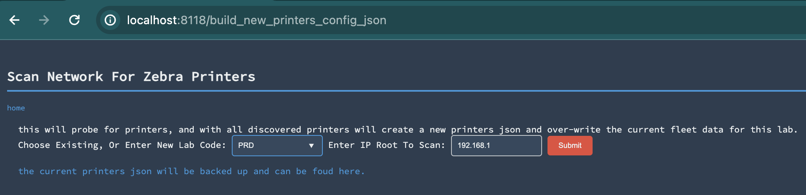
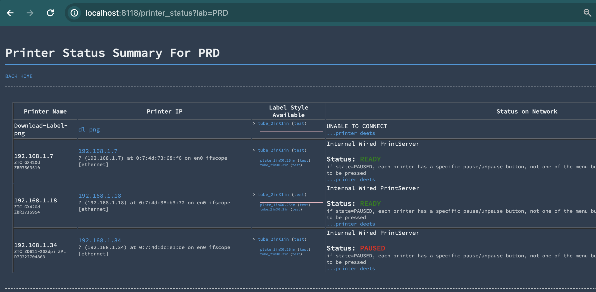

# Zebra Printer Configuration
Bloom relies on [zebra_day](https://github.com/Daylily-Informatics/zebra_day) as the authoritative printer-fleet service. Bloom fetches shared printer, template, and label-profile state from the zebra_day API and submits print jobs back to zebra_day for delivery. Please see that repository for printer-specific setup details. The notes below are a Bloom-focused quick reference.

## Printer Setup
* Bloom does not start or manage zebra_day. Configure the running zebra_day service with `bloom.zebra_day.base_url` and `bloom.zebra_day.token` or the equivalent `BLOOM_ZEBRA_DAY__*` environment variables.

### Detect Printers On Your Local Network
_this MUST be done at least once when setting up a new bloom install_ && _done again when adding new printers_
* Use the zebra_day admin UI to discover printers, assign printer IDs, and manage default label profiles. Bloom reads those shared records remotely; it no longer rebuilds local printer JSON.

* The printers visible in zebra_day are the printers available in the Bloom UI. Bloom stores the selected zebra_day `printer_id` as the user preference value and uses zebra_day label-profile names for `label_zpl_style`.

## Label Template Modification
* see zebra_day docs for more information on label templates.

# Printing From Bloom
* Most objects in bloom have basic barcode printing enabled.  You may customize the basic printing ( change what information is printed, how it's printed, the number printed). The default print behavior will print the EUID as a scannable barcode, the EUID as a human readable string, and if possible, the object _user specified_ name (which may be '' if not specifically set).
* Each user session will display the available printers for the lab code, as well as the default label styles. With each print request, these may be set.
* Keep in mind, these interfaces _are not optimized_ for production use. They demonstrate the finest level to which operations can be customized. Production interfaces will likely benefit from rolling up many of these fine steps.
