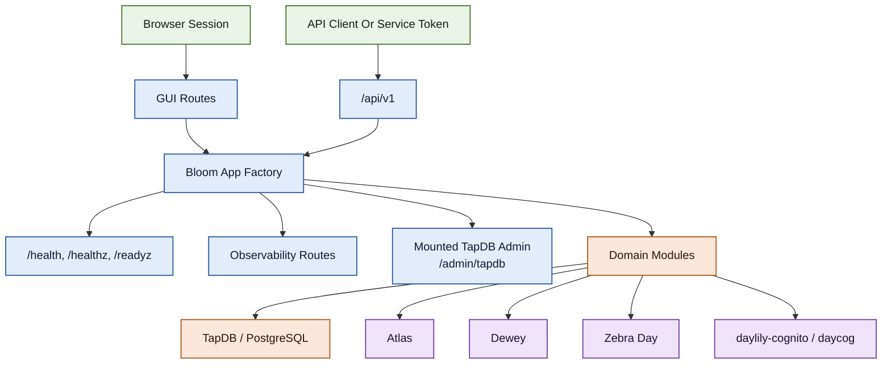

# Bloom Architecture

Bloom is a FastAPI application that combines a versioned HTTP API, a server-rendered GUI, health and observability endpoints, and a mounted TapDB admin sub-application. Its core architectural decision is narrow ownership: Bloom is authoritative for material primitives and lineage, but it deliberately delegates identity, shared DB/runtime lifecycle, deployment orchestration, and adjacent service concerns to other parts of the Dayhoff bundle.



## App Composition

The runtime is assembled in `bloom_lims.app.create_app()` and has the following major pieces:

| Layer | Current behavior |
| --- | --- |
| App factory | Builds the FastAPI app, validates required config at startup, and wires lifespan shutdown for metrics writers. |
| Middleware | Trusted-host filtering, CORS, explicit origin allowlist enforcement, session middleware, per-request observability, request attribution for DB metrics, and optional rate limiting. |
| Static/template mounts | `/static` and `/templates` are mounted as static directories. |
| Health | `/health`, `/health/live`, `/health/ready`, plus top-level `/healthz` and `/readyz`. |
| Observability | Routes such as `/obs_services`, `/api_health`, `/endpoint_health`, `/db_health`, `/api/anomalies`, `/my_health`, and `/auth_health`. |
| API | Versioned router under `/api/v1`. |
| GUI | Dashboard, search, queue runtime, admin, and graph routes. |
| Embedded admin | TapDB admin app mounted at `/admin/tapdb`, Bloom-admin-gated. |

Two implementation details matter operationally:

- Startup validation is strict. Bloom aborts startup if TapDB config cannot be resolved or if required Cognito settings are empty.
- The TapDB admin mount is not a second product. It is an embedded administrative surface guarded by Bloom's own session role checks.

## Configuration Model

Bloom's config model is deployment-scoped and YAML-first.

### Bloom YAML

The main service config lives at:

```text
~/.config/bloom-<deploy-name>/bloom-config-<deploy-name>.yaml
```

This file carries service-level settings such as:

- environment and feature flags
- TapDB client, namespace, config path, and local ports
- Cognito pool/client/domain/redirect configuration
- Atlas, Dewey, Zebra Day, and related integration settings
- storage paths such as the upload directory

### TapDB Namespace Config

Bloom resolves its runtime DB/admin context through a namespaced TapDB config:

```text
~/.config/tapdb/bloom/bloom-<deploy-name>/tapdb-config.yaml
```

Bloom's local upload directory now defaults next to that runtime config:

```text
~/.config/tapdb/bloom/bloom-<deploy-name>/<tapdb-env>/uploads
```

Bloom creates that directory automatically when settings are loaded.

### Precedence And Validation

Current precedence is:

1. `BLOOM_*` environment variables
2. deployment-scoped user YAML
3. packaged template defaults

The docs and CLI now treat the YAML path as the normal configuration path. Environment overrides still exist in code, but they are not the recommended operational model for standard service bring-up.

## Runtime Layers

### API Layer: `bloom_lims/api/v1`

This is the versioned HTTP contract. Mounted route groups include:

- objects, containers, content, templates, subjects, and lineages
- auth and token management
- execution queue, batch jobs, async tasks, and stats
- search v2
- graph and tracking
- external specimen and Atlas bridge routes
- beta lab routes under the Atlas integration namespace

Workflow/workset modules still exist on disk, but they are not mounted by the current v1 router.

### GUI Layer: `bloom_lims/gui`

The GUI is mostly server-rendered Jinja templates backed by route families for:

- auth and Cognito callback/logout handling
- the modern dashboard and search pages
- operations views such as queue runtime, equipment, reagents, create flows, and admin
- graph exploration and graph mutation helpers

The richer graph browser endpoints used by the GUI live outside `/api/v1` under `/api/graph/*`.

### Domain Layer: `bloom_lims/domain`

The domain layer is where Bloom's narrow ownership becomes concrete:

| Module group | Current responsibility |
| --- | --- |
| `containers.py`, `content.py`, `equipment.py`, `external_specimens.py` | material/object state management |
| `execution_queue.py`, `execution_actions.py` | queue-centric runtime behavior |
| `beta_lab*.py`, `beta_actions.py` | beta queue/lab flows and staged material operations |
| `workflows.py`, `object_sets.py` | older concepts that still exist in code but are not current mounted product surfaces |
| `files.py`, `utils.py`, `base.py` | supporting infrastructure and shared helpers |

### Auth Layer: `bloom_lims/auth`

Bloom's current auth split is:

- browser session auth through Cognito Hosted UI helpers from `daylily-cognito`
- API token auth resolved by Bloom's own token service and RBAC
- group service wrappers around TapDB-backed group membership

Roles are `READ_ONLY`, `READ_WRITE`, and `ADMIN`. Group codes such as `API_ACCESS`, `ENABLE_ATLAS_API`, and `ENABLE_URSA_API` are used as feature gates, especially for external integration routes.

### Integration Layer: `bloom_lims/integrations`

Current notable integrations:

| Integration | Current boundary |
| --- | --- |
| Atlas | reference validation, container context lookup, status-event push, and best-effort outbound Bloom events |
| Dewey | authenticated artifact registration client |
| Zebra Day | printer listing, label profile discovery, and print-job submission |
| TapDB mount | embedded admin surface and runtime namespace bootstrap |

Bloom also exposes carrier tracking endpoints under `/api/v1/tracking`, with current FedEx-focused support plus placeholders for other carriers.

## Persistence Model

Bloom persists state through TapDB-managed PostgreSQL structures and namespaced config, not by hand-written one-off local DB bootstrap logic. The working model is:

- templates define allowed object shapes and categories
- object creation mints EUID-backed instances
- lineage edges and containment relationships connect those instances
- operator/runtime surfaces project queue state on top of the same core identity graph

That is why Bloom feels like a foundation service rather than a vertical application. It stores the durable material graph that other services and operator workflows can interrogate.

## Health, Observability, And Readiness

Bloom exposes two overlapping health surfaces:

- detailed health under `/health`, `/health/live`, `/health/ready`, and `/health/metrics`
- orchestration aliases under `/healthz` and `/readyz`

Readiness currently checks:

- database connectivity
- that the service is not in maintenance mode

Observability endpoints add rollups for API health, per-endpoint health, DB probes, auth health, and anomaly tracking. These routes are protected by Bloom API auth rather than being anonymously public.

## Security Boundaries

Security-relevant boundaries in the current design:

- GUI sessions use Cognito and a normalized session principal. Raw OAuth tokens are not stored in the session payload.
- Browser routes and API routes have different auth paths, but they share the same Bloom role vocabulary.
- External Atlas/Ursa routes require service-token auth plus group membership gates.
- Mounted TapDB admin inherits Bloom admin gating rather than running separate embedded credentials.
- Origin filtering and trusted-host middleware are enforced at the application edge.

## Bloom As A Foundation Service

Bloom is "material primitive authority," not the full LIS stack, because that split keeps the system legible:

- Atlas owns order and intake context.
- Bloom owns material state and lineage.
- Dewey owns artifacts and artifact retrieval.
- Zebra Day owns printing.
- daycog owns shared Cognito lifecycle.
- Dayhoff owns deployment and discoverability.

That separation shows up directly in the codebase. The integrations are thin wrappers. The core data model stays in Bloom.

## Retired And Historical Surfaces

Some names remain in the repo for history or compatibility, but they are not mounted as supported product surfaces today:

- `/api/v1/workflows/*`
- `/api/v1/worksets/*`
- workflow GUI router mounts
- the old `/graph` alias
- retired controls and other legacy utility pages called out in `docs/old_docs/LEGACY_REMOVAL_GAP_REPORT.md`

Use the current mounted routers and tests as the source of truth for what is live.
