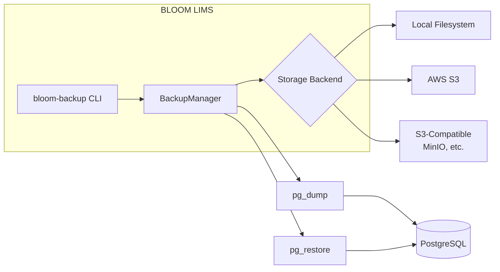

# BLOOM LIMS Backup and Recovery System

This document describes the backup and recovery system for BLOOM LIMS PostgreSQL database.

## Overview

The backup system provides:
- **Full, schema-only, and data-only backups** using PostgreSQL's `pg_dump`
- **Local and S3 storage backends** with support for S3-compatible services (MinIO, etc.)
- **Compression** with configurable levels
- **Backup verification** for integrity checking
- **Retention policy enforcement** for automatic cleanup
- **CLI tool** for manual operations and automation

## Architecture



## Quick Start

### Create a Backup

```bash
# Full backup to local storage (default)
bloom-backup create

# Schema-only backup
bloom-backup create --type=schema

# Backup to S3
bloom-backup create --storage=s3
```

### List Backups

```bash
# List all backups
bloom-backup list

# JSON format (for scripting)
bloom-backup list --format=json
```

### Restore from Backup

```bash
# Restore specific backup
bloom-backup restore bloom_mydb_full_20231223_120000

# Verify backup without restoring
bloom-backup restore bloom_mydb_full_20231223_120000 --dry-run
```

### Verify Backup Integrity

```bash
bloom-backup verify bloom_mydb_full_20231223_120000
```

### Apply Retention Policy

```bash
bloom-backup cleanup
```

## Configuration

### Environment Variables

```bash
# Storage Configuration
BLOOM_BACKUP_STORAGE=local          # local or s3
BLOOM_BACKUP_LOCAL_DIR=/var/lib/bloom/backups
BLOOM_BACKUP_TEMP_DIR=/tmp/bloom_backup

# S3 Configuration
BLOOM_BACKUP_S3_BUCKET=my-bucket
BLOOM_BACKUP_S3_PREFIX=bloom-backups/
BLOOM_BACKUP_S3_ENDPOINT=           # For S3-compatible services
AWS_DEFAULT_REGION=us-east-1
AWS_ACCESS_KEY_ID=your-key
AWS_SECRET_ACCESS_KEY=your-secret

# Database Configuration
PGHOST=localhost
PGPORT=5432
PGDATABASE=bloom_lims
PGUSER=postgres
PGPASSWORD=your-password

# Backup Options
BLOOM_BACKUP_COMPRESS=true
BLOOM_BACKUP_COMPRESS_LEVEL=6       # 1-9
BLOOM_BACKUP_PARALLEL_JOBS=4
BLOOM_BACKUP_VERIFY=true
```

## Python API

```python
from bloom_lims.backup import BackupManager, BackupConfig

# Create with defaults from environment
manager = BackupManager()

# Or with explicit config
config = BackupConfig()
config.storage_type = StorageType.S3
config.s3.bucket = "my-bucket"
manager = BackupManager(config)

# Create backup
backup_id, location = manager.create_backup()

# List backups
backups = manager.list_backups()

# Restore
manager.restore_backup(backup_id)

# Apply retention
deleted = manager.apply_retention_policy()
```

## Retention Policy

Default retention settings:
- **Daily backups**: Keep last 7
- **Weekly backups**: Keep last 4 (Monday backups)
- **Monthly backups**: Keep last 12 (1st of month)
- **Minimum**: Always keep at least 3 backups

## Scheduled Backups

### Using Cron

```bash
# Daily backup at 2 AM
0 2 * * * /path/to/bloom-backup create >> /var/log/bloom-backup.log 2>&1

# Weekly cleanup
0 3 * * 0 /path/to/bloom-backup cleanup >> /var/log/bloom-backup.log 2>&1
```

### Using Systemd Timer

Create `/etc/systemd/system/bloom-backup.service`:
```ini
[Unit]
Description=BLOOM LIMS Database Backup

[Service]
Type=oneshot
ExecStart=/usr/local/bin/bloom-backup create
```

Create `/etc/systemd/system/bloom-backup.timer`:
```ini
[Unit]
Description=Daily BLOOM backup

[Timer]
OnCalendar=daily
Persistent=true

[Install]
WantedBy=timers.target
```

## Security Best Practices

1. **Encrypt backups at rest** - Use S3 server-side encryption or encrypt before upload
2. **Restrict access** - Use IAM policies to limit S3 bucket access
3. **Secure credentials** - Use AWS IAM roles or secrets management
4. **Test restores regularly** - Verify backups can be restored successfully
5. **Monitor backup jobs** - Set up alerts for backup failures

