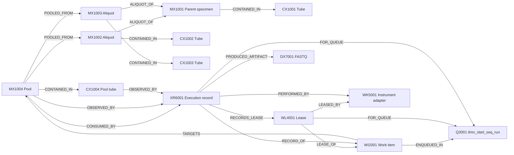
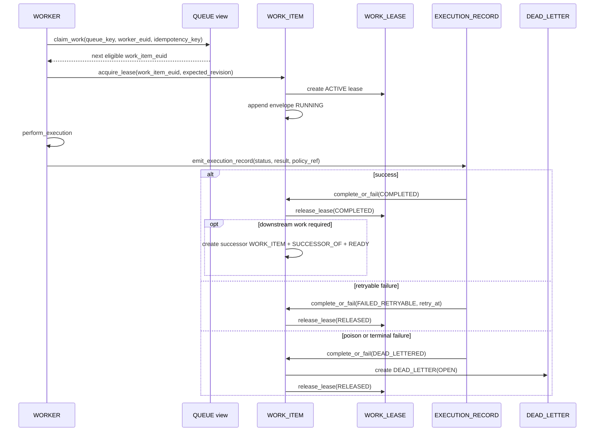
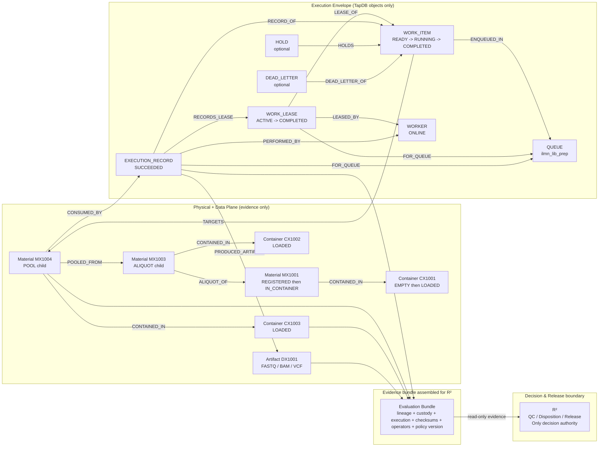

# LSMC Material Transfer Algebra and Execution Envelope Constitution

## 1. Primitive Material Transfer Algebra

### 1.1 Formal domain

Let the authoritative state at commit time be the directed TapDB graph `G = (O, E)`.

| Symbol | Meaning |
|---|---|
| `O` | Set of TapDB objects. |
| `E` | Set of TapDB lineage edges. |
| `M ⊂ O` | Set of material objects. |
| `C ⊂ O` | Set of container objects. |
| `X ⊂ O` | Set of execution record objects. |
| `H ⊂ O` | Set of hold objects. |
| `Q ⊂ O` | Set of queue objects. |
| `WI ⊂ O` | Set of work item objects. |
| `WL ⊂ O` | Set of work lease objects. |
| `DL ⊂ O` | Set of dead letter objects. |
| `base_state(o)` | Underlying lifecycle state before hold or lease overlays are applied. |
| `state(o)` | Projected lifecycle state after applying hold or lease overlays; for example, a held contained material projects as `QUARANTINED` while its `base_state` remains `IN_CONTAINER`. |
| `held(o)` | `true` iff an ACTIVE `HOLD` targets `o`, or targets a governing container or work item for `o`. |
| `occ(c)` | `{ m ∈ M | (m --CONTAINED_IN--> c) ∈ E and base_state(m)=IN_CONTAINER }`. |
| `loc(m)` | The unique container `c` such that `m ∈ occ(c)`, if any. |

### 1.2 Object shape rules

| Object kind | Required immutable core fields | Allowed mutable append-only fields |
|---|---|---|
| `MATERIAL` | `material_euid`; `material_kind`; `material_subkind`; `quantity` (nullable); `quantity_unit` (nullable); `created_at`; `created_by`; `site_scope` | none |
| `CONTAINER` | `container_euid`; `container_kind`; `container_type`; `capacity_mode=SINGLE_MATERIAL`; `created_at`; `created_by`; `site_scope` | `label_history[]` only |

`label_history[]` entries MUST be append-only and each entry MUST contain `label_value`, `label_scheme`, `applied_at`, `applied_by_euid`, and `reason_code`.

### 1.3 Algebraic commit rules

1. Every primitive operation is a partial function `op(G, input) -> G'`.
2. Every primitive operation MUST run inside one TapDB transaction.
3. If any precondition fails, the entire primitive operation MUST roll back.
4. Every primitive operation MUST receive `operation_idempotency_key`, `performed_by_euid`, and `observed_at`.
5. Replay with the same `operation_idempotency_key` and byte-identical payload MUST return the original result without minting new objects.
6. Replay with the same `operation_idempotency_key` and a different payload MUST fail with `ERR_IDEMPOTENCY_CONFLICT`.
7. Every primitive operation MUST create exactly one immutable `EXECUTION_RECORD` object.
8. Every new object MUST receive a new EUID at creation time.
9. Authoritative relationships MUST be edges, not EUID fields inside objects. Lookup-shadow EUIDs MAY exist inside immutable record snapshots but are non-authoritative.
10. Physical provenance edges MUST be acyclic.
11. A complex lab step MAY be an ordered atomic composition of primitive operations; all resulting objects and edges MUST commit together.

### 1.4 Quantity rules

1. `MOVE_MATERIAL` is a full-quantity transfer.
2. `ALIQUOT_MATERIAL` is a two-output partition: one aliquot child and one remainder child.
3. `SPLIT_MATERIAL` is an `N >= 2` output partition.
4. `POOL_MATERIAL` is full-input combination only; partial pooling MUST be modeled as `ALIQUOT_MATERIAL` or `SPLIT_MATERIAL` followed by `POOL_MATERIAL`.
5. If all quantities are declared and unit-compatible, child quantities MUST sum to parent quantities, except where a same-transaction discard is explicitly recorded.
6. If a parent material quantity changes, the parent material MUST terminate and all surviving portions MUST be represented by new child material EUIDs.

### 1.5 Standard failure codes

| Code | Meaning |
|---|---|
| `ERR_IDEMPOTENCY_CONFLICT` | Same idempotency key, different payload. |
| `ERR_NOT_FOUND` | Required object does not exist. |
| `ERR_INVALID_STATE` | Source or destination state violates the operation contract. |
| `ERR_DESTINATION_NOT_EMPTY` | Destination container has an active occupant. |
| `ERR_ACTIVE_HOLD` | An active hold blocks the requested transition. |
| `ERR_TERMINAL_OBJECT` | Source object is terminal and cannot transition. |
| `ERR_QUANTITY_MISMATCH` | Quantities do not conserve under the declared transfer specification. |
| `ERR_CYCLE_DETECTED` | Requested lineage would create a cycle. |
| `ERR_DUPLICATE_LIVE_LABEL` | Proposed container label collides with another live container label in the same site scope. |
| `ERR_SAME_SOURCE_AND_DESTINATION` | Source and destination containers are the same where forbidden. |
| `ERR_POLICY_BLOCK` | A policy artifact forbids the transition. |

### 1.6 Primitive operations

#### REGISTER_CONTAINER

| Field | Rule |
|---|---|
| Name | `REGISTER_CONTAINER` |
| Description | Create a container object without asserting emptiness. |
| Required inputs | `container_kind`; `container_type`; optional initial label entry; `site_scope`; `operation_idempotency_key`; `performed_by_euid`; `observed_at` |
| Resulting objects created | `CONTAINER c`; `EXECUTION_RECORD xr` |
| Lineage edges produced | `c REGISTERED_BY xr`; `xr PERFORMED_BY actor_or_worker` |
| Invariants enforced | Container EUID is unique; `capacity_mode=SINGLE_MATERIAL`; no `CONTAINED_IN` edge is created; no cycle is created. |
| Allowed container states | new object only |
| Forbidden states | not applicable |
| Preconditions | No existing live container in the same site scope may already own the same initial label value; idempotency contract holds. |
| Postconditions | `state(c)=REGISTERED`; `occ(c)=∅`. |
| Container state changes | New container enters `REGISTERED`. |
| Material state changes | none |
| Failure conditions | `ERR_IDEMPOTENCY_CONFLICT`; `ERR_DUPLICATE_LIVE_LABEL`; `ERR_POLICY_BLOCK` |

#### REGISTER_EMPTY_CONTAINER

| Field | Rule |
|---|---|
| Name | `REGISTER_EMPTY_CONTAINER` |
| Description | Create a container object and assert that it is empty at registration time. This is equivalent to `REGISTER_CONTAINER` plus an emptiness observation in the same transaction. |
| Required inputs | `container_kind`; `container_type`; optional initial label entry; `site_scope`; `operation_idempotency_key`; `performed_by_euid`; `observed_at`; `empty_verification_method` |
| Resulting objects created | `CONTAINER c`; `EXECUTION_RECORD xr` |
| Lineage edges produced | `c REGISTERED_BY xr`; `c OBSERVED_BY xr`; `xr PERFORMED_BY actor_or_worker` |
| Invariants enforced | `occ(c)=∅`; container may immediately serve as a destination; no cycle is created. |
| Allowed container states | new object only |
| Forbidden states | not applicable |
| Preconditions | Same as `REGISTER_CONTAINER`, plus the physical container has been observed empty. |
| Postconditions | `state(c)=EMPTY`; `occ(c)=∅`. |
| Container state changes | New container enters `EMPTY`. |
| Material state changes | none |
| Failure conditions | `ERR_IDEMPOTENCY_CONFLICT`; `ERR_DUPLICATE_LIVE_LABEL`; `ERR_POLICY_BLOCK` |

#### REGISTER_MATERIAL

| Field | Rule |
|---|---|
| Name | `REGISTER_MATERIAL` |
| Description | Create a material object that is not yet placed in a container. Parent lineage MAY be declared for generic transformations, but parent disposition is unchanged unless a terminating primitive is executed in the same transaction. |
| Required inputs | `material_kind`; `material_subkind`; optional `quantity`; optional `quantity_unit`; optional `parent_material_euids[]`; `site_scope`; `operation_idempotency_key`; `performed_by_euid`; `observed_at` |
| Resulting objects created | `MATERIAL m`; `EXECUTION_RECORD xr` |
| Lineage edges produced | `m REGISTERED_BY xr`; optional `m DERIVED_FROM p` for each declared parent `p`; `xr PERFORMED_BY actor_or_worker` |
| Invariants enforced | Material EUID is unique; no container edge exists until placement; physical provenance stays acyclic. |
| Allowed container states | not applicable |
| Forbidden states | not applicable |
| Preconditions | Any declared parent material MUST exist, MUST not be terminal (`ALIQUOTED`, `POOLED`, `CONSUMED`, or `DISCARDED`), and MUST not be blocked by an active hold that forbids derivation. |
| Postconditions | `state(m)=REGISTERED`; `loc(m)=null`. |
| Container state changes | none |
| Material state changes | New material enters `REGISTERED`. |
| Failure conditions | `ERR_NOT_FOUND`; `ERR_ACTIVE_HOLD`; `ERR_TERMINAL_OBJECT`; `ERR_CYCLE_DETECTED`; `ERR_IDEMPOTENCY_CONFLICT` |

#### PLACE_MATERIAL_IN_CONTAINER

| Field | Rule |
|---|---|
| Name | `PLACE_MATERIAL_IN_CONTAINER` |
| Description | Place a previously registered, uncontained material into an empty container. Because this is first placement rather than movement between containers, no new material EUID is created. |
| Required inputs | `material_euid`; `destination_container_euid`; optional `position`; `operation_idempotency_key`; `performed_by_euid`; `observed_at` |
| Resulting objects created | `EXECUTION_RECORD xr` only |
| Lineage edges produced | `material CONTAINED_IN destination_container`; `material OBSERVED_BY xr`; `destination_container OBSERVED_BY xr`; `xr PERFORMED_BY actor_or_worker` |
| Invariants enforced | The material may appear in exactly one active container; the destination must be empty. |
| Allowed container states | destination `REGISTERED` or `EMPTY` |
| Forbidden states | destination `LOADED`; `IN_PROCESS`; `CONSUMED`; `RETIRED` |
| Preconditions | `state(material)=REGISTERED`; `loc(material)=null`; `occ(destination_container)=∅`; no blocking hold exists on the material or destination container. |
| Postconditions | `state(material)=IN_CONTAINER`; `loc(material)=destination_container`; `state(destination_container)=LOADED`. |
| Container state changes | destination `REGISTERED or EMPTY -> LOADED` |
| Material state changes | material `REGISTERED -> IN_CONTAINER` |
| Failure conditions | `ERR_NOT_FOUND`; `ERR_INVALID_STATE`; `ERR_DESTINATION_NOT_EMPTY`; `ERR_ACTIVE_HOLD`; `ERR_IDEMPOTENCY_CONFLICT` |

#### MOVE_MATERIAL

| Field | Rule |
|---|---|
| Name | `MOVE_MATERIAL` |
| Description | Full transfer of one active material from its current container to a different destination container. The parent material identity terminates; a new child material identity is created in the destination container. |
| Required inputs | `source_material_euid`; `destination_container_euid`; optional `position`; `operation_idempotency_key`; `performed_by_euid`; `observed_at` |
| Resulting objects created | Child `MATERIAL m'`; `EXECUTION_RECORD xr` |
| Lineage edges produced | `m' DERIVED_FROM source_material`; `m' CONTAINED_IN destination_container`; `source_material OBSERVED_BY xr`; `m' REGISTERED_BY xr`; `destination_container OBSERVED_BY xr`; `xr PERFORMED_BY actor_or_worker` |
| Invariants enforced | The source material identity is never active in two containers; the destination container is empty; the child is the only active successor of the parent in this operation. |
| Allowed container states | source container `LOADED` or `IN_PROCESS`; destination container `REGISTERED` or `EMPTY` |
| Forbidden states | destination container `LOADED`; `IN_PROCESS`; `CONSUMED`; `RETIRED`; source container equal to destination container |
| Preconditions | `state(source_material)=IN_CONTAINER`; `loc(source_material)=source_container`; `occ(destination_container)=∅`; no blocking hold exists on source material, source container, or destination container. |
| Postconditions | `state(source_material)=CONSUMED` with terminal reason `MOVE_MATERIAL`; `state(m')=IN_CONTAINER`; `loc(m')=destination_container`; source container is empty; destination container is loaded. |
| Container state changes | source `LOADED or IN_PROCESS -> EMPTY`; destination `REGISTERED or EMPTY -> LOADED` |
| Material state changes | parent `IN_CONTAINER -> CONSUMED`; child `REGISTERED -> IN_CONTAINER` |
| Failure conditions | `ERR_NOT_FOUND`; `ERR_INVALID_STATE`; `ERR_DESTINATION_NOT_EMPTY`; `ERR_ACTIVE_HOLD`; `ERR_SAME_SOURCE_AND_DESTINATION`; `ERR_IDEMPOTENCY_CONFLICT` |

#### ALIQUOT_MATERIAL

| Field | Rule |
|---|---|
| Name | `ALIQUOT_MATERIAL` |
| Description | Partition one active source material into exactly two child materials: one aliquot child in a destination container and one remainder child in the source container. The parent material identity terminates. |
| Required inputs | `source_material_euid`; `destination_container_euid`; `aliquot_quantity`; `remainder_quantity`; `quantity_unit`; optional `position`; `operation_idempotency_key`; `performed_by_euid`; `observed_at` |
| Resulting objects created | Aliquot child `MATERIAL m_a`; remainder child `MATERIAL m_r`; `EXECUTION_RECORD xr` |
| Lineage edges produced | `m_a ALIQUOT_OF source_material`; `m_r DERIVED_FROM source_material`; `m_a CONTAINED_IN destination_container`; `m_r CONTAINED_IN source_container`; `source_material OBSERVED_BY xr`; `m_a REGISTERED_BY xr`; `m_r REGISTERED_BY xr`; `xr PERFORMED_BY actor_or_worker` |
| Invariants enforced | The parent material does not remain active; both resulting portions receive new EUIDs; quantity is conserved. |
| Allowed container states | source container `LOADED` or `IN_PROCESS`; destination container `REGISTERED` or `EMPTY` |
| Forbidden states | destination container `LOADED`; `IN_PROCESS`; `CONSUMED`; `RETIRED`; source container equal to destination container |
| Preconditions | `state(source_material)=IN_CONTAINER`; destination empty; no blocking hold exists; `aliquot_quantity + remainder_quantity = parent_quantity` when quantities are declared. |
| Postconditions | `state(source_material)=ALIQUOTED`; `state(m_a)=IN_CONTAINER`; `state(m_r)=IN_CONTAINER`; `loc(m_a)=destination_container`; `loc(m_r)=source_container`. |
| Container state changes | source remains `LOADED`; destination `REGISTERED or EMPTY -> LOADED` |
| Material state changes | parent `IN_CONTAINER -> ALIQUOTED`; aliquot child `REGISTERED -> IN_CONTAINER`; remainder child `REGISTERED -> IN_CONTAINER` |
| Failure conditions | `ERR_NOT_FOUND`; `ERR_INVALID_STATE`; `ERR_DESTINATION_NOT_EMPTY`; `ERR_ACTIVE_HOLD`; `ERR_QUANTITY_MISMATCH`; `ERR_SAME_SOURCE_AND_DESTINATION`; `ERR_IDEMPOTENCY_CONFLICT` |

#### POOL_MATERIAL

| Field | Rule |
|---|---|
| Name | `POOL_MATERIAL` |
| Description | Combine two or more full-input source materials into one pooled child material in a destination container. Partial pooling is forbidden; partial preparation MUST occur first via `ALIQUOT_MATERIAL` or `SPLIT_MATERIAL`. |
| Required inputs | `source_material_euids[2..n]`; `destination_container_euid`; optional `pooled_quantity`; optional `quantity_unit`; optional `position`; `operation_idempotency_key`; `performed_by_euid`; `observed_at` |
| Resulting objects created | Pooled child `MATERIAL m_p`; `EXECUTION_RECORD xr` |
| Lineage edges produced | `m_p POOLED_FROM source_i` for each source material; `m_p CONTAINED_IN destination_container`; each source material `OBSERVED_BY xr`; `m_p REGISTERED_BY xr`; `destination_container OBSERVED_BY xr`; `xr PERFORMED_BY actor_or_worker` |
| Invariants enforced | Each source input is consumed in full; each source material may participate at most once; destination container has one active occupant after the operation; provenance stays acyclic. |
| Allowed container states | each source container `LOADED` or `IN_PROCESS`; destination container `REGISTERED` or `EMPTY` |
| Forbidden states | destination `LOADED`; `IN_PROCESS`; `CONSUMED`; `RETIRED`; duplicate source material entries |
| Preconditions | Every source material is `IN_CONTAINER`; all source materials are distinct; destination is empty; no blocking hold exists on any source material or container. |
| Postconditions | every source material enters `POOLED`; pooled child enters `IN_CONTAINER` in the destination container; every non-destination source container becomes empty. |
| Container state changes | each non-destination source container `LOADED or IN_PROCESS -> EMPTY`; destination `REGISTERED or EMPTY -> LOADED` |
| Material state changes | each source parent `IN_CONTAINER -> POOLED`; pooled child `REGISTERED -> IN_CONTAINER` |
| Failure conditions | `ERR_NOT_FOUND`; `ERR_INVALID_STATE`; `ERR_DESTINATION_NOT_EMPTY`; `ERR_ACTIVE_HOLD`; `ERR_QUANTITY_MISMATCH`; `ERR_IDEMPOTENCY_CONFLICT` |

#### SPLIT_MATERIAL

| Field | Rule |
|---|---|
| Name | `SPLIT_MATERIAL` |
| Description | Partition one active source material into `N >= 2` child materials. Every resulting portion receives a new material EUID. One destination MAY be the original source container to represent a remainder child. |
| Required inputs | `source_material_euid`; `destinations[]`, where each destination contains `container_euid`, `child_quantity`, and optional `position`; `operation_idempotency_key`; `performed_by_euid`; `observed_at` |
| Resulting objects created | One child `MATERIAL` per destination; `EXECUTION_RECORD xr` |
| Lineage edges produced | for each child `m_i`: `m_i SPLIT_FROM source_material`; `m_i CONTAINED_IN destination_i`; each child `REGISTERED_BY xr`; source material `OBSERVED_BY xr`; `xr PERFORMED_BY actor_or_worker` |
| Invariants enforced | `N >= 2`; each destination container appears at most once; every surviving portion receives a new EUID; quantity is conserved; at most one destination may be the original source container. |
| Allowed container states | source container `LOADED` or `IN_PROCESS`; each non-source destination `REGISTERED` or `EMPTY`; source container may appear once as a destination even though it is currently loaded because the parent is terminating in the same transaction |
| Forbidden states | duplicate destinations; any non-source destination `LOADED`; `IN_PROCESS`; `CONSUMED`; `RETIRED` |
| Preconditions | `state(source_material)=IN_CONTAINER`; every destination is valid under the rule above; blocking holds absent; quantities sum to parent quantity when quantities are declared. |
| Postconditions | `state(source_material)=ALIQUOTED`; every child material enters `IN_CONTAINER`; the source container remains loaded iff it receives one child; otherwise it becomes empty. |
| Container state changes | source `LOADED or IN_PROCESS -> LOADED` if it receives a remainder child, else `EMPTY`; every non-source destination `REGISTERED or EMPTY -> LOADED` |
| Material state changes | parent `IN_CONTAINER -> ALIQUOTED`; each child `REGISTERED -> IN_CONTAINER` |
| Failure conditions | `ERR_NOT_FOUND`; `ERR_INVALID_STATE`; `ERR_DESTINATION_NOT_EMPTY`; `ERR_ACTIVE_HOLD`; `ERR_QUANTITY_MISMATCH`; `ERR_IDEMPOTENCY_CONFLICT` |

#### CONSUME_MATERIAL

| Field | Rule |
|---|---|
| Name | `CONSUME_MATERIAL` |
| Description | Terminate a material identity because it has been irreversibly used by an execution attempt. Any output materials MUST be created by separate primitives in the same transaction and linked by lineage. |
| Required inputs | `material_euid`; `consumption_reason_code`; optional `work_item_euid`; `operation_idempotency_key`; `performed_by_euid`; `observed_at` |
| Resulting objects created | `EXECUTION_RECORD xr` only |
| Lineage edges produced | `material CONSUMED_BY xr`; `material OBSERVED_BY xr`; optional `xr RECORD_OF work_item`; `xr PERFORMED_BY actor_or_worker` |
| Invariants enforced | A consumed material identity is terminal and may not re-enter a container. |
| Allowed container states | if contained: source container `LOADED` or `IN_PROCESS`; if uncontained: not applicable |
| Forbidden states | material already `ALIQUOTED`; `POOLED`; `CONSUMED`; `DISCARDED` |
| Preconditions | Material exists and is non-terminal; no blocking hold exists unless the hold explicitly permits discard-or-consume resolution. |
| Postconditions | `state(material)=CONSUMED`; if the material had a container and no replacement child material is placed into that same container in the same transaction, the container becomes `EMPTY`. |
| Container state changes | contained source container `LOADED or IN_PROCESS -> EMPTY`, unless a same-transaction replacement child is placed into it |
| Material state changes | material `REGISTERED or IN_CONTAINER -> CONSUMED` |
| Failure conditions | `ERR_NOT_FOUND`; `ERR_TERMINAL_OBJECT`; `ERR_ACTIVE_HOLD`; `ERR_IDEMPOTENCY_CONFLICT` |

#### DISCARD_MATERIAL

| Field | Rule |
|---|---|
| Name | `DISCARD_MATERIAL` |
| Description | Terminate a material identity as waste, destroyed material, or intentionally abandoned material. Discarded material may never be reactivated. |
| Required inputs | `material_euid`; `discard_reason_code`; optional `disposition_note_hash`; `operation_idempotency_key`; `performed_by_euid`; `observed_at` |
| Resulting objects created | `EXECUTION_RECORD xr` only |
| Lineage edges produced | `material DISCARDED_BY xr`; `material OBSERVED_BY xr`; `xr PERFORMED_BY actor_or_worker` |
| Invariants enforced | A discarded material identity is terminal; discard history is append-only. |
| Allowed container states | if contained: source container `LOADED` or `IN_PROCESS`; if uncontained: not applicable |
| Forbidden states | material already terminal |
| Preconditions | Material exists and is not already terminal; discard is authorized under the active holds and policy rules. |
| Postconditions | `state(material)=DISCARDED`; if the material had a container and no same-transaction replacement child is placed into that container, the container becomes `EMPTY`. |
| Container state changes | contained source container `LOADED or IN_PROCESS -> EMPTY`, unless a same-transaction replacement child is placed into it |
| Material state changes | material `REGISTERED`, `IN_CONTAINER`, or `QUARANTINED` -> `DISCARDED` |
| Failure conditions | `ERR_NOT_FOUND`; `ERR_TERMINAL_OBJECT`; `ERR_ACTIVE_HOLD`; `ERR_POLICY_BLOCK`; `ERR_IDEMPOTENCY_CONFLICT` |

#### RELABEL_CONTAINER

| Field | Rule |
|---|---|
| Name | `RELABEL_CONTAINER` |
| Description | Append a new label assertion to an existing container. Container EUID is unchanged; prior labels remain part of the permanent record. |
| Required inputs | `container_euid`; `new_label_value`; `label_scheme`; `reason_code`; `operation_idempotency_key`; `performed_by_euid`; `observed_at` |
| Resulting objects created | `EXECUTION_RECORD xr` only |
| Lineage edges produced | `container OBSERVED_BY xr`; `xr PERFORMED_BY actor_or_worker` |
| Invariants enforced | Container identity is stable; label history is append-only; new label must not collide with another live container in the same site scope. |
| Allowed container states | `REGISTERED`; `EMPTY`; `LOADED`; `IN_PROCESS` |
| Forbidden states | `CONSUMED`; `RETIRED` |
| Preconditions | Container exists and is non-terminal; `label_history[]` is append-only; no duplicate live label collision exists. If an active `IDENTITY_HOLD` exists, relabel is allowed only when executed as part of an open reconciliation case. |
| Postconditions | The container’s canonical label becomes the last entry in `label_history[]`; all earlier label entries remain retrievable. |
| Container state changes | none |
| Material state changes | none |
| Failure conditions | `ERR_NOT_FOUND`; `ERR_TERMINAL_OBJECT`; `ERR_DUPLICATE_LIVE_LABEL`; `ERR_ACTIVE_HOLD`; `ERR_IDEMPOTENCY_CONFLICT` |

## 2. Material Lifecycle State Machine

### 2.1 Canonical material states

| State | Meaning | Entry condition | Terminal |
|---|---|---|---|
| `REGISTERED` | Material exists but is not yet actively contained. | `REGISTER_MATERIAL` completed and no active `CONTAINED_IN` edge exists. | no |
| `IN_CONTAINER` | Material is the single active occupant of a container. | `PLACE_MATERIAL_IN_CONTAINER`; child output of `MOVE_MATERIAL`; child output of `ALIQUOT_MATERIAL`; child output of `POOL_MATERIAL`; child output of `SPLIT_MATERIAL`. | no |
| `ALIQUOTED` | Parent material identity ended by partition into child portions. | Parent of `ALIQUOT_MATERIAL` or `SPLIT_MATERIAL`. | yes |
| `POOLED` | Parent material identity ended by combination into a pooled child. | Input parent of `POOL_MATERIAL`. | yes |
| `CONSUMED` | Parent material identity ended by full transfer or irreversible process use. The precise reason is the latest terminal `EXECUTION_RECORD.action_key`. | Parent of `MOVE_MATERIAL`; target of `CONSUME_MATERIAL`. | yes |
| `DISCARDED` | Parent material identity ended as waste or deliberate abandonment. | Target of `DISCARD_MATERIAL`. | yes |
| `QUARANTINED` | Projection overlay used when an active blocking hold targets the material, its containing container, or its active work item. When the hold is released, the material reverts to its underlying non-hold state. | Any active blocking hold. | no |

### 2.2 Mermaid diagram

```mermaid
stateDiagram-v2
    [*] --> REGISTERED
    REGISTERED --> IN_CONTAINER: PLACE_MATERIAL_IN_CONTAINER
    REGISTERED --> CONSUMED: CONSUME_MATERIAL
    REGISTERED --> DISCARDED: DISCARD_MATERIAL
    REGISTERED --> QUARANTINED: ACTIVE HOLD

    IN_CONTAINER --> ALIQUOTED: ALIQUOT_MATERIAL / SPLIT_MATERIAL (parent)
    IN_CONTAINER --> POOLED: POOL_MATERIAL (input parent)
    IN_CONTAINER --> CONSUMED: MOVE_MATERIAL (parent) / CONSUME_MATERIAL
    IN_CONTAINER --> DISCARDED: DISCARD_MATERIAL
    IN_CONTAINER --> QUARANTINED: ACTIVE HOLD

    QUARANTINED --> REGISTERED: HOLD RELEASED; no active container
    QUARANTINED --> IN_CONTAINER: HOLD RELEASED; active container remains
    QUARANTINED --> DISCARDED: DISCARD_MATERIAL (authorized)
```



### 2.3 Allowed transitions

| From | To | Allowed by |
|---|---|---|
| `REGISTERED` | `IN_CONTAINER` | `PLACE_MATERIAL_IN_CONTAINER` |
| `REGISTERED` | `CONSUMED` | `CONSUME_MATERIAL` |
| `REGISTERED` | `DISCARDED` | `DISCARD_MATERIAL` |
| `REGISTERED` | `QUARANTINED` | Active blocking hold |
| `IN_CONTAINER` | `ALIQUOTED` | `ALIQUOT_MATERIAL`; `SPLIT_MATERIAL` on parent |
| `IN_CONTAINER` | `POOLED` | `POOL_MATERIAL` on input parent |
| `IN_CONTAINER` | `CONSUMED` | `MOVE_MATERIAL` on parent; `CONSUME_MATERIAL` |
| `IN_CONTAINER` | `DISCARDED` | `DISCARD_MATERIAL` |
| `IN_CONTAINER` | `QUARANTINED` | Active blocking hold |
| `QUARANTINED` | `REGISTERED` | Hold released and material is uncontained |
| `QUARANTINED` | `IN_CONTAINER` | Hold released and material remains actively contained |
| `QUARANTINED` | `DISCARDED` | `DISCARD_MATERIAL` executed under authorized disposition policy |

### 2.4 Forbidden transitions

| Forbidden transition | Rule |
|---|---|
| Any terminal state -> any non-terminal state | Forbidden. New material identity is required. |
| `ALIQUOTED` -> `POOLED` | Forbidden. Pooling applies to child materials, not the already-terminated parent. |
| `POOLED` -> `IN_CONTAINER` | Forbidden. A pooled input parent cannot reappear as active. |
| `CONSUMED` -> `IN_CONTAINER` | Forbidden. Transfer or process use ends the original identity. |
| `DISCARDED` -> any other state | Forbidden. Discard is terminal. |

### 2.5 Terminal states

`ALIQUOTED`, `POOLED`, `CONSUMED`, and `DISCARDED` are terminal.

## 3. Container Lifecycle State Machine

### 3.1 Canonical container states

| State | Meaning | Entry condition | Terminal |
|---|---|---|---|
| `REGISTERED` | Container exists but emptiness has not yet been explicitly asserted. | `REGISTER_CONTAINER` | no |
| `EMPTY` | Container has no active occupant. | `REGISTER_EMPTY_CONTAINER`; full removal/consumption/discard of the active occupant; explicit reconciliation asserting emptiness. | no |
| `LOADED` | Container has exactly one active occupant. | `PLACE_MATERIAL_IN_CONTAINER`; child output placed into the container. | no |
| `IN_PROCESS` | Projection overlay used while an active work lease targets the container or its active occupant. When the lease closes, the container reverts to `EMPTY` or `LOADED` as derived. | Active `WORK_LEASE` on the container or occupant. | no |
| `CONSUMED` | Single-use container physically destroyed or irreversibly spent. | Administrative `EXECUTION_RECORD` with `action_key=CONSUME_CONTAINER` outside Section 1. | yes |
| `RETIRED` | Container permanently withdrawn from service. | Administrative `EXECUTION_RECORD` with `action_key=RETIRE_CONTAINER` or reconciliation closure. | yes |

### 3.2 Mermaid diagram

```mermaid
stateDiagram-v2
    [*] --> REGISTERED
    REGISTERED --> EMPTY: REGISTER_EMPTY_CONTAINER
    REGISTERED --> LOADED: PLACE_MATERIAL_IN_CONTAINER
    EMPTY --> LOADED: PLACE / MOVE / ALIQUOT / POOL / SPLIT child placed here
    LOADED --> IN_PROCESS: ACTIVE WORK_LEASE
    IN_PROCESS --> LOADED: LEASE CLOSED; active occupant remains
    IN_PROCESS --> EMPTY: LEASE CLOSED; occupant removed or terminated
    LOADED --> EMPTY: active occupant fully moved / consumed / discarded
    EMPTY --> RETIRED: action_key=RETIRE_CONTAINER
    LOADED --> CONSUMED: action_key=CONSUME_CONTAINER
    EMPTY --> CONSUMED: action_key=CONSUME_CONTAINER
```



### 3.3 Allowed transitions

| From | To | Allowed by |
|---|---|---|
| `REGISTERED` | `EMPTY` | `REGISTER_EMPTY_CONTAINER`; reconciliation |
| `REGISTERED` | `LOADED` | `PLACE_MATERIAL_IN_CONTAINER` |
| `EMPTY` | `LOADED` | Placement or child creation into container |
| `LOADED` | `IN_PROCESS` | Active lease on container or occupant |
| `IN_PROCESS` | `LOADED` | Lease closure with active occupant retained |
| `IN_PROCESS` | `EMPTY` | Lease closure with active occupant removed or terminated |
| `LOADED` | `EMPTY` | Full transfer, full consumption, full discard, or split with no remainder in same container |
| `EMPTY` | `RETIRED` | Administrative `EXECUTION_RECORD` with `action_key=RETIRE_CONTAINER` |
| `REGISTERED` | `RETIRED` | Administrative `EXECUTION_RECORD` with `action_key=RETIRE_CONTAINER` |
| `LOADED` or `EMPTY` | `CONSUMED` | Administrative `EXECUTION_RECORD` with `action_key=CONSUME_CONTAINER` |

### 3.4 Forbidden transitions

| Forbidden transition | Rule |
|---|---|
| `LOADED` -> `LOADED` by adding a second active material | Forbidden. Any replacement must occur as a same-transaction identity swap in which the old occupant terminates and the new occupant is the only active child. |
| `CONSUMED` -> any other state | Forbidden. |
| `RETIRED` -> any other state | Forbidden. |
| `REGISTERED` -> `IN_PROCESS` | Forbidden. A container must first become `LOADED` or `EMPTY`, then be targeted by work. |

### 3.5 Terminal states

`CONSUMED` and `RETIRED` are terminal.

## 4. Canonical Lineage Edge Vocabulary

### 4.1 Edge record rules

Every lineage edge MUST contain `edge_type`, `source_euid`, `target_euid`, `created_at`, `created_by_euid`, and `operation_idempotency_key`. Edge metadata MAY contain immutable `role`, `ordinal`, `position`, or `notes_hash` values.

### 4.2 Allowed edge types

| Edge name | Direction | Source object types | Target object types | Semantic meaning |
|---|---|---|---|---|
| `DERIVED_FROM` | source -> target | `MATERIAL`, `ARTIFACT` | `MATERIAL`, `ARTIFACT` | Generic child-to-parent provenance when no more specific transform edge applies. |
| `ALIQUOT_OF` | source -> target | `MATERIAL` | `MATERIAL` | Child aliquot material was partitioned from the parent material. |
| `POOLED_FROM` | source -> target | `MATERIAL` | `MATERIAL` | Pooled child material contains full input from the target parent material. |
| `SPLIT_FROM` | source -> target | `MATERIAL` | `MATERIAL` | Child material is one partition of the target parent material. |
| `CONTAINED_IN` | source -> target | `MATERIAL` | `CONTAINER` | Material is the active occupant of the target container. |
| `CONSUMED_BY` | source -> target | `MATERIAL` | `EXECUTION_RECORD` | Material identity was terminated by the target execution record. |
| `DISCARDED_BY` | source -> target | `MATERIAL` | `EXECUTION_RECORD` | Material identity was discarded by the target execution record. |
| `PRODUCED_ARTIFACT` | source -> target | `EXECUTION_RECORD` | `ARTIFACT` | The execution record produced the target artifact. |
| `OBSERVED_BY` | source -> target | `MATERIAL`, `CONTAINER`, `ARTIFACT`, `WORK_ITEM`, `WORK_LEASE`, `QUEUE`, `WORKER` | `EXECUTION_RECORD` | The source object was observed, inspected, or attested by the target execution record. |
| `REGISTERED_BY` | source -> target | `MATERIAL`, `CONTAINER`, `ARTIFACT`, `QUEUE`, `WORK_ITEM`, `WORK_LEASE`, `WORKER`, `HOLD`, `DEAD_LETTER` | `EXECUTION_RECORD` | The source object was created and registered by the target execution record. |
| `CUSTODY_TRANSFERRED_BY` | source -> target | `CONTAINER` | `EXECUTION_RECORD` | The target execution record transferred custody of the source container. |
| `PERFORMED_BY` | source -> target | `EXECUTION_RECORD`, `HOLD`, `RECONCILIATION` | `WORKER`, `ACTOR` | The source action or record was performed by the target identity. |
| `TARGETS` | source -> target | `WORK_ITEM` | `MATERIAL`, `CONTAINER`, `ARTIFACT`, `RUN`, `POOL`, `GENERIC_SUBJECT` | The work item operates on the target subject. |
| `ENQUEUED_IN` | source -> target | `WORK_ITEM` | `QUEUE` | The work item belongs to the target queue definition. |
| `SUCCESSOR_OF` | source -> target | `WORK_ITEM` | `WORK_ITEM` | The source work item is the next planned unit after the target work item. |
| `LEASE_OF` | source -> target | `WORK_LEASE` | `WORK_ITEM` | The lease reserves execution rights for the target work item. |
| `LEASED_BY` | source -> target | `WORK_LEASE` | `WORKER` | The lease is owned by the target worker. |
| `FOR_QUEUE` | source -> target | `WORK_LEASE`, `EXECUTION_RECORD`, `HOLD`, `DEAD_LETTER` | `QUEUE` | The source object is scoped to the target queue. |
| `RECORD_OF` | source -> target | `EXECUTION_RECORD` | `WORK_ITEM` | The execution record describes an attempt for the target work item. |
| `RECORDS_LEASE` | source -> target | `EXECUTION_RECORD` | `WORK_LEASE` | The execution record was emitted under the target lease. |
| `HOLDS` | source -> target | `HOLD` | `MATERIAL`, `CONTAINER`, `WORK_ITEM`, `QUEUE`, `ARTIFACT`, `EVALUATION_TARGET` | The hold blocks transitions on the target object. |
| `DEAD_LETTER_OF` | source -> target | `DEAD_LETTER` | `WORK_ITEM` | The dead letter records terminal unresolved failure for the target work item. |
| `RECONCILES` | source -> target | `RECONCILIATION` | `MATERIAL`, `CONTAINER`, `ARTIFACT`, `WORK_ITEM`, `EXECUTION_RECORD` | The reconciliation case addresses the target object or record. |
| `SUPERSEDES` | source -> target | `RECONCILIATION`, `EXECUTION_RECORD`, corrected domain object | superseded object or record | The source corrects the target without deleting it. Canonical projections MUST prefer the newest non-superseded record in scope. |

### 4.3 Mermaid lineage example graph



## 5. Execution Envelope Model

### 5.1 Core execution rules

1. Traditional mutable workflow-step state is forbidden.
2. Execution is modeled by first-class TapDB objects: `QUEUE`, `WORK_ITEM`, `WORK_LEASE`, `WORKER`, `EXECUTION_RECORD`, `HOLD`, and `DEAD_LETTER`.
3. No external queue is authoritative. Queue visibility is derived from `WORK_ITEM` envelope state plus `HOLD`, `WORK_LEASE`, and `DEAD_LETTER` objects.
4. No external workflow engine is authoritative. Downstream work is represented by explicit successor `WORK_ITEM` objects linked by `SUCCESSOR_OF`.
5. The execution envelope is the append-only mutable field `WORK_ITEM.execution_envelope.events[]`.
6. Queue, worker, lease, hold, and dead-letter status changes are append-only event arrays inside their owning objects.

### 5.2 Execution envelope event shape

```json
{
  "revision": 1,
  "state": "PENDING|READY|RUNNING|WAITING_EXTERNAL|FAILED_RETRYABLE|HELD|FAILED_TERMINAL|DEAD_LETTERED|CANCELED|COMPLETED",
  "queue_key_snapshot": "string",
  "attempt_number": 0,
  "ready_at": "RFC3339|null",
  "due_at": "RFC3339|null",
  "retry_at": "RFC3339|null",
  "hold_state": "NONE|ACTIVE",
  "terminal": false,
  "last_execution_record_euid_snapshot": "EUID|null",
  "emitted_at": "RFC3339",
  "emitted_by_euid": "EUID"
}
```

`WORK_ITEM` canonical state is the last envelope event.

### 5.3 Execution objects

| Object | Suggested TapDB template code | Required immutable fields | Append-only mutable fields | Lifecycle states | Relationships |
|---|---|---|---|---|---|
| `QUEUE` | `data/execution/queue/1.0/` | `queue_euid`; `queue_key`; `display_name`; `subject_template_codes[]`; `dispatch_priority`; `required_worker_capabilities[]`; `lease_duration_seconds`; `max_attempts_default`; `retry_policy`; `selection_policy`; `diagnostics_enabled`; `created_at`; `created_by_euid` | `state_events[]` with `ACTIVE`, `DRAINING`, `DISABLED`, and `RETIRED` transitions | `ACTIVE`; `DRAINING`; `DISABLED`; `RETIRED` | inbound `ENQUEUED_IN` from `WORK_ITEM`; inbound `FOR_QUEUE` from `WORK_LEASE`, `EXECUTION_RECORD`, `HOLD`, `DEAD_LETTER` |
| `WORK_ITEM` | `data/execution/work_item/1.0/` | `work_item_euid`; `requested_action_key`; `priority_initial`; `ready_at_initial`; `due_at_initial`; `max_attempts`; `idempotency_scope`; `payload_hash`; `created_at`; `created_by_euid` | `execution_envelope.events[]` only | `PENDING`; `READY`; `RUNNING`; `WAITING_EXTERNAL`; `FAILED_RETRYABLE`; `HELD`; `FAILED_TERMINAL`; `DEAD_LETTERED`; `CANCELED`; `COMPLETED` | outbound `TARGETS` to subject objects; outbound `ENQUEUED_IN` to `QUEUE`; outbound `SUCCESSOR_OF` to prior `WORK_ITEM`; inbound `LEASE_OF` from `WORK_LEASE`; inbound `RECORD_OF` from `EXECUTION_RECORD`; inbound `HOLDS` from `HOLD`; inbound `DEAD_LETTER_OF` from `DEAD_LETTER` |
| `WORK_LEASE` | `data/execution/work_lease/1.0/` | `lease_euid`; `lease_token`; `claimed_at`; `ttl_seconds`; `attempt_number`; `subject_revision_at_claim`; `claim_idempotency_key`; `payload_hash`; `created_by_euid` | `lease_events[]` with `ACTIVE`, `RELEASED`, `COMPLETED`, `EXPIRED`, `ABANDONED`, and `CANCELED` transitions and heartbeat timestamps | `ACTIVE`; `RELEASED`; `COMPLETED`; `EXPIRED`; `ABANDONED`; `CANCELED` | outbound `LEASE_OF` to `WORK_ITEM`; outbound `LEASED_BY` to `WORKER`; outbound `FOR_QUEUE` to `QUEUE`; inbound `RECORDS_LEASE` from `EXECUTION_RECORD` |
| `WORKER` | `actor/system/worker/1.0/` | `worker_euid`; `worker_key`; `worker_type`; `capabilities[]`; `site_scope[]`; `platform_scope[]`; `assay_scope[]`; `max_concurrent_leases`; `build_version`; `host`; `process_identity`; `registered_at`; `registered_by_euid` | `status_events[]`; `heartbeat_events[]` | `ONLINE`; `OFFLINE`; `DRAINING`; `DISABLED`; `RETIRED` | inbound `LEASED_BY` from `WORK_LEASE`; inbound `PERFORMED_BY` from `EXECUTION_RECORD`, `HOLD`, `RECONCILIATION` |
| `EXECUTION_RECORD` | `data/execution/execution_record/1.0/` | `record_euid`; `action_key`; `status`; `attempt_number`; `expected_state`; `start_state`; `end_state`; `started_at`; `finished_at`; `duration_ms`; `retryable`; `error_class`; `error_code`; `error_message`; `input_snapshot`; `result_snapshot`; `policy_ref`; `created_at`; `created_by_euid` | none | `STARTED`; `SUCCEEDED`; `FAILED_RETRYABLE`; `FAILED_TERMINAL`; `CANCELED`; `EXPIRED` | outbound `RECORD_OF` to `WORK_ITEM`; outbound `RECORDS_LEASE` to `WORK_LEASE`; outbound `FOR_QUEUE` to `QUEUE`; outbound `PERFORMED_BY` to `WORKER` or `ACTOR`; outbound `PRODUCED_ARTIFACT` to artifacts; inbound `CONSUMED_BY`, `DISCARDED_BY`, `OBSERVED_BY`, `REGISTERED_BY`, `CUSTODY_TRANSFERRED_BY` |
| `HOLD` | `data/execution/hold/1.0/` | `hold_euid`; `hold_type`; `hold_code`; `reason`; `placed_at`; `placed_by_role`; `evidence_minimum`; `created_at`; `created_by_euid` | `resolution_events[]` with `ACTIVE` and `RELEASED` transitions | `ACTIVE`; `RELEASED` | outbound `HOLDS` to target object(s); optional outbound `FOR_QUEUE` to `QUEUE`; outbound `PERFORMED_BY` to `WORKER` or `ACTOR`; optional outbound `SUPERSEDES` to prior hold |
| `DEAD_LETTER` | `data/execution/dead_letter/1.0/` | `dead_letter_euid`; `opened_at`; `failure_count`; `triggering_error_class`; `triggering_error_code`; `triggering_error_message`; `created_at`; `created_by_euid` | `resolution_events[]` with `OPEN`, `REQUEUED`, `CANCELED`, and `IGNORED` transitions | `OPEN`; `REQUEUED`; `CANCELED`; `IGNORED` | outbound `DEAD_LETTER_OF` to `WORK_ITEM`; outbound `FOR_QUEUE` to `QUEUE`; optional outbound `SUPERSEDES` to prior dead letter |

### 5.4 Queue visibility function

A work item `wi` is visible in queue `q` at time `t` iff all of the following are true:

1. `(wi --ENQUEUED_IN--> q)` exists.
2. `last(wi.execution_envelope.events).state ∈ {READY, FAILED_RETRYABLE}`.
3. `retry_at <= t` when `retry_at` is present.
4. No ACTIVE `HOLD` targets `wi` or any object targeted by `wi`.
5. No ACTIVE `WORK_LEASE` exists such that `(lease --LEASE_OF--> wi)`.
6. `last(q.state_events).state = ACTIVE`.
7. The worker scope and capability rules of `q` are satisfied.
8. No OPEN `DEAD_LETTER` targets `wi`.

## 6. Queue / Lease Protocol

### 6.1 Deterministic protocol steps

| Step | Mutation | Required rule |
|---|---|---|
| `claim_work` | none | Build the visible candidate set for the queue and choose the first item by deterministic order: `priority DESC`, `due_at ASC`, `ready_at ASC`, `created_at ASC`, `work_item_euid ASC`. |
| `acquire_lease` | create `WORK_LEASE`; append `WORK_ITEM` envelope event | Must occur in one TapDB transaction that re-checks visibility, work item revision, queue state, worker state, active holds, and active lease absence. The appended work-item state becomes `RUNNING`; `attempt_number` increments by 1. |
| `perform_execution` | none by itself; domain primitives may run | Worker executes the requested action. Any material change MUST use the Section 1 primitives. Worker MUST NOT record QC or release decisions. |
| `emit_execution_record` | create immutable `EXECUTION_RECORD` | At least one terminal execution record per lease attempt is mandatory. Optional `STARTED` records MAY be emitted earlier, but terminal records are required. |
| `complete_or_fail` | append `WORK_ITEM` envelope event; optional create successor `WORK_ITEM`; optional create `DEAD_LETTER` | Success appends `COMPLETED` or `WAITING_EXTERNAL`; retryable failure appends `FAILED_RETRYABLE`; terminal failure appends `DEAD_LETTERED` and creates `DEAD_LETTER`. |
| `release_lease` | append `WORK_LEASE` event | Success closes the lease as `COMPLETED`; retryable failure closes as `RELEASED`; timeout sweeper closes as `EXPIRED`; explicit cancellation closes as `CANCELED` or `ABANDONED`. |

### 6.2 Lease, renewal, retry, and poison-job rules

| Parameter | Rule |
|---|---|
| Lease duration | Default `900` seconds. Queue-specific override allowed on `QUEUE.lease_duration_seconds`. |
| Renewal cadence | Holder MUST renew before lease expiry and SHOULD renew every `min(300, ttl_seconds / 3)` seconds. |
| Renewal authority | Only the worker owning the lease may renew it. Renewing an expired or terminal lease is forbidden. |
| Renewal effect | `expires_at = now + ttl_seconds`; append a `heartbeat` event to the lease. |
| Default retry policy | `EXPONENTIAL_BACKOFF` with `initial_delay_seconds=60`, `backoff_factor=2.0`, `max_delay_seconds=3600`. |
| Retry formula | `delay(attempt) = min(max_delay_seconds, initial_delay_seconds * backoff_factor^(attempt-1))`. |
| Default max attempts | `5`. Queue or work-item override allowed. |
| Retryable failure visibility | Work item becomes visible again only when `retry_at <= now` and no active hold or dead letter exists. |
| Poison-job rule | A work item is poison and MUST dead-letter when any of the following is true: `attempt_number >= max_attempts`; failure is classified permanent; the same normalized `{error_class,error_code,payload_hash}` occurs for `3` consecutive attempts; or the attempt violates contract integrity (missing mandatory execution record, idempotency mismatch, or schema violation). |
| Dead-letter visibility | OPEN dead-letter items are not claimable. |
| Dead-letter requeue | Requeue requires explicit resolution event `REQUEUED` on the dead letter, a new `READY` envelope event, and release/removal of any blocking hold. |

### 6.3 Synthetic timeout handling

If a lease expires before terminal `emit_execution_record` and `complete_or_fail` occur, a sweeper worker MUST perform all of the following atomically:

1. Append `EXPIRED` to the lease.
2. Create an immutable `EXECUTION_RECORD` with `status=EXPIRED`, `error_code=HEARTBEAT_TIMEOUT`.
3. Evaluate the poison-job rules.
4. Append `FAILED_RETRYABLE` or `DEAD_LETTERED` to the work item as appropriate.
5. Create `DEAD_LETTER` when required.

### 6.4 Mermaid execution flow diagram



## 7. Hold and Exception Model

### 7.1 Common hold rules

1. An ACTIVE hold blocks all transitions listed for its type.
2. Hold history is append-only. Release is a resolution event, not an edit.
3. `QUARANTINED` is the projected state for any material under a blocking hold. Containers do not change canonical lifecycle state; they are marked held in projections and block transitions while the hold is active.
4. A hold on a container propagates quarantine to its active occupant and blocks any visible work items targeting that container or occupant.
5. A hold release MUST reference the evidence or reconciliation case that justifies release.

### 7.2 Hold types

| Hold type | May be placed by | Blocks | Minimum evidence required | Removal protocol |
|---|---|---|---|---|
| `IDENTITY_HOLD` | Atlas intake verifier; Bloom/LES operator; reconciliation worker; authenticated operator with specimen identity authority | `PLACE_MATERIAL_IN_CONTAINER`; `MOVE_MATERIAL`; `ALIQUOT_MATERIAL`; `POOL_MATERIAL`; `SPLIT_MATERIAL`; `CONSUME_MATERIAL`; `emit_execution_record` success closure; R² evaluation; release | Label mismatch observation; duplicate identifier detection; chain-of-custody discrepancy; unexpected placement observation | Open `RECONCILIATION`; create or reference superseding identity evidence; dual verification by authorized identity resolver; append hold `RELEASED` event |
| `CONTAMINATION_HOLD` | Instrument adapter; Bloom/LES operator; contamination monitor; QC monitor | Downstream `ALIQUOT_MATERIAL`; `POOL_MATERIAL`; sequencing-run start; R² evaluation; release | Contamination metric breach; environmental contamination observation; operator contamination report | Record contamination investigation; either discard the material/container or record superseding clean evidence and authorized release of hold |
| `POLICY_HOLD` | Policy distribution service; QMS / Trust & Audit administrator; recall service | `claim_work`; `acquire_lease`; downstream successor creation; R² evaluation; release | Signed policy recall; blocked policy version; explicit management stop order | Reference superseding policy artifact or signed override artifact; append hold `RELEASED` event |
| `EVIDENCE_HOLD` | Evidence completeness validator; checksum verifier; R² pre-evaluator; reconciliation worker | `complete_or_fail` success closure; R² evaluation; release | Missing lineage edge; missing operator identity; missing checksum; missing execution record; schema mismatch | Materialize missing evidence or resolve by reconciliation; append hold `RELEASED` event |
| `EXECUTION_HOLD` | Queue owner; active worker; instrument adapter; scheduler/sweeper; operator supervisor | `claim_work`; `acquire_lease`; automatic retries; successor work creation | Worker crash; instrument fault; lease timeout; manual pause request | Clear execution fault, close or expire active leases, then append hold `RELEASED` event |

## 8. Reconciliation Protocol

### 8.1 Reconciliation object

A reconciliation case is a TapDB object `RECONCILIATION` with immutable fields `reconciliation_euid`, `reconciliation_type`, `opened_at`, `opened_by_euid`, `status`, `summary_hash`, and append-only `resolution_events[]`. It MUST relate to affected objects by `RECONCILES` edges and MAY supersede erroneous records or objects by `SUPERSEDES` edges.

### 8.2 General reconciliation rules

1. Reconciliation never deletes history.
2. Reconciliation MAY create replacement objects, but it MUST never mutate prior immutable objects.
3. `SUPERSEDES` changes canonical projection, not historical existence.
4. Any reconciliation affecting identity, lineage, or release evidence MUST place at least one blocking hold until resolved.
5. R² MUST treat any OPEN reconciliation in scope as a release blocker.

### 8.3 Reconciliation types

| Discrepancy | Reconciliation objects | Superseding lineage | Quarantine handling |
|---|---|---|---|
| `MISSING_CONTAINER` | `RECONCILIATION` + `IDENTITY_HOLD` on the expected container and any active contained material/work items | If later custody evidence proves location, the new custody `EXECUTION_RECORD` or reconciliation resolution MAY `SUPERSEDES` the prior missing-container assessment record. The physical container object itself is not rewritten. | Container, active occupant, and visible work items remain quarantined until found, retired, or explicitly discarded by policy. |
| `UNEXPECTED_MATERIAL` | `RECONCILIATION` + `IDENTITY_HOLD` on the container and the observed material branch; if the material has no record, `REGISTER_MATERIAL` in quarantined scope is mandatory before further action | Corrected containment assertions or newly discovered canonical material objects MAY `SUPERSEDES` prior wrong occupancy or wrong identity records. | Container and observed material remain quarantined until the material is either linked to a canonical origin or discarded. |
| `LABEL_MISMATCH` | `RECONCILIATION` + `IDENTITY_HOLD`; optional `RELABEL_CONTAINER` or same-scope material relabel evidence | The new label assertion becomes canonical; the reconciliation case or replacement label evidence MUST `SUPERSEDES` the wrong label assertion for projection purposes. | The container, active occupant, and downstream work items remain quarantined until dual verification and hold release. |
| `DUPLICATE_ID` | `RECONCILIATION` + `IDENTITY_HOLD` on every duplicate object and all visible descendants in scope | Canonical replacement objects with newly minted EUIDs MUST be created. The replacement object or reconciliation record MUST `SUPERSEDES` every non-canonical duplicate. Duplicate EUIDs are never edited in place. | All affected objects are quarantined immediately. No release evaluation may proceed until the duplicate graph has a single canonical successor branch. |
| `UNKNOWN_ORIGIN` | `RECONCILIATION` + `IDENTITY_HOLD` + `EVIDENCE_HOLD`; mandatory registration of the found material if no object exists | If origin evidence is later found, a new canonical child or correction record MAY `SUPERSEDES` the unknown-origin assessment. Without such evidence, no provenance supersession is allowed. | Material remains quarantined. It may only be discarded or resolved by documented provenance evidence; it may not be released. |

## 9. Evidence Bundle Required for QC / Release Evaluation

### 9.1 Minimum required bundle

Before R² may evaluate QC or release, the requesting system MUST provide an evaluation bundle with all of the following components:

| Component | Minimum required contents |
|---|---|
| `material_lineage` | Every material EUID in the target branch from accession root or explicit unknown-origin registration to the target material or output artifact; all provenance edge EUIDs in that branch; every terminal material disposition in that branch |
| `container_custody` | Every container EUID that held any material in the target branch; all custody-transfer execution record EUIDs; all relabel events; current canonical labels |
| `execution_records` | Every work-item EUID, lease EUID, and execution-record EUID that created, transformed, observed, measured, or consumed materials or artifacts in scope |
| `instrument_outputs` | Raw or derived instrument output artifact EUIDs; checksums; storage references; metric artifacts when produced |
| `artifact_checksums` | One checksum tuple `{artifact_euid, algorithm, value}` for every artifact in scope |
| `operator_identity` | Every worker/actor EUID linked by `PERFORMED_BY` to in-scope execution records; worker build/version identity when worker type is service or instrument adapter |
| `policy_version` | Exact policy identifier and version used for the requested R² evaluation and, where relevant, the policy identifiers/versions referenced by in-scope execution records |

### 9.2 Formal bundle structure

```json
{
  "bundle_kind": "QC_EVALUATION|RELEASE_EVALUATION",
  "bundle_id": "opaque string",
  "target": {
    "kind": "MATERIAL|ARTIFACT|RUN|TRX|RESULT_SET",
    "euid": "EUID"
  },
  "as_of": "RFC3339",
  "policy_ref": {
    "policy_id": "string",
    "policy_version": "string"
  },
  "material_lineage": {
    "material_euids": ["..."],
    "lineage_edges": [
      {"edge_type": "DERIVED_FROM|ALIQUOT_OF|POOLED_FROM|SPLIT_FROM|CONTAINED_IN|CONSUMED_BY|DISCARDED_BY", "source_euid": "...", "target_euid": "..."}
    ]
  },
  "container_custody": {
    "container_euids": ["..."],
    "custody_execution_record_euids": ["..."],
    "label_history": [
      {"container_euid": "...", "label_value": "...", "label_scheme": "...", "applied_at": "RFC3339", "applied_by_euid": "..."}
    ]
  },
  "execution_records": {
    "work_item_euids": ["..."],
    "lease_euids": ["..."],
    "execution_record_euids": ["..."]
  },
  "instrument_outputs": {
    "artifact_euids": ["..."],
    "storage_refs": ["..."],
    "metrics": ["..."]
  },
  "artifact_checksums": [
    {"artifact_euid": "...", "algorithm": "SHA256", "value": "..."}
  ],
  "operator_identity": {
    "worker_euids": ["..."],
    "actor_euids": ["..."]
  },
  "completeness": {
    "active_holds_present": false,
    "open_dead_letters_present": false,
    "open_reconciliations_present": false,
    "missing_components": []
  }
}
```

### 9.3 Evaluation gate

R² MUST reject evaluation and MUST require an `EVIDENCE_HOLD` if any of the following is true:

1. Any required bundle component is absent.
2. Any in-scope artifact checksum is missing or mismatched.
3. Any in-scope object has an ACTIVE `IDENTITY_HOLD`, `CONTAMINATION_HOLD`, `POLICY_HOLD`, or `EVIDENCE_HOLD`.
4. Any in-scope work item has an OPEN dead letter.
5. Any in-scope reconciliation case is OPEN.
6. The requested policy version is absent or differs from the bundle policy reference.

## 10. Global Invariants

1. TapDB is the only persistence system of record.
2. Every authoritative domain object is a TapDB object; every authoritative relationship is a typed TapDB lineage edge.
3. No relational join field is authoritative across domain objects; lookup-shadow EUIDs are non-authoritative.
4. EUIDs are opaque and immutable.
5. A material EUID may exist in only one active container at a time.
6. Containers hold at most one active material at a time.
7. Material movement between containers creates a new material EUID in the destination.
8. Any partial transfer creates new material EUIDs for every surviving portion, including the remainder.
9. Material, artifact, and execution provenance edges are append-only and acyclic.
10. Objects are immutable except for the explicitly named append-only mutable fields in this constitution.
11. Execution records are immutable.
12. Every primitive operation creates one immutable execution record.
13. Idempotent replay with identical payload returns the original result; replay with divergent payload fails.
14. Holds block transitions until released by an append-only resolution event.
15. OPEN dead letters block further automatic work claims.
16. Queue membership is derived from work-item envelope state plus holds, leases, and dead letters; there is no external authoritative queue.
17. External buses and outboxes are transport only; they are not truth.
18. Corrections are represented by superseding records or reconciliation objects; prior history is never deleted.
19. Policy is referenced by version; runtime systems may not fork policy in ad hoc configuration.
20. Systems may record evidence and planning intent, but only R² may record QC, disposition, or release decisions.

## 11. Complete System Diagram


